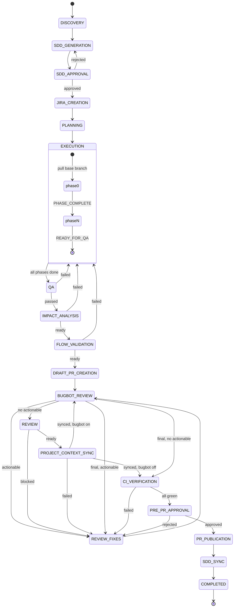

# Workflow State Machine
## Preflight (before DISCOVERY)

0. **Disk-first** ([filesystem-verification.md](filesystem-verification.md)): verify paths on disk with Glob/Read — never trust chat memory or stale `state.workflowContext`.
1. **Bootstrap** (on `start` and `resume`): Glob/Read **`.cursor/project-context/`**; generate missing MDC (project-specific — not template copy); never overwrite files verified present on disk this session; **never** load MDC from templates path.
2. **MDC validation** (Orchestrator §0): **Read** **`.cursor/project-context/*.mdc`** from disk → build `workflowContext`. On failure: `FAILED` / `MDC_INCOMPLETE`.
3. **Requirements**: user provides objective + acceptance criteria; orchestrator states default base branch **`master`** (`base branch: <name>` to override).
4. **Auto-run**: after gate 1 approval, `context.autoRun: true` — chain through gate 2 without per-phase prompts.

## States overview

| State | Agent(s) | User approval? |
|-------|----------|----------------|
| `DISCOVERY` | project-discovery | No |
| `SDD_GENERATION` | sdd-architect | No |
| `SDD_APPROVAL` | orchestrator | **Yes (gate 1)** — `approve` (Option 1, no cleanup) or `approve option N [+ cleanup]`; records `scopeSelection` + `cleanup` |
| `JIRA_CREATION` | jira | No |
| `PLANNING` | planning | No |
| `EXECUTION` | developer (all phases) | **No** |
| `QA` | qa | No |
| `IMPACT_ANALYSIS` | impact-analysis | No |
| `FLOW_VALIDATION` | flow-validation | No |
| `DRAFT_PR_CREATION` | pr-manager (`mode: draft`) | No |
| `BUGBOT_REVIEW` | bugbot | No |
| `REVIEW` | review | No |
| `REVIEW_FIXES` | developer | No |
| `PROJECT_CONTEXT_SYNC` | developer (`mode: project-context-sync`) | No |
| `CI_VERIFICATION` | orchestrator (`gh pr checks`) | No |
| `PRE_PR_APPROVAL` | orchestrator | **Yes (gate 2)** — `approve` / `continue` / `yes` / `approve pr` |
| `PR_PUBLICATION` | pr-manager (`mode: publish`) | No |
| `SDD_SYNC` | sdd-sync | No |
| `COMPLETED` | — | — |
| `FAILED` | — | — |

**Removed:** `PLAN_APPROVAL` (plan auto-proceeds). **Reordered:** BugBot and review run **before** final PR publish.

---

## Pipeline (happy path)

```
start (requirements; base branch master by default)
  → DISCOVERY → SDD_GENERATION
  → SDD_APPROVAL (user — flexible approve/continue)
  → [AUTO-RUN] JIRA → PLANNING → EXECUTION (all phases, no stops)
      branch: git pull origin <base> → checkout -b <artifactSlug>
  → QA → IMPACT_ANALYSIS → FLOW_VALIDATION → DRAFT_PR → BUGBOT → REVIEW
  → [REVIEW_FIXES ↔ BUGBOT loop if needed]
  → PROJECT_CONTEXT_SYNC (deps, versions, MDC, compile)
  → BUGBOT_REVIEW (final pass on PR tip, if enabled)
  → CI_VERIFICATION (gh pr checks green)
  → PRE_PR_APPROVAL (user — flexible approve/continue)
  → PR_PUBLICATION (full pr-body.md, mark PR ready)
  → SDD_SYNC → COMPLETED
```

---

## State definitions (delta highlights)

### PLANNING → EXECUTION

| Field | Value |
|-------|--------|
| **Next** | `EXECUTION` immediately — **not** `PLAN_APPROVAL` |
| **Note** | Orchestrator auto-records `approvals.plan.autoApproved` |

### EXECUTION

| Field | Value |
|-------|--------|
| **Actions** | Invoke `developer` for each phase **without** user confirmation when `context.autoRun === true` |
| **Branch** | Phase 0: `git fetch` + pull `origin/<baseBranch>` (default `master`) → `checkout -b <artifactSlug>`; later phases reuse same branch |
| **Next** | `QA` when `READY_FOR_QA` |

### IMPACT_ANALYSIS

| Field | Value |
|-------|--------|
| **Entry** | QA `READY_FOR_IMPACT_ANALYSIS` with `passed: true` |
| **Actions** | Analyze diff, APIs, schema, config; `impact-analysis-report.md` |
| **Outputs** | `riskLevel`, `impactAnalysisReportPath` |
| **Next** | `FLOW_VALIDATION` if `READY_FOR_FLOW_VALIDATION`; `EXECUTION` if failed |

### FLOW_VALIDATION

| Field | Value |
|-------|--------|
| **Entry** | Impact analysis complete; `business-flows.mdc` loaded |
| **Actions** | Map change to business flows; `flow-validation-report.md`; Flow Safety Score |
| **Outputs** | `flowSafetyScore`, `flowValidationReportPath` |
| **Next** | `DRAFT_PR_CREATION` if `READY_FOR_REVIEW`; `EXECUTION` if `FLOW_VALIDATION_FAILED` |

### DRAFT_PR_CREATION

| Field | Value |
|-------|--------|
| **Entry** | Flow validation passed; branch pushed |
| **Actions** | `pr-manager` with `inputs.mode: "draft"` — `gh pr create --draft` minimal body |
| **Outputs** | `pr: { url, number, draft: true }` |
| **Next** | `BUGBOT_REVIEW` |

### BUGBOT_REVIEW

| Field | Value |
|-------|--------|
| **Entry** | Draft PR exists (or waiver) |
| **Actions** | Trigger `/bugbot` if needed; poll; `bugbot-report.md` |
| **Next** | `REVIEW` if no actionable findings; `REVIEW_FIXES` if actionable |

### REVIEW

| Field | Value |
|-------|--------|
| **Entry** | After BugBot (incorporate `bugbotReportPath`) |
| **Outputs** | `READY_FOR_PRE_PR` or `REVIEW_BLOCKED` |
| **Next** | `PROJECT_CONTEXT_SYNC` if ready; `REVIEW_FIXES` if blocked |

### PROJECT_CONTEXT_SYNC

| Field | Value |
|-------|--------|
| **Entry** | `REVIEW` returned `READY_FOR_PRE_PR` |
| **Actions** | Developer `mode: project-context-sync` — recon branch, update `.cursor/project-context/*.mdc`, validate build/plugin coordinates; `project-context-sync-report.md` |
| **Next** | `BUGBOT_REVIEW` (final) if `bugbot.enabled`; else `CI_VERIFICATION`. On fail → `REVIEW_FIXES` / `EXECUTION` |

Spec: [project-context-sync.md](project-context-sync.md), [pre-pr-verification.md](pre-pr-verification.md).

### BUGBOT_REVIEW (final — before gate 2)

| Field | Value |
|-------|--------|
| **Entry** | After `PROJECT_CONTEXT_SYNC`; `bugbot.enabled` and no waiver |
| **Actions** | Re-run BugBot on current PR tip (sync may have pushed); update `bugbot-report.md` |
| **Next** | `CI_VERIFICATION` if 0 actionable; `REVIEW_FIXES` if actionable |

### CI_VERIFICATION

| Field | Value |
|-------|--------|
| **Entry** | `PROJECT_CONTEXT_SYNCED`; compile report pass; deps/versions reconciled |
| **Actions** | `gh pr checks` — all green; persist `ciVerification` |
| **Next** | `PRE_PR_APPROVAL` if green; `REVIEW_FIXES` / wait if fail/pending |

### PRE_PR_APPROVAL

| Field | Value |
|-------|--------|
| **Actions** | Present implementation + QA + BugBot + review + deps/versions + compile + CI table + `pr-body.md` preview |
| **Next** | `PR_PUBLICATION` on approval intent (`approve`, `continue`, `yes`, `approve pr`); else `REVIEW_FIXES` / `EXECUTION` |

### PR_PUBLICATION

| Field | Value |
|-------|--------|
| **Entry** | `approvals.prePr.approved === true` |
| **Actions** | `pr-manager` with `inputs.mode: "publish"` — update body from `pr-body.md`, `gh pr ready` if draft |
| **Outputs** | Public PR with full description |
| **Next** | `SDD_SYNC` |

---

## Transition diagram


