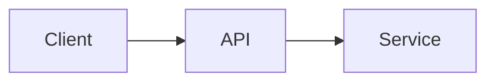
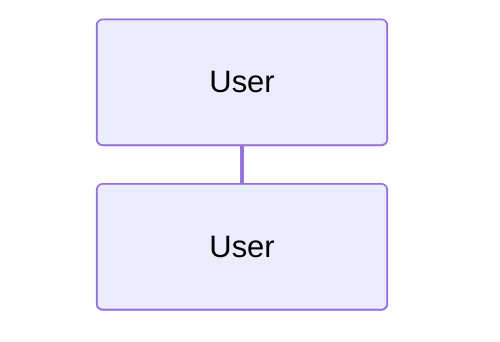

# Software Design Document

**Artifact slug:** `<artifactSlug>` (paired RDD: `<artifactSlug>-requirements.md`; see [artifact-naming.md](../../sdlc-system/workflow/artifact-naming.md))  
**Workflow ID:** `<workflowId>`  
**Title:** `<feature title>`  
**Version:** 1.0  
**Status:** PENDING_APPROVAL

## 1. System overview

## 1b. Scope options (user selects at SDD approval)

Present the reasonable scopes for this work as **radio options** (pick one). **Option 1 is the default** (smallest safe scope). The user confirms or changes the selection when approving the SDD.

**Scope (choose one — default: Option 1):**

- (x) **Option 1 — <minimal scope>** — <what it covers / excludes>
- ( ) **Option 2 — <broader scope>** — <what it additionally covers>
- ( ) **Option 3 — <fuller scope>** — <optional; only if a third is meaningful>

**Cleanup (optional — check to include):**

- [ ] **Remove unused files and dead code** in the affected area (superseded files deleted, orphaned tests/config removed) — see [complete-delivery.md](../../sdlc-system/workflow/complete-delivery.md)

> The selected option drives planning scope and the implementation diff. Each option must list what it includes and excludes so the choice is unambiguous.

## 2. Architecture

## 3. Components

| Component | Responsibility | Repo |
|-----------|----------------|------|

## 4. APIs

### 4.1 `<Endpoint>`

- **Method / Path:**
- **Auth:**
- **Request:**
- **Response:**
- **Errors:**

## 5. Data model

| Entity | Store | Key fields |
|--------|-------|------------|

## 6. Sequence flows

### 6.1 `<Flow name>`

## 7. Risks

| ID | Risk | Mitigation |
|----|------|------------|

## 8. Edge cases

-

## 9. Testing strategy

| Layer | Approach |
|-------|----------|
| Unit | |
| Integration | |
| E2E | |

## 10. Appendix

- Related Jira: _(filled after Jira agent)_
- RDD reference: `<artifactSlug>-requirements.md`
