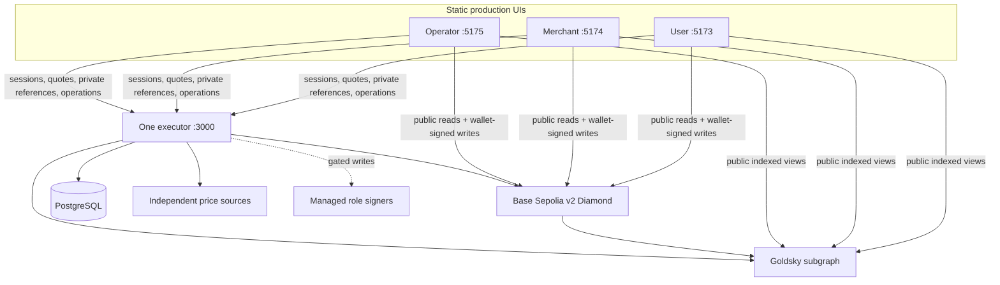

# P2PFlow Base Sepolia MVP

High-level as-built guide · 16 August 2026

> Release status: implementation and local verification candidate only. This guide does not claim a live Diamond, subgraph, executor, or UI. Mainnet is prohibited. Base Sepolia writes remain `OFF` until the coordinated release gate is approved.

## What was built

P2PFlow is a non-custodial, role-governed P2P USDC marketplace for Base Sepolia. Users buy or sell USDC against off-chain fiat settlement; approved merchants provide USDC liquidity and private payment channels; operators review entities, resolve disputes, and control bounded automation.



The Diamond is the custody and lifecycle authority. Goldsky is a public read projection, never a write authority. The executor is one process containing the HTTP API, confirmed scanner, scheduler, pricing, matching, recovery, jobs, outbox, retention, and reconciliation modules. The three UIs are static production builds with strict public runtime configuration and no local backend, mock data, demo success, or fixture fallback.

## BUY: user buys USDC

1. The user authenticates with a wallet and requests a quote. The executor requires independent `USDC/USD` and `USD/INR` quorum, rejects stale/outlier sources, and returns a round plus price bound.
2. The wallet creates a BUY order on the Diamond. Matching may assign a bounded set of eligible merchant channels only when the matching module is separately enabled.
3. One merchant accepts. The user may then reveal that merchant channel's private payment reference through the executor.
4. The user sends fiat off-chain and marks it sent on-chain.
5. The merchant confirms fiat receipt. The Diamond releases reserved merchant USDC to the user.
6. If settlement fails, explicit cancellation, expiry/recovery, or dispute paths preserve and release reservations exactly once.

## SELL: user sells USDC

1. The user creates an encrypted private payout reference and requests a quote.
2. The wallet sets an exact USDC allowance and creates a SELL order; the Diamond escrows the user's USDC.
3. The UI derives the order ID from the exact `OrderCreated` receipt and binds only the opaque payment-reference ID to that order through the executor.
4. An eligible merchant accepts, reveals the user's payout reference as a current party, sends fiat off-chain, and marks it sent.
5. The user confirms fiat receipt. The Diamond releases escrowed USDC to the merchant.
6. Cancellation, expiry, accepted-before-payment recovery, and dispute resolution are explicit state transitions; terminal custody cannot be released twice.

## Security boundaries

- Only official six-decimal Base Sepolia USDC (`0x036CbD53842c5426634e7929541eC2318f3dCF7e`) on chain ID `84532` is accepted in a shared deployment. Chain ID, bytecode, facets/selectors, protocol/storage identity, initialization receipts, roles, and manifest digests are checked by a read-only preflight.
- Owner plus seven application roles are mutually distinct. Executor pricing, matching, and recovery use separate managed signer references and exact exclusive roles; raw private keys and exposed prior identities are rejected.
- Browser authentication uses wallet nonces, an HttpOnly cookie, exact Origin checks, and rotating memory-only CSRF. The executor rechecks current wallet/role for privileged actions.
- UPI/payment values are AES-GCM encrypted, disclosed only to current parties/operators, memory-only in browsers, absent from URLs/chain/subgraph/logs, and purged after approved retention with an irreversible deletion tombstone.
- Wallet writes arm a non-PII, integrity-bound recovery journal before submission. Unknown hashes stay blocked. Known transactions require exact calldata/receipt/event/state plus 12 canonical confirmations before cleanup.
- Automation starts `OFF`. `SHADOW` executes reads and simulation without reservation, signing, nonce allocation, or broadcast. `ENABLED` requires all governance, signer, review, shadow, backup, alert, and rollback gates.

## Deployment prerequisites

Before a separately authorized Base Sepolia deployment or any write enablement:

1. Approve Q-1–Q-8: signer/roles; hosting/database/alerts; named price providers/thresholds; caps; safety durations; private fields/key ownership/retention; independent reviewer/governance; executor remote/PR policy.
2. Provision replacement managed identities. Permanently denylist every exposed or prior development identity. Keep owner and all seven roles distinct.
3. Pass clean CI in all six repositories, canonical package/digest parity, real PostgreSQL tests, local BUY/SELL/dispute/recovery E2E, privacy/bundle/image scans, and container validation.
4. Obtain independent contract and frozen-diff review with no open finding. Rehearse backup/restore, `OFF` drain, pause, image/database rollback, signer rotation, transaction uncertainty, and privacy incident response.
5. Produce a fresh reviewed v2 manifest through the separately authorized process, then run the read-only Base Sepolia preflight. The fresh Diamond must still be paused.
6. Deploy the exact canonical Goldsky subgraph from the reviewed address/start block; verify `_meta` height/errors and manifest/ABI digest.
7. Start exactly one executor and PostgreSQL with all modes `OFF`; serve one strict runtime document to all three static UIs.
8. Run and independently approve a representative shadow window. Only an explicitly named operator may later unpause or enable one module at a time.

## Local production-build verification

Use Node 24.18.0 and npm 11.16.0. From each repository, run `npm ci --no-audit --no-fund` and its `npm run verify`. The coordinated workspace additionally runs:

```sh
cd p2pflow-smart-contract
npm run verify:workspace
npm run verify:coordinated
npm run test:system
```

Run executor PostgreSQL coverage against an isolated disposable database:

```sh
cd p2pflow-executor
EXECUTOR_TEST_DATABASE_URL=postgresql://isolated-test-database \
  npm run test:postgres
```

After a reviewed runtime document and its real dependencies are available, serve the already verified production builds on loopback:

```sh
# user
npm run preview -- --host 127.0.0.1 --port 5173
# merchant
npm run preview -- --host 127.0.0.1 --port 5174
# operator
npm run preview -- --host 127.0.0.1 --port 5175
```

Expected local entry points after those processes are actually started are `http://127.0.0.1:5173`, `:5174`, and `:5175`; executor health is `http://127.0.0.1:3000/health/live` and `/health/ready`. These are loopback conventions, not claimed running services or production URLs.

## Manual Base Sepolia smoke sequence

Use separate funded test wallets for user, merchant, and each operator role, official Base Sepolia USDC, and the reviewed release record. Never use a prohibited signer.

1. With writes `OFF`, load all UIs; confirm the same chain, Diamond, package/manifest digest, subgraph height, and no fixture/demo surface. Confirm unsafe runtime data fails closed.
2. Register the merchant with stake; independently approve it in the operator UI; create and bind an encrypted UPI channel; approve the channel; deposit liquidity; set active capacity.
3. Complete BUY: user obtains a live quote and creates an order; matching assigns; merchant accepts; user reveals merchant payment reference, records fiat sent, merchant confirms receipt; verify final user/merchant balances, reservation release, subgraph projection, audit, and notification after 12 confirmations.
4. Complete SELL: user creates encrypted payout reference, exact allowance, and order; verify receipt-derived ID/binding; matching assigns; merchant accepts/reveals reference and records fiat sent; user confirms; verify escrow release and final projections after 12 confirmations.
5. Exercise one cancel/expiry path and one dispute/resolution path; prove each reservation/escrow is released once and private disclosure closes in terminal state.
6. In the operator UI review operations health, price evidence, jobs/outbox, transaction attempts, audit/evidence references, modes, merchant/channel/order state, Graph lag, and canonical cursor.
7. Restart the one executor and replay the confirmed overlap; verify no duplicate assignment, reservation, notification, bind, or financial write. Test a shallow reorg/uncertain receipt in the approved harness, not by creating ambiguous live transfers.
8. Return all automation to `OFF`, drain the write fence, and record commits, addresses/endpoints, blocks/receipts, digests, results, operator, reviewer, and UTC times without secrets or plaintext payment values.

Detailed architecture, release, and incident procedures are under `docs/architecture`, `docs/release`, and `docs/runbooks`.
