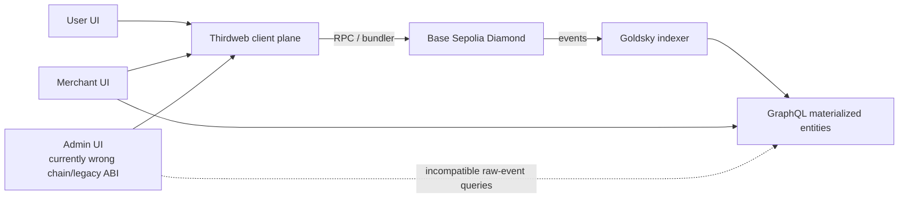
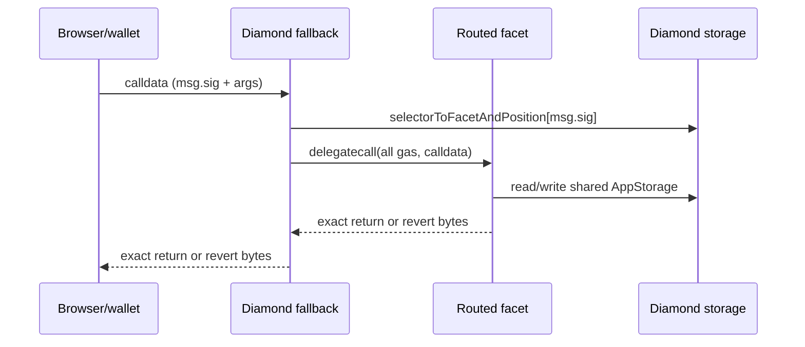
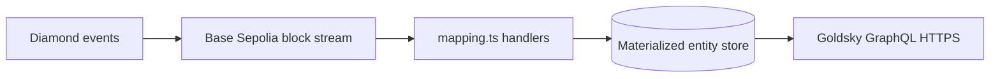

# P2PFlow Complete Smart Contract and UI Network Architecture

Generated 2026-07-29 UTC. Companion source for `P2PFlow_Complete_Architecture_2026-07-29.pdf`.

> Security: endpoint examples are redacted patterns. No `.env` value, private key, secret, or literal client identifier is included.

## Executive finding

There are two incompatible truth layers: the checked-in Solidity deploys **5 facets / 36 routed selectors**, while the active Base Sepolia Diamond exposes **6 facets / 63 routed selectors**. The active ABI also contains `init(...)`, but it is not routed by the live loupe. Exact source AppStorage is documented below; it must not be assumed to describe the live extended OrderFacet generation.

| Repository | Base commit | Evidence |
| --- | --- | --- |
| p2pflow-smart-contract | 6823a7a | Solidity source, artifacts, deploy/upgrade scripts |
| p2pflow-subgraph | 157207a | Active Base Sepolia manifest, ABI, schema, mappings |
| p2pflow-admin-ui | 142fba4 | Admin React/Vite client |
| p2pflow-merchant-ui | 13264f1 | Merchant React/Vite client |
| p2pflow-user-ui | 3f64def | User React/Vite client |

## System context

## Live deployment

| Facet | Address | Selector count | Functions |
| --- | --- | --- | --- |
| DiamondCutFacet | 0x13E3B3C63362B1cad5430c3745dC96130E7a5117 | 1 | diamondCut |
| DiamondLoupeFacet | 0x3D50E8DF96e7F43a8570A9e54C42F8b559fffB58 | 5 | facetAddress, facetAddresses, facetFunctionSelectors, facets, supportsInterface |
| OwnershipFacet | 0x2c63a6234D1a587D7b160FF96fF703c1097f7b30 | 2 | owner, transferOwnership |
| ConfigFacet | 0xcF9510e42511014FaB632238Dbf5250562C61D83 | 15 | addEligibleMerchant, clearEligibleMerchants, getChannelLimitDefaults, getConfig, getEligibleMerchants, getOrderPricing, isEligibleMerchant, pausePlatform, removeEligibleMerchant, setDefaultChannelLimits, setDisputeWindow, setMinMerchantStake, setOrderPricing, transferPlatformAdmin, unpausePlatform |
| MerchantFacet | 0x2C1e028064c18aD316Fa8Fa69d1B328cC219E97D | 24 | addPaymentChannel, approveChannel, approveMerchantUnstake, blacklistMerchant, clearMerchantDispute, depositStake, getAllMerchants, getChannel, getChannelLimits, getMerchant, getMerchantChannels, getMyChannels, getMyProfile, getPendingChannels, goOffline, goOnline, migrateAndTerminate, registerMerchant, rejectChannel, rejectMerchantUnstake, setMerchantDisputed, setPaymentChannelActive, setPaymentChannelInactive, withdrawStake |
| OrderFacet | 0xCCA73B72b83FDccfBFe4294224c32ccc305df4Fb | 16 | acceptOrder, cancelOrder, confirmPayment, createBuyOrder, createSellOrder, getAssignedMerchants, getChannelFiat, getMerchantBalances, getMerchantOrders, getOrder, getOrderIds, getUserOrders, markPaymentSent, raiseDispute, resolveDispute, settleOrder |

Chain `84532`; Diamond `0xF40AD901CCfB5E5EdC5162D6Ac7DDd5Ed5899F3A`; active subgraph start block `44359818`.

## Diamond runtime and upgrade flow

The Diamond owner alone calls `diamondCut`. Add/Replace/Remove mutate routing with swap-and-pop, emit `DiamondCut`, and may delegatecall an initializer.

## Checked-in contract enums

| Enum | Member | Numeric value | Meaning |
| --- | --- | --- | --- |
| MerchantAccountStatus | ACTIVE | 0 | Registered/operational account state |
| MerchantAccountStatus | INACTIVE | 1 | Unstake workflow state |
| MerchantAccountStatus | BLACKLISTED | 2 | Administrative terminal restriction; no unblacklist API |
| MerchantAccountStatus | DISPUTED | 3 | Administrative dispute restriction |
| MerchantAvailability | ONLINE | 0 | Merchant available for matching |
| MerchantAvailability | OFFLINE | 1 | Merchant unavailable |
| ChannelStatus | PENDING | 0 | Awaiting review |
| ChannelStatus | APPROVED | 1 | Approved channel |
| ChannelStatus | REJECTED | 2 | Rejected; duplicate key freed |
| ChannelStatus | TERMINATED | 3 | Migrated/closed |
| ChannelAvailability | ACTIVE | 0 | Channel enabled |
| ChannelAvailability | INACTIVE | 1 | Channel disabled |
| FacetCutAction | Add | 0 | Register previously absent selectors |
| FacetCutAction | Replace | 1 | Move existing selectors to a new facet |
| FacetCutAction | Remove | 2 | Delete selector routes; facet address must be zero |

## Live-only order/dispute enums

These values are reconstructed from the active mapping/schema; the corresponding Solidity declarations are absent from the source repository.

| Enum | Member | Numeric value | Meaning |
| --- | --- | --- | --- |
| OrderType | BUY | 0 | Buy USDC order; mapping/schema interpretation |
| OrderType | SELL | 1 | Sell USDC order; mapping/schema interpretation |
| OrderStatus | CREATED | 0 | Created and awaiting acceptance |
| OrderStatus | ACCEPTED | 1 | Merchant/channel accepted |
| OrderStatus | PAID | 2 | Payment marked/confirmed |
| OrderStatus | COMPLETED | 3 | Settlement completed |
| OrderStatus | CANCELLED | 4 | Cancelled |
| DisputeStatus | NONE | 0 | No active dispute |
| DisputeStatus | OPEN | 1 | Dispute raised |
| DisputeStatus | SETTLED | 2 | Dispute/risk settled |
| DisputeResult | NONE | 0 | No result |
| DisputeResult | USER_WINS | 1 | Resolved for user |
| DisputeResult | MERCHANT_WINS | 2 | Resolved for merchant |

## Checked-in structs

| Struct | Fields in declaration order |
| --- | --- |
| Merchant | wallet:address; accountStatus:enum; availability:enum; usdcLiquidity:uint256; unstakePending:bool; unstakeRequestedAmount:uint256; telegramUsername:string; registeredAt:uint256; channelIds:bytes32[] |
| PaymentChannel | channelId:bytes32; merchant:address; bankName:string; accountLast4:string; upiId:string; label:string; status:enum; availability:enum; fiatBalance:uint256; appliedAt:uint256; reviewedAt:uint256 |
| PlatformConfig | admin:address; usdcToken:address; paused:bool; minMerchantStakeUsdc:uint256; initialized:bool |
| AppStorage | config; merchants mapping; merchantList; channels mapping; channelDuplicateGuard mapping; _reentrancyStatus |
| FacetCut | facetAddress:address; action:FacetCutAction; functionSelectors:bytes4[] |
| Facet | facetAddress:address; functionSelectors:bytes4[] |
| FacetAddressAndPosition | facetAddress:address; functionSelectorPosition:uint96 |
| FacetFunctionSelectors | functionSelectors:bytes4[]; facetAddressPosition:uint256 |
| DiamondStorage | selectorToFacetAndPosition mapping; facetFunctionSelectors mapping; facetAddresses array; supportedInterfaces mapping; contractOwner |

## Active ABI tuple evolution

| Tuple | Active fields | Difference |
| --- | --- | --- |
| PlatformConfig | admin; usdcToken; paused; minMerchantStakeUsdc; initialized | Same five fields as checked-in source |
| Merchant | Source 9 fields + reservedUsdc + riskUsdc | Two active-ABI trailing additions |
| PaymentChannel | Source 11 fields + __deprecated_dailyLimitUsdc; __deprecated_monthlyLimitUsdc; dailyVolumeUsed; dailyWindowStart; monthlyVolumeUsed; monthlyWindowStart; reservedFiat | Seven active-ABI trailing additions |
| Order | orderId; orderType; status; user; merchant; channelId; usdcAmount; fiatAmount; price; createdAt; acceptedAt; paidAt; completedAt; cancelledAt; disputeExpiresAt; disputeStatus; disputeResolver; disputeResult; assignedMerchants; riskReleased; orderNumber | 21-field live ABI tuple; Solidity declaration absent from source repo |

## Exact checked-in AppStorage

| Slot | Field | Encoding |
| --- | --- | --- |
| 0 | config.admin | address at byte offset 0 |
| 1 | config.usdcToken + config.paused | address offset 0; bool offset 20 |
| 2 | config.minMerchantStakeUsdc | uint256 |
| 3 | config.initialized | bool |
| 4 | merchants | mapping(address => Merchant) seed |
| 5 | merchantList | dynamic array length; data at keccak256(5) |
| 6 | channels | mapping(bytes32 => PaymentChannel) seed |
| 7 | channelDuplicateGuard | mapping(bytes32 => bool) seed |
| 8 | _reentrancyStatus | uint256: 1 not-entered; 2 entered |

Diamond routing storage begins at `0xc8fcad8db84d3cc18b4c41d551ea0ee66dd599cde068d998e57d5e09332c131c` and contains selector/facet maps, facetAddresses, interface support, and contractOwner.

**Upgrade hazard:** a prior layout placed merchants/merchantList/channels/duplicateGuard at slots 3/4/5/6. Adding nested `config.initialized` shifted these roots to 4/5/6/7. Do not cross-upgrade without migration.

## Checked-in source functions: 36 routed selectors

| Facet | Selector | Signature | Mutability | Access | Behavior |
| --- | --- | --- | --- | --- | --- |
| DiamondCutFacet | 0x1f931c1c | diamondCut((address,uint8,bytes4[])[],address,bytes) | nonpayable | Diamond owner | Add/replace/remove selector routes; optional initializer delegatecall. |
| DiamondLoupeFacet | 0xcdffacc6 | facetAddress(bytes4) | view | Permissionless view | Resolve selector to implementation address. |
| DiamondLoupeFacet | 0x52ef6b2c | facetAddresses() | view | Permissionless view | Return all registered facet addresses. |
| DiamondLoupeFacet | 0xadfca15e | facetFunctionSelectors(address) | view | Permissionless view | Return selectors routed to one facet. |
| DiamondLoupeFacet | 0x7a0ed627 | facets() | view | Permissionless view | Return every facet address and selector array. |
| DiamondLoupeFacet | 0x01ffc9a7 | supportsInterface(bytes4) | view | Permissionless view | Read ERC-165 support mapping. |
| OwnershipFacet | 0x8da5cb5b | owner() | view | Permissionless view | Read Diamond contract owner. |
| OwnershipFacet | 0xf2fde38b | transferOwnership(address) | nonpayable | Diamond owner | Write Diamond owner; zero address is permitted. |
| ConfigFacet | 0xc3f909d4 | getConfig() | view | Permissionless view | Return PlatformConfig. |
| ConfigFacet | 0x6b78c29b | pausePlatform() | nonpayable | Platform admin | Set paused=true and emit PlatformPaused. |
| ConfigFacet | 0x64ec2ceb | setMinMerchantStake(uint256) | nonpayable | Platform admin | Replace minimum raw USDC stake. |
| ConfigFacet | 0x3397d9a2 | transferPlatformAdmin(address) | nonpayable | Platform admin | Replace business admin; rejects zero address. |
| ConfigFacet | 0x1a9ba7eb | unpausePlatform() | nonpayable | Platform admin | Set paused=false and emit PlatformUnpaused. |
| MerchantFacet | 0x1fee2a96 | addPaymentChannel(string,string,string,string) | nonpayable | Active merchant; notPaused | Normalize/guard bank key; create PENDING/INACTIVE channel. |
| MerchantFacet | 0x3d58ff4a | approveChannel(bytes32) | nonpayable | Platform admin | PENDING -> APPROVED/ACTIVE; set reviewedAt. |
| MerchantFacet | 0xbb634d55 | approveMerchantUnstake(address) | nonpayable | Platform admin; nonReentrant | Clear request; transfer USDC out; restore ACTIVE/OFFLINE. |
| MerchantFacet | 0x30321dcc | blacklistMerchant(address) | nonpayable | Platform admin | Cancel request; set BLACKLISTED/OFFLINE. |
| MerchantFacet | 0xd91b0a8d | clearMerchantDispute(address) | nonpayable | Platform admin | DISPUTED -> ACTIVE; stays OFFLINE. |
| MerchantFacet | 0xcb82cc8f | depositStake(uint256) | nonpayable | Merchant; notPaused; nonReentrant | Transfer USDC in and increase tracked liquidity. |
| MerchantFacet | 0x8ce2df51 | getAllMerchants() | view | Permissionless view | Return merchantList addresses. |
| MerchantFacet | 0x831c2b82 | getChannel(bytes32) | view | Permissionless view | Return channel by ID. |
| MerchantFacet | 0xb2734eaf | getMerchant(address) | view | Permissionless view | Return Merchant by wallet. |
| MerchantFacet | 0xb4de411c | getMerchantChannels(address) | view | Permissionless view | Materialize all channels for wallet. |
| MerchantFacet | 0xae180328 | getMyChannels() | view | Permissionless view | Self-call getMerchantChannels(msg.sender). |
| MerchantFacet | 0x21527e50 | getMyProfile() | view | Permissionless view | Return caller Merchant. |
| MerchantFacet | 0x8307d08b | getPendingChannels() | view | Permissionless view | Two-pass scan of all merchants/channels; O(total channels). |
| MerchantFacet | 0xa6485ccd | goOffline() | nonpayable | Registered merchant | Set OFFLINE. |
| MerchantFacet | 0x6e5b676b | goOnline() | nonpayable | Active merchant; notPaused | Require ACTIVE and current minimum; set ONLINE. |
| MerchantFacet | 0x0586296c | migrateAndTerminate(bytes32,bytes32) | nonpayable | Owner merchant; notPaused | Move fiatBalance; terminate source; free duplicate key. |
| MerchantFacet | 0xb00c52b0 | registerMerchant(uint256,string) | nonpayable | Public; notPaused; nonReentrant | Transfer stake in; initialize Merchant; append merchantList. |
| MerchantFacet | 0x38a9f5df | rejectChannel(bytes32) | nonpayable | Platform admin | PENDING -> REJECTED/INACTIVE; free duplicate key. |
| MerchantFacet | 0x66d3b61c | rejectMerchantUnstake(address) | nonpayable | Platform admin | Clear request; restore ACTIVE; stays OFFLINE. |
| MerchantFacet | 0x8e0540de | setMerchantDisputed(address) | nonpayable | Platform admin | ACTIVE -> DISPUTED/OFFLINE. |
| MerchantFacet | 0xb7889c93 | setPaymentChannelActive(bytes32) | nonpayable | Owner merchant; notPaused | Approved caller-owned channel -> ACTIVE. |
| MerchantFacet | 0x1dcad144 | setPaymentChannelInactive(bytes32) | nonpayable | Owner merchant | Approved caller-owned channel -> INACTIVE. |
| MerchantFacet | 0xbed9d861 | withdrawStake() | nonpayable | Registered merchant | Request full unstake; set INACTIVE/OFFLINE; no token transfer. |

## Live routed functions: 63 selectors

| Facet | Selector | Signature | Mutability | Outputs |
| --- | --- | --- | --- | --- |
| DiamondCutFacet | 0x1f931c1c | diamondCut((address,uint8,bytes4[])[],address,bytes) | nonpayable | - |
| DiamondLoupeFacet | 0xcdffacc6 | facetAddress(bytes4) | view | facetAddress_:address |
| DiamondLoupeFacet | 0x52ef6b2c | facetAddresses() | view | facetAddresses_:address[] |
| DiamondLoupeFacet | 0xadfca15e | facetFunctionSelectors(address) | view | facetFunctionSelectors_:bytes4[] |
| DiamondLoupeFacet | 0x7a0ed627 | facets() | view | facets_:(address,bytes4[])[] |
| DiamondLoupeFacet | 0x01ffc9a7 | supportsInterface(bytes4) | view | bool |
| OwnershipFacet | 0x8da5cb5b | owner() | view | owner_:address |
| OwnershipFacet | 0xf2fde38b | transferOwnership(address) | nonpayable | - |
| ConfigFacet | 0x09ec0f24 | addEligibleMerchant(address) | nonpayable | - |
| ConfigFacet | 0x3551ac6c | clearEligibleMerchants() | nonpayable | - |
| ConfigFacet | 0xbf284d84 | getChannelLimitDefaults() | view | dailyUsdc:uint256, monthlyUsdc:uint256 |
| ConfigFacet | 0xc3f909d4 | getConfig() | view | (address,address,bool,uint256,bool) |
| ConfigFacet | 0x2f583d4b | getEligibleMerchants() | view | address[] |
| ConfigFacet | 0xab211bd9 | getOrderPricing() | view | buyPriceInrPerUsdc:uint256, sellPriceInrPerUsdc:uint256, disputeWindowSeconds:uint256 |
| ConfigFacet | 0x903eadc0 | isEligibleMerchant(address) | view | bool |
| ConfigFacet | 0x6b78c29b | pausePlatform() | nonpayable | - |
| ConfigFacet | 0x6a96f84d | removeEligibleMerchant(address) | nonpayable | - |
| ConfigFacet | 0x892b8a9c | setDefaultChannelLimits(uint256,uint256) | nonpayable | - |
| ConfigFacet | 0x332226d0 | setDisputeWindow(uint256) | nonpayable | - |
| ConfigFacet | 0x64ec2ceb | setMinMerchantStake(uint256) | nonpayable | - |
| ConfigFacet | 0xf7260e6e | setOrderPricing(uint256,uint256) | nonpayable | - |
| ConfigFacet | 0x3397d9a2 | transferPlatformAdmin(address) | nonpayable | - |
| ConfigFacet | 0x1a9ba7eb | unpausePlatform() | nonpayable | - |
| MerchantFacet | 0x1fee2a96 | addPaymentChannel(string,string,string,string) | nonpayable | - |
| MerchantFacet | 0x3d58ff4a | approveChannel(bytes32) | nonpayable | - |
| MerchantFacet | 0xbb634d55 | approveMerchantUnstake(address) | nonpayable | - |
| MerchantFacet | 0x30321dcc | blacklistMerchant(address) | nonpayable | - |
| MerchantFacet | 0xd91b0a8d | clearMerchantDispute(address) | nonpayable | - |
| MerchantFacet | 0xcb82cc8f | depositStake(uint256) | nonpayable | - |
| MerchantFacet | 0x8ce2df51 | getAllMerchants() | view | address[] |
| MerchantFacet | 0x831c2b82 | getChannel(bytes32) | view | (bytes32,address,string,string,string,string,uint8,uint8,uint256,uint256,uint256,uint256,uint256,uint256,uint256,uint256,uint256,uint256) |
| MerchantFacet | 0x5b020623 | getChannelLimits(bytes32) | view | dailyLimitUsdc:uint256, dailyVolumeUsed:uint256, dailyResetsAt:uint256, monthlyLimitUsdc:uint256, monthlyVolumeUsed:uint256, monthlyResetsAt:uint256 |
| MerchantFacet | 0xb2734eaf | getMerchant(address) | view | (address,uint8,uint8,uint256,bool,uint256,string,uint256,bytes32[],uint256,uint256) |
| MerchantFacet | 0xb4de411c | getMerchantChannels(address) | view | (bytes32,address,string,string,string,string,uint8,uint8,uint256,uint256,uint256,uint256,uint256,uint256,uint256,uint256,uint256,uint256)[] |
| MerchantFacet | 0xae180328 | getMyChannels() | view | (bytes32,address,string,string,string,string,uint8,uint8,uint256,uint256,uint256,uint256,uint256,uint256,uint256,uint256,uint256,uint256)[] |
| MerchantFacet | 0x21527e50 | getMyProfile() | view | (address,uint8,uint8,uint256,bool,uint256,string,uint256,bytes32[],uint256,uint256) |
| MerchantFacet | 0x8307d08b | getPendingChannels() | view | bytes32[] |
| MerchantFacet | 0xa6485ccd | goOffline() | nonpayable | - |
| MerchantFacet | 0x6e5b676b | goOnline() | nonpayable | - |
| MerchantFacet | 0x0586296c | migrateAndTerminate(bytes32,bytes32) | nonpayable | - |
| MerchantFacet | 0xb00c52b0 | registerMerchant(uint256,string) | nonpayable | - |
| MerchantFacet | 0x38a9f5df | rejectChannel(bytes32) | nonpayable | - |
| MerchantFacet | 0x66d3b61c | rejectMerchantUnstake(address) | nonpayable | - |
| MerchantFacet | 0x8e0540de | setMerchantDisputed(address) | nonpayable | - |
| MerchantFacet | 0xb7889c93 | setPaymentChannelActive(bytes32) | nonpayable | - |
| MerchantFacet | 0x1dcad144 | setPaymentChannelInactive(bytes32) | nonpayable | - |
| MerchantFacet | 0xbed9d861 | withdrawStake() | nonpayable | - |
| OrderFacet | 0xd6039a61 | acceptOrder(bytes32,bytes32) | nonpayable | - |
| OrderFacet | 0x7489ec23 | cancelOrder(bytes32) | nonpayable | - |
| OrderFacet | 0x3611d088 | confirmPayment(bytes32) | nonpayable | - |
| OrderFacet | 0x84ce1bfc | createBuyOrder(uint256) | nonpayable | orderId:bytes32, assigned:address[] |
| OrderFacet | 0x3c81c4b8 | createSellOrder(uint256) | nonpayable | orderId:bytes32, assigned:address[] |
| OrderFacet | 0x7372f2f1 | getAssignedMerchants(bytes32) | view | address[] |
| OrderFacet | 0x1e3e148d | getChannelFiat(bytes32) | view | totalFiat:uint256, reservedFiat:uint256, unreservedFiat:uint256 |
| OrderFacet | 0xeb0817c5 | getMerchantBalances(address) | view | totalUsdc:uint256, reservedUsdc:uint256, riskUsdc:uint256, unreservedUsdc:uint256 |
| OrderFacet | 0x4ebac543 | getMerchantOrders(address) | view | bytes32[] |
| OrderFacet | 0x5778472a | getOrder(bytes32) | view | (bytes32,uint8,uint8,address,address,bytes32,uint256,uint256,uint256,uint256,uint256,uint256,uint256,uint256,uint256,uint8,address,uint8,address[],bool,uint256) |
| OrderFacet | 0x9e0acf8f | getOrderIds() | view | bytes32[] |
| OrderFacet | 0x63c69f08 | getUserOrders(address) | view | bytes32[] |
| OrderFacet | 0x3af1b286 | markPaymentSent(bytes32) | nonpayable | - |
| OrderFacet | 0xe14f5b7d | raiseDispute(bytes32) | nonpayable | - |
| OrderFacet | 0xb641237c | resolveDispute(bytes32,uint8) | nonpayable | - |
| OrderFacet | 0x49085d8c | settleOrder(bytes32) | nonpayable | - |

## Active ABI errors

| Error | Signature |
| --- | --- |
| InitializationFunctionReverted | InitializationFunctionReverted(address,bytes) |
| SafeERC20FailedOperation | SafeERC20FailedOperation(address) |

## Active ABI events: 36

| Domain | Event | Indexed fields | Data fields |
| --- | --- | --- | --- |
| Config | DefaultChannelLimitsUpdated | - | dailyUsdc:uint256, monthlyUsdc:uint256 |
| Config | DisputeWindowUpdated | - | disputeWindowSeconds:uint256 |
| Config | EligibleMerchantAdded | merchant:address | - |
| Config | EligibleMerchantRemoved | merchant:address | - |
| Config | EligibleMerchantsCleared | - | - |
| Config | MinMerchantStakeUpdated | - | newMinStakeUsdc:uint256 |
| Config | OrderPricingUpdated | - | buyPriceInrPerUsdc:uint256, sellPriceInrPerUsdc:uint256 |
| Config | PlatformAdminTransferred | previousAdmin:address, newAdmin:address | - |
| Config | PlatformPaused | by:address | - |
| Config | PlatformUnpaused | by:address | - |
| Diamond core | DiamondCut | - | _diamondCut:(address,uint8,bytes4[])[], _init:address, _calldata:bytes |
| Diamond core | OwnershipTransferred | previousOwner:address, newOwner:address | - |
| Merchant | AvailabilityChanged | wallet:address | availability:uint8 |
| Merchant | ChannelAdded | channelId:bytes32, wallet:address | - |
| Merchant | ChannelApproved | channelId:bytes32, wallet:address | - |
| Merchant | ChannelAvailabilityChanged | channelId:bytes32, wallet:address | availability:uint8 |
| Merchant | ChannelRejected | channelId:bytes32, wallet:address | - |
| Merchant | ChannelTerminated | channelId:bytes32, wallet:address | - |
| Merchant | FiatMigrated | fromChannelId:bytes32, toChannelId:bytes32, wallet:address | amount:uint256 |
| Merchant | MerchantBlacklisted | wallet:address | - |
| Merchant | MerchantDisputeCleared | wallet:address | - |
| Merchant | MerchantDisputed | wallet:address | - |
| Merchant | MerchantRegistered | wallet:address | usdcLiquidity:uint256 |
| Merchant | UnstakeRequestRejected | wallet:address | - |
| Merchant | UnstakeRequested | wallet:address | amount:uint256 |
| Merchant | UsdcDeposited | wallet:address | amount:uint256 |
| Merchant | UsdcWithdrawn | wallet:address | amount:uint256 |
| Order | DisputeRaised | orderId:bytes32, by:address | raisedAt:uint256 |
| Order | DisputeResolved | orderId:bytes32, resolver:address | result:uint8, resolvedAt:uint256 |
| Order | OrderAccepted | orderId:bytes32, merchant:address, channelId:bytes32 | acceptedAt:uint256 |
| Order | OrderAssigned | orderId:bytes32, merchant:address | assignedAt:uint256 |
| Order | OrderCancelled | orderId:bytes32, by:address | cancelledAt:uint256 |
| Order | OrderCompleted | orderId:bytes32, merchant:address | completedAt:uint256, disputeExpiresAt:uint256 |
| Order | OrderCreated | orderId:bytes32, user:address | orderType:uint8, usdcAmount:uint256, fiatAmount:uint256, price:uint256, createdAt:uint256, orderNumber:uint256 |
| Order | OrderPaid | orderId:bytes32, by:address | paidAt:uint256 |
| Order | OrderRiskReleased | orderId:bytes32, merchant:address | usdcAmount:uint256 |

## Subgraph

The active manifest indexes `0xF40AD901CCfB5E5EdC5162D6Ac7DDd5Ed5899F3A` on Base Sepolia from block `44359818`. It exposes materialized entities; it is eventually consistent after transaction receipts. The admin's raw-event queries are incompatible with this schema.

### GraphQL schema enums

| Enum | Members |
| --- | --- |
| MerchantAccountStatus | ACTIVE, INACTIVE, BLACKLISTED, DISPUTED |
| MerchantAvailability | ONLINE, OFFLINE |
| ChannelStatus | PENDING, APPROVED, REJECTED, TERMINATED |
| ChannelAvailability | ACTIVE, INACTIVE |
| MerchantActivityKind | REGISTERED, USDC_DEPOSITED, UNSTAKE_REQUESTED, UNSTAKE_REJECTED, USDC_WITHDRAWN, AVAILABILITY_ONLINE, AVAILABILITY_OFFLINE |
| ChannelEventKind | ADDED, APPROVED, REJECTED, AVAILABILITY_CHANGED, TERMINATED |
| PlatformEventKind | PAUSED, UNPAUSED, MIN_STAKE_UPDATED, ADMIN_TRANSFERRED, OWNERSHIP_TRANSFERRED, DIAMOND_CUT, DEFAULT_CHANNEL_LIMITS_UPDATED, ORDER_PRICING_UPDATED, DISPUTE_WINDOW_UPDATED, ELIGIBLE_MERCHANT_ADDED, ELIGIBLE_MERCHANT_REMOVED, ELIGIBLE_MERCHANTS_CLEARED |
| OrderType | BUY, SELL |
| OrderStatus | CREATED, ACCEPTED, PAID, COMPLETED, CANCELLED |
| DisputeStatus | NONE, OPEN, SETTLED |
| DisputeResult | NONE, USER_WINS, MERCHANT_WINS |
| OrderEventKind | CREATED, ASSIGNED, ACCEPTED, PAID, COMPLETED, CANCELLED, RISK_RELEASED, DISPUTE_RAISED, DISPUTE_RESOLVED |

### GraphQL entities

| Entity | Lifecycle | Fields/purpose |
| --- | --- | --- |
| Platform | Mutable singleton | id; admin; usdcToken; paused; minMerchantStakeUsdc; defaultChannelDailyLimitUsdc; defaultChannelMonthlyLimitUsdc; buyPriceInrPerUsdc; sellPriceInrPerUsdc; disputeWindowSeconds; eligibleMerchants; 12 merchant/channel counters; totalUsdcCustodied; lastUpdatedBlock; lastUpdatedTimestamp; events |
| Merchant | Mutable snapshot | id; wallet; telegramUsername; accountStatus; availability; usdcLiquidity; unstakePending; unstakeRequestedAmount; totalDeposited; totalWithdrawn; channelCount; activeChannelCount; reservedUsdc; riskUsdc; unreservedUsdc; registration provenance; blacklistedAt; disputedAt; freshness; derived relations |
| PaymentChannel | Mutable snapshot | id; channelId; merchant; bankName; accountLast4; upiId; label; status; availability; fiatBalance; reservedFiat; dailyVolumeUsed; dailyWindowStart; monthlyVolumeUsed; monthlyWindowStart; lifecycle/freshness; derived events/migrations |
| Order | Mutable snapshot | id; orderId; orderNumber; orderType; status; user; merchant; channel; usdcAmount; fiatAmount; price; lifecycle timestamps; disputeStatus/result/resolver/timestamps; riskReleased; provenance/freshness; assignments/events/dispute |
| OrderAssignment | Mutable relation | id=orderId\|\|merchant; order; merchant; merchantAddress; assignedAt; accepted; block; timestamp; txHash |
| Dispute | Mutable one-to-one | id=orderId; order; raisedBy; raisedAt; status; resolver; result; resolvedAt; block; timestamp; txHash |
| MerchantActivity | Immutable history | id=txHash\|logIndex; merchant; kind; optional amount; block; timestamp; txHash; logIndex |
| MerchantStatusChange | Immutable history | id; merchant; previousStatus; newStatus; block; timestamp; txHash; logIndex |
| ChannelEvent | Immutable history | id; channel; merchant; kind; optional availability; block; timestamp; txHash; logIndex |
| FiatMigration | Immutable history | id; merchant; fromChannel; toChannel; amount; block; timestamp; txHash; logIndex |
| PlatformEvent | Immutable history | id; platform; kind; optional actor/admin/owner/minimum/limits/pricing/window/eligibleMerchant fields; block; timestamp; txHash; logIndex |
| OrderEvent | Immutable history | id; order; kind; optional actor/merchant/usdcAmount/fiatAmount/disputeExpiresAt/disputeResult; block; timestamp; txHash; logIndex |

### Handler mutations and server-side RPC fan-out

| Event group | Mutations | Indexer views/event |
| --- | --- | --- |
| MerchantRegistered | Merchant; Platform counters/custody; MerchantActivity | 6 |
| USDC/unstake/status merchant events (8) | Merchant totals/status; Platform buckets/custody; activity/history | 4 or 6 each |
| ChannelAdded | PaymentChannel; merchant/platform counts; ChannelEvent | 7 |
| ChannelApproved / Rejected / Terminated | Channel refresh; status/active counters; ChannelEvent | 7 each |
| ChannelAvailabilityChanged | Availability and active counters; ChannelEvent | 0 or 4 |
| FiatMigrated | Refresh source/destination; immutable FiatMigration | 6 |
| Platform config/ownership/eligibility events (11) | Platform values/list; immutable PlatformEvent | 4 each |
| OrderCreated / Paid / Cancelled / DisputeRaised | Order/Dispute snapshots and OrderEvent | 0 |
| OrderAssigned | Assignment + defensive Merchant; OrderEvent | 0 or 2 |
| OrderAccepted / Completed | Order + assignment; merchant/channel refresh; OrderEvent | up to 5 |
| OrderRiskReleased / DisputeResolved | Risk/dispute state; merchant refresh; OrderEvent | up to 2 |

The manifest registers 35 of the ABI's 36 events. `DiamondCut` has no handler. Indexer enrichment calls are Goldsky-side RPC, not browser Thirdweb traffic.

## Endpoint catalog

| Class | Config/provider | Redacted URL pattern | Use |
| --- | --- | --- | --- |
| EVM RPC | Thirdweb default | https://84532.rpc.thirdweb.com/<client-id> | User/merchant JSON-RPC reads, preflight, broadcast and receipt polling. |
| Admin EVM RPC | Thirdweb or VITE_ALCHEMY_RPC_URL | https://11155111.rpc.thirdweb.com/<client-id> or <override> | Current admin chain is Ethereum Sepolia although its Diamond/subgraph values are Base. |
| Embedded wallet | Thirdweb in-app wallet | https://embedded-wallet.thirdweb.com | User/merchant login and account lifecycle; traffic is strategy/session-dependent. |
| Bundler | Thirdweb EIP-7702 | https://84532.bundler.thirdweb.com/v2 | User/merchant sponsored flow; dynamic preflight/status polling. Admin does not activate it. |
| Chain metadata | Thirdweb | https://api.thirdweb.com/v1/chains/<chain-id> | Conditional GET; approximately five-minute SDK cache. |
| Social profile | Thirdweb | https://social.thirdweb.com/v1/profiles/<wallet> | AccountName and AccountAvatar can independently issue two GETs. |
| Analytics | Thirdweb | https://c.thirdweb.com/event | Conditional connection and transaction lifecycle events. |
| Embedded auth | Thirdweb | https://embedded-wallet.thirdweb.com/api/2024-05-05/login/<strategy>?clientId=<redacted> | Email/passkey/OAuth login and callback; strategy-dependent. |
| Linked accounts | Thirdweb | https://embedded-wallet.thirdweb.com/api/2024-05-05/accounts | Bearer GET for connected in-app wallet profiles. |
| ENS resolver RPC | Thirdweb | https://1.rpc.thirdweb.com/<client-id> | Conditional Ethereum-mainnet reverse lookup; shared/cacheable. |
| Insight | Thirdweb | https://insight.thirdweb.com | Only when wallet modal asset/history views are opened. |
| Bridge | Thirdweb | https://bridge.thirdweb.com/v1/tokens?... | Conditional insufficient-funds/pay flow. |
| Subgraph | Goldsky GraphQL | https://api.goldsky.com/api/public/<project>/subgraphs/<name>/<tag>/gn | One POST per logical attempt; concrete public project path redacted. |
| User REST | VITE_APP_BASE_URL / VITE_APP_BASE_LIVE_URL | <configured base>/... | FAQ/auth paths use split environment names; credentials and wallet headers enabled. |
| Merchant REST | VITE_APP_BASE_URL | <configured base>/... | Client exists; no active consumer found. |
| Admin REST | VITE_APP_BASE_URL / VITE_APP_BASE_LIVE_URL | <configured base>/... | FAQ path active; split config can fall through to frontend origin without a proxy. |
| QR image | goQR image service | https://api.qrserver.com/v1/create-qr-code/?... | One image GET per uncached mount; encodes UPI ID and amount to a third party. |

Anything prefixed `VITE_` is browser-public. Server secrets must not be placed in `VITE_THIRDWEB_SECRET_KEY`, `VITE_APP_SECRET_KEY`, or any other Vite input.

## Request-count semantics

| Operation | Logical count | Transport/repetition |
| --- | --- | --- |
| One useReadContract | 1 logical eth_call | Often coalesced with same-tick calls into one JSON-RPC batch POST, maximum 100. |
| User useWalletBalance | 4 logical eth_call | balanceOf + name + symbol + decimals; normally one batch POST on a cold fetch. |
| Merchant USDC observer | 1 logical eth_call | Direct balanceOf(address), not the four-read metadata helper. |
| TanStack query success | 1 attempt | staleTime controls whether mount/focus/reconnect produces another execution. |
| TanStack query failure | Up to 4 attempts | Initial attempt plus retry:3 unless overridden; approximately 1/2/4-second backoff. |
| Subgraph helper query | 1 POST per attempt | Cold success = 1 POST; persistent failure can reach 4 POSTs for each key. |
| Contract write | No fixed HTTP count | May include pay preflight, simulation, wallet/delegation, bundler, broadcast and receipt polling. |
| React StrictMode dev | May replay mounts/effects | Same-key pending queries usually dedupe; raw effects and abort/restart fetches may duplicate. |
| Connected ConnectButton | Conditional provider calls | Native balance, chain metadata, two social profile GETs, ENS and analytics depend on state/cache. |

Formulas: subgraph cold success = Q POSTs; persistent failure = Q × 4 attempts. Wallet balance = 4 logical `eth_call` methods, normally 1 batch POST. Order route over T seconds = `1 + floor(T/6)` reads. Transaction transport count is dynamic.

## Admin UI call matrix

| Route | Cold logical calls | Calls | Caveat |
| --- | --- | --- | --- |
| /, /dashboard | 4 base eth_call + D getDispute | getPlatformStats; getOpenDisputes; getPendingApplications; getAdmins; then one getDispute per ID | Legacy selectors are absent live; failures can retry up to 4 attempts per query. |
| /transactions/all | 1 + on-demand | getPlatformStats mount; one getOrder for each newly submitted ID | No active polling. |
| /merchants | 2 base + N + U or M | Both lists mount; applications add N getChannelApplication + U getMerchant; active adds M getMerchant | Hidden-tab list still runs; legacy types/signatures are incompatible. |
| /payments-channels | Intended 1 + M GraphQL POST; then C eth_call | AllMerchants; one channels query/merchant; one getChannel/channel | First raw-event query fails active-schema validation up to 4 attempts, so M+C normally never starts. |
| /buy-sell-price | 2 eth_call | getMarketConfig + getOracleRate; Refresh repeats both | Functions absent from live selector map. |
| /faqs | 1 REST POST | POST /faq; search after 350 ms; category/page posts immediately | Create/update mutation + one refresh POST; delete one DELETE; Axios has no retry. |
| other routes | 0 application data calls | Header wallet UI / ComingSoon content | Connected wallet/provider discovery remains conditional network traffic. |

## Merchant UI call matrix

| Route/trigger | Cold logical calls | Calls | Caveat |
| --- | --- | --- | --- |
| Provider + connected guard | 2 subgraph POST on cold success | merchant(id) and merchant(id){channels...} in parallel | Persistent failure max 8 attempts. Dev StrictMode may send/abort/restart both. |
| Global connected observer | 1 balanceOf eth_call | USDC balanceOf(address), mounted across routes | staleTime 0; focus/reconnect/new observer can repeat; failure max 4 attempts. |
| / | Guard cache + N getChannel | One on-chain detail read per unique nonterminated channel | N same-tick calls normally share one batch POST; stale observers refetch. |
| /register | 1 allowance + 1 balance refetch; 1/2 writes | allowance; optional MAX_UINT approve; registerMerchant; explicit balance refetch | Approve waits for receipt; register resolves after broadcast under current provider nesting. |
| /account/overview | 0/1 shared channels POST + N eth_call | Guard key reused; one getChannel per rendered channel | Fresh cache adds 0 GraphQL; stale remount can add one POST. |
| /account/payment-channels | 0/1 shared POST + N eth_call | Same subgraph key; per-channel on-chain detail | Writes do not invalidate/refetch GraphQL or RPC state, so UI can remain stale. |
| /account/stake | Global balance only | Deposit/withdraw hooks exist, but current buttons are UI/toast only | No active stake transaction from this page in the snapshot. |
| /orders | 0 | Static sample data | No contract/subgraph calls or polling. |
| QR dialog | 1 external image GET | api.qrserver.com only after Accept then Scan | Browser cache-dependent; UPI ID and amount leave the app origin. |

## User UI call matrix

| Route/trigger | Cold logical calls | Calls | Caveat |
| --- | --- | --- | --- |
| / | 4 token eth_call + 1 config eth_call | useWalletBalance: balanceOf/name/symbol/decimals; getMarketConfig | Normally batched; getMarketConfig is absent live; staleTime 0 refetches. |
| /buy | 1 findBestMerchant eth_call on mount | Broken enabled placement queries (amount=0,type=0); Continue sends createBuyOrder | Can submit a stale merchant; multi-argument UI signature differs from live uint256-only call. |
| /sell | 1 merchant read; then 1 allowance + 1/2 writes | findBestMerchant; allowance; optional approve; createSellOrder | Approval may race create; multi-argument UI signature differs live. |
| /order?id= | 1 immediate + every 6 s | getOrder(orderId) while mounted | 10 scheduled reads/min + initial; focus/reconnect add. Missing ID still attempts due enabled bug. |
| /limits | 1 config eth_call + 1 REST POST | getMarketConfig and FAQ POST on mount | FAQ production once; dev StrictMode normally twice because raw effect has no dedupe/cancel. |
| /transactions | 0 current live calls | Order-ID/order helper hooks exist but are dormant | User UI has no subgraph client or active query. |
| wallet/auth | Session-dependent HTTPS | Embedded login; on FAQ 401: create-auth -> sign -> verify-auth | Original request is not retried; auth 401 can recursively re-enter interceptor. |

## Provider lifecycle and writes

User and merchant place ThirdwebProvider outside an inner default QueryClientProvider. Effective reads are stale immediately, retry three times, and refetch on mount/focus/reconnect. Normal provider-level receipt waiting and read invalidation are bypassed; most writes resolve after broadcast.

| Flow | Logical calls | Defect/recurrence |
| --- | --- | --- |
| Merchant connect guard | 2 GraphQL POSTs | Cold success 2; persistent failure 8 attempts; dev may abort/restart. |
| Merchant channel list | N getChannel eth_call | Usually one batch POST; stale remount/focus repeats N. |
| Merchant register | allowance + optional approve + register + balance refetch | Only approve explicitly waits; GraphQL/channel keys are not invalidated. |
| User balance | 4 token eth_call | Usually one batch POST; stale mount/focus/reconnect repeats. |
| User order | 1 + floor(T/6) getOrder | 10 scheduled reads/min after initial; wrong tx-hash-as-order-ID navigation. |
| User sell | allowance + optional approve + create | Approval can race create; UI ABI differs live. |

### Dormant / zero-call paths

Unconsumed user oracle/order-ID/session-key helpers, merchant stake/activity/meta/REST helpers, merchant static orders, and multiple admin legacy helpers produce zero current traffic. No UI uses WebSocket or SSE. A nominal 30-second subgraph-meta poll exists but is not mounted.

## Cross-layer gap register

| Severity | Area | Evidence/impact | Action |
| --- | --- | --- | --- |
| Critical | Source vs live Diamond | Source deploys 5 facets / 36 selectors; live Base Diamond exposes 6 facets / 63 selectors plus a non-routed init ABI entry. | Treat live ABI/storage generation as separate; obtain the exact deployed source and storage layout before upgrading. |
| Critical | AppStorage upgrade history | Adding nested config.initialized shifted mapping roots from 3/4/5/6 to 4/5/6/7. | Never upgrade across this layout without an explicit migration and verified old layout. |
| Critical | Admin chain | Admin labels Base but hardcodes Ethereum Sepolia chain 11155111 and ignores VITE_CHAIN_ID. | Point chain, RPC, Diamond, and subgraph to one deployment. |
| Critical | Admin ABI | Admin calls legacy functions/signatures absent from the live selector map. | Regenerate ABI and adapt each route to the deployed interface. |
| Critical | Admin GraphQL | UI queries raw event tables; active schema exposes materialized Merchant/PaymentChannel entities. | Rewrite queries to current schema or deploy a compatible subgraph. |
| Critical | User order signatures | UI uses multi-argument createBuy/createSell/raiseDispute and unavailable market/oracle/matching reads. | Reconcile UI hooks with the exact OrderFacet ABI. |
| High | Frontend secrets | VITE_THIRDWEB_SECRET_KEY / VITE_APP_SECRET_KEY names are read by browser code. | Anything prefixed VITE_ is public in the bundle; remove server secrets and rotate exposed credentials. |
| High | Tests vs source | Tests expect DORMANT and functions absent from MerchantFacet. | Bring tests and contract source back to a single protocol generation. |
| High | Upgrade script | Adds/replaces selectors only, never removes dropped selectors, and supplies no initializer. | Generate full cut diff and explicit migration initializer. |
| High | Custody escape hatches | ETH/direct ERC-20 can enter the Diamond but current source has no rescue path. | Add governed, audited recovery or prevent unintended transfers. |
| Medium | Unbounded view | getPendingChannels scans every merchant/channel twice. | Index pending IDs or page results. |
| High | Query provider nesting | User/merchant Thirdweb hooks use an inner default QueryClient, losing intended 60 s caching/receipt invalidation. | Put one QueryClient at the correct provider boundary and add lifecycle tests. |
| High | Order navigation ID | User buy/sell navigate with transaction hash, then call getOrder(bytes32) as if it were orderId. | Decode OrderCreated from receipt or return/persist the actual order ID. |
| High | Merchant post-write sync | Register/channel writes do not invalidate/refetch guard, subgraph, or channel-detail queries. | Wait for receipt, then poll indexer/invalidate exact keys with a bounded timeout. |
| High | User approval race | User sell approve and create can be broadcast without waiting for approval inclusion. | Wait for approval receipt before creating the order. |
| Medium | React Query enabled placement | Several hooks place enabled outside queryOptions, so it is ignored. | Move enabled into queryOptions and test disconnected/null-argument states. |
| Medium | REST configuration | FAQ endpoints and Axios base client use different VITE base names; 401 auth can recursively re-enter. | Use one server base, isolate auth client, add a retry guard, and retry the original request once. |
| Medium | Indexer gaps | DiamondCut is unhandled; reset timestamps are ignored; missing prerequisite entities can skip later handlers. | Add handler/schema tests, backfill rules, and explicit indexer health metrics. |

## Source references

| Area | Files |
| --- | --- |
| Diamond/storage | p2pflow-smart-contract/contracts/Diamond.sol; contracts/shared/AppStorage.sol; contracts/libraries/LibDiamond.sol |
| Facets/init/deploy | contracts/facets/*.sol; contracts/upgradeInitializers/DiamondInit.sol; scripts/deploy.js; scripts/upgrade.js |
| Live ABI/subgraph | p2pflow-subgraph/abis/Diamond.json; subgraph.yaml; schema.graphql; src/mapping.ts |
| Admin | p2pflow-admin-ui/src/hooks/useDiamond.js; useSubgraph.js; pages/** |
| Merchant | p2pflow-merchant-ui/src/hooks/useDiamond.js; useSubgraph.js; app/**; pages/** |
| User | p2pflow-user-ui/src/hooks/useDiamond.js; services/blockchain/**; pages/** |
