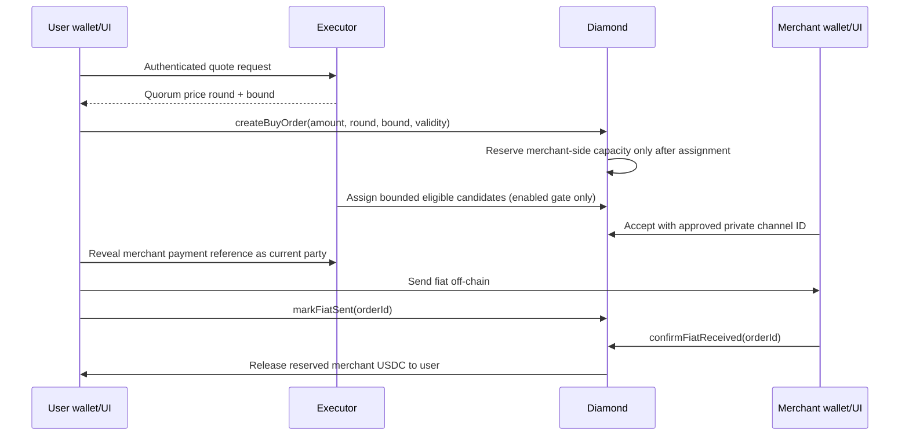
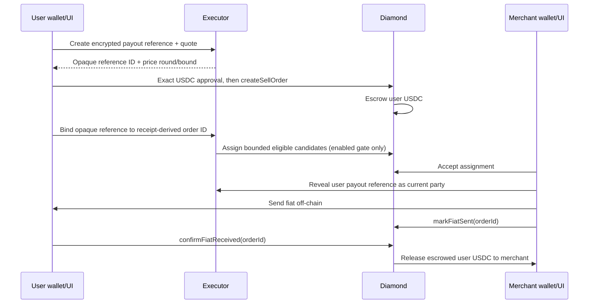

# P2PFlow Base Sepolia MVP — as-built architecture

Status: implementation-complete release candidate. No deployment is asserted by this document. Shared writes remain `OFF` and the fresh-Diamond contract gate requires `paused == true` until all release approvals pass.

## System topology

```mermaid
flowchart LR
  U[User static UI] -->|wallet reads/writes| D[Base Sepolia v2 Diamond]
  M[Merchant static UI] -->|wallet reads/writes| D
  A[Operator static UI] -->|role-gated wallet writes| D
  U -->|session, quote, private reference| E[Single executor process]
  M -->|session, private channel/order reference| E
  A -->|operations, audit, mode control| E
  U -->|public projections| G[Goldsky subgraph]
  M -->|public projections| G
  A -->|public projections| G
  D -->|public events| G
  E -->|confirmed HTTP scan; WSS wake hint| D
  E -->|indexed-height check| G
  E --> P[(PostgreSQL)]
  E --> S[Independent price sources]
  E -. enabled only after gates .-> K[Managed signer boundary]
  C[@p2pflow/protocol] --> U
  C --> M
  C --> A
  C --> E
  C --> G
```

The user, merchant, and operator applications are production-built static React applications. They have no fixture fallback and no application server. A strict public runtime document supplies the same reviewed manifest and HTTPS executor/subgraph/RPC endpoints. Missing or unsafe configuration stops before wallet/session providers mount.

The executor is one Node process and one Docker image. HTTP, canonical scanner, scheduler, pricing, matching, recovery, jobs, outbox, retention, and reconciliation are internal modules sharing one PostgreSQL pool. A second executor process is outside the supported MVP topology.

The Goldsky subgraph indexes only public protocol events and pinned pagination data. Private payment values, sessions, signatures, and raw transactions are absent from the schema. Direct chain reads and canonical receipts remain authoritative for write eligibility and settlement.

## On-chain protocol

The EIP-2535 Diamond composes access/configuration, pricing, merchant, assignment, order, dispute, ownership, loupe, and upgrade facets over namespaced v2 storage. It accepts only six-decimal official Base Sepolia USDC in a shared environment.

Core invariants include:

- Diamond token balance covers merchant stake, merchant liquidity, and SELL escrow; BUY reservations are subsets of merchant liquidity and are never double-counted.
- Merchant and channel reservations never exceed available liquidity/capacity.
- Every order reservation or escrow is represented exactly once until one terminal path consumes or releases it.
- Status, party, deadline, quote-round, user price bound, assignment epoch/candidate, and role checks occur on-chain.
- Completion, cancellation, expiry, rejection, dispute resolution, and recovery cannot release custody twice.

The generated `@p2pflow/protocol` package is the single source for ABIs, manifest validation, call factories, receipt decoding, constants/statuses/errors, and artifact digests. Its local fixture is exported only through an explicit test-only subpath and must not occur in a production package entrypoint or bundle.

## BUY lifecycle



The user buys USDC and pays fiat. The accepted merchant receives fiat and supplies reserved USDC liquidity. Private settlement data is served only to current parties and never emitted on-chain.

## SELL lifecycle



Order identity is decoded from the exact canonical `OrderCreated` receipt; a transaction hash is never treated as an order ID. Cancellation, expiry, dispute, and accepted-before-payment recovery use explicit state-dependent paths.

## Trust and security boundaries

| Boundary | Authority | Enforced behavior |
|---|---|---|
| Wallet → Diamond | User/merchant/operator wallet | Exact canonical ABI call, role/party/state checks, zero-value calls, receipt plus 12-confirmation recovery |
| Browser → executor | Wallet-bound HttpOnly session | Nonce signature, exact Origin, rotating memory-only CSRF, idempotency, current-wallet response binding |
| Private payment store | Executor + managed encryption key | AES-GCM, owner/party/operator authorization, request-scoped disclosure, terminal retention and irreversible deletion tombstone |
| Public projection | Diamond events → Goldsky | No private fields; pinned cursor/block/hash and lag/error disclosure; never write authority |
| Automation | Single executor → managed signer | Startup ceiling + durable mode, simulation, exact role/attestation/selector/value/gas, prohibited identity denylist, nonce/receipt reconciliation |
| Release | Human governance | Q-1–Q-8, replacement identities, independent review, shadow evidence, explicit unpause/enablement, rollback ownership |

## Canonical finality and recovery

All clients distinguish wallet approval, broadcast, provisional receipt, finality, and authoritative reconciliation. Public recovery journals are armed before wallet submission and serialized across tabs. If the hash is unknown, the lane remains blocked; matching state is not proof. If known, sender, target, value, calldata, transaction/receipt block hash and number, expected event, 12 confirmations, and action-specific postcondition must agree immediately before cleanup.

The executor persists confirmed scanner cursor and canonical block hashes. WSS only wakes it. Shallow reorg rollback reverses derived effects under an exclusive canonical fence and replays; deep mismatch disables writes. Jobs, outbox, reservations, transaction attempts, and mode promotions are idempotent and generation-bound.

## Release prerequisites

No shared capability is ready to enable until the coordinated checklist is complete. Blocking decisions are: Q-1 role/signers; Q-2 hosting/database/alerts; Q-3 price sources/thresholds; Q-4 caps; Q-5 durations; Q-6 private fields/key/retention; Q-7 reviewer/governance; Q-8 executor remote/PR policy. Replacement signers, independent contract review, clean six-repository gates, real PostgreSQL and local system E2E, read-only live preflight, accepted shadow evidence, backup/rollback rehearsal, and explicit operator approval are all mandatory.

See `docs/release/coordinated-base-sepolia-checklist.md` and `docs/runbooks/` for operational detail.
