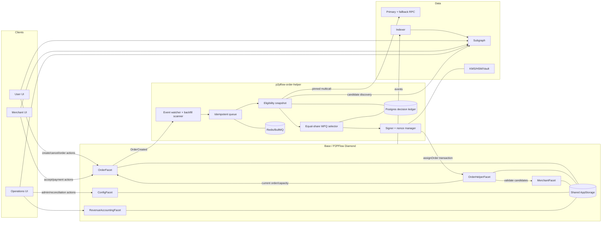
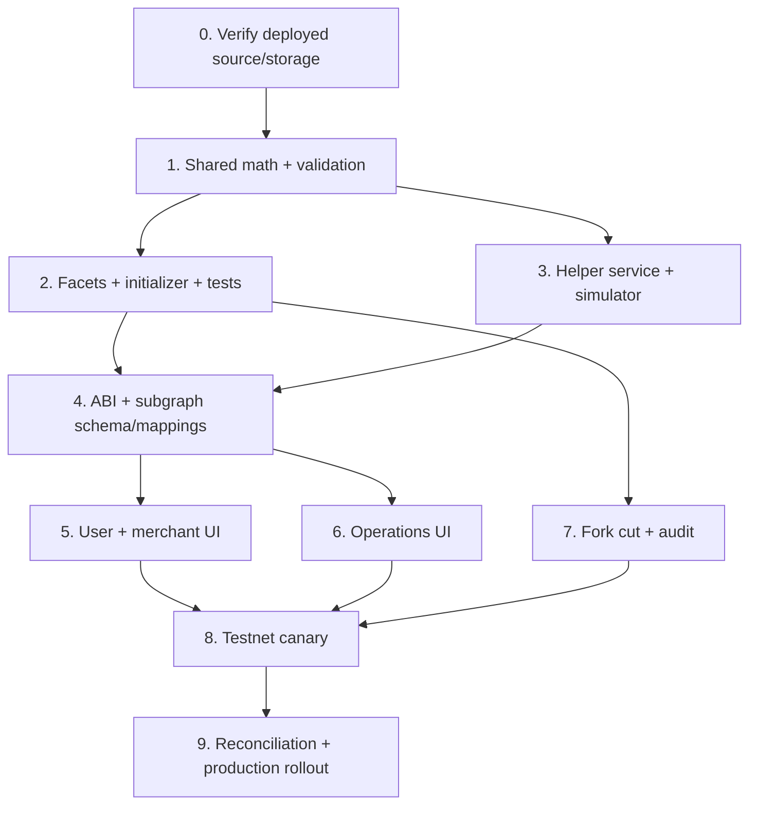

# P2PFlow Complete Implementation Plan

**Status:** implementation-ready proposal

**Prepared:** 2026-07-29 UTC

**Primary target:** P2PFlow Base Sepolia Diamond `0xF40AD901CCfB5E5EdC5162D6Ac7DDd5Ed5899F3A` on chain `84532`

**Companion inventory:** [P2PFlow Complete Smart Contract and UI Network Architecture](./P2PFlow_Complete_Architecture_2026-07-29.md)

This plan specifies the requested off-chain Order Helper, exactly-four-merchant assignment, on-chain eligibility enforcement, equal order sharing, merchant principal accounting, protocol spread accounting, subgraph changes, and all three UIs. It is a design and rollout plan; it does not claim that P2P.me's private production algorithm has been reproduced.

## 1. Executive decision

The implementation will use the following architecture:

1. A user creates an order on the Diamond. Creation no longer scans or assigns merchants synchronously.
2. An off-chain `p2pflow-order-helper` observes the order, computes a deterministic fair ranking, and submits exactly four `(merchant, paymentChannel)` candidates.
3. A new `OrderHelperFacet` accepts assignment transactions only from the configured `orderAssigner` address.
4. The private key is never stored in the Diamond, UI, repository, Thirdweb configuration, or subgraph. It is held by KMS/HSM/Vault and signs the helper's transaction.
5. The Diamond validates every candidate during assignment and validates the accepting merchant again at acceptance. Off-chain selection can improve ranking, but it can never bypass contract safety.
6. Equal sharing means equal **accepted USDC notional**, not equal order count. Four ordered acceptance leases stop the fastest merchant from winning every order.
7. Merchant principal is tracked in USDC units:

   ```text
   merchantPrincipalUsdc
     = merchant.usdcLiquidity
     + sum(channel.fiatPrincipalUsdc)
   ```

   Normal BUY/SELL trades do not change this value. Reservations and risk balances are partitions of those totals, not extra value.

8. A channel's actual expected bank cash remains `fiatBalance`, but principal represented by that cash is tracked separately as `fiatPrincipalUsdc`. The difference between bank cash and the fiat required to back that principal is protocol-owned fiat equity, not merchant liquidity.
9. Fiat is off-chain. A smart contract cannot prove that INR was paid or swept. Revenue collection therefore needs an attested reconciliation flow and must be displayed as a receivable until the bank transfer is confirmed.
10. The checked-in Solidity is older than the active Diamond. No upgrade may be built from the current `main` storage definition. Phase 0 must first recover and verify the exact deployed storage layout and bytecode.

## 2. What is proven, what is inferred, and what is new

### 2.1 Public P2P.me reference

The supplied legacy route, `https://p2pme-ops.netlify.app/developer/diamond`, could not be loaded from this environment: direct access timed out and the web fetch could not safely retrieve its body. The current `ops.p2p.me`, `app.p2p.me`, and `lp.p2p.me` surfaces are client-rendered applications, so their HTML shells do not disclose their algorithms.

The public source material does prove the following:

| Observation                                                                                                                                                                                                                                               | Evidence                                                                                                                                                                                                                                                                | How this plan uses it                                                                                                             |
| --------------------------------------------------------------------------------------------------------------------------------------------------------------------------------------------------------------------------------------------------------- | ----------------------------------------------------------------------------------------------------------------------------------------------------------------------------------------------------------------------------------------------------------------------- | --------------------------------------------------------------------------------------------------------------------------------- |
| P2P.me routes an order to a circle in the SDK, using subgraph discovery followed by an on-chain eligibility check.                                                                                                                                        | [SDK routing source at pinned commit](https://github.com/p2pdotme/p2pdotme-sdk/blob/6268a48672437b2fb5364e3779a0dd28f2f8a2eb/src/orders/internal/routing/routing.ts)                                                                                                    | Use indexed data for discovery, then verify at a pinned RPC block and again in the transaction.                                   |
| The published executor listens for `OrderPlaced`, queues work, and calls `assignMerchants(orderId)`. It does not submit a chosen merchant list.                                                                                                           | [Executor README](https://github.com/p2pdotme/executor/blob/ab9ecc94349cc8fb2422f34a9c9e609e2ff2a817/README.md), [handler source](https://github.com/p2pdotme/executor/blob/ab9ecc94349cc8fb2422f34a9c9e609e2ff2a817/src/queue/handlers.ts)                             | Reuse the resilient listener/queue/scanner operating pattern, but redesign selection so the helper submits four exact candidates. |
| Public merchant data includes stake, online/blacklist state, ongoing orders, pending unstake, volume, missed/completed statistics, and fiat balances. Dispute state exists on-chain but is not fully materialized in the current `CircleMerchant` entity. | [P2P.me subgraph schema](https://github.com/p2pdotme/subgraph/blob/ef6145bcf44e6126ce89f1cbc1e6759a2ec8d9b9/schema.graphql), [MerchantRegistry ABI](https://github.com/p2pdotme/subgraph/blob/ef6145bcf44e6126ce89f1cbc1e6759a2ec8d9b9/abis/MerchantRegistryFacet.json) | Index all useful fields, but never trust the subgraph as the authorization source.                                                |
| Public documentation describes reputation, completion, speed, liquidity, dynamic spread, and concentration controls. It does not publish a merchant-level algorithm that can be copied exactly.                                                           | [Liquidity market design](https://p2pdotme-docs-50.mintlify.app/whitepaper/liquidity-market-design), [pricing/oracle](https://p2pdotme-docs-50.mintlify.app/whitepaper/pricing-oracle)                                                                                  | Treat these as risk inputs and inspiration; use the explicit equal-share policy defined in this document.                         |

The current public P2P.me mainnet Diamond is a substantially newer generation than this repository's Base Sepolia deployment. A read-only loupe inspection on 2026-07-29 showed 21 facet addresses and 335 selectors on the published mainnet Diamond, while this project snapshot exposes 6 facets and 63 selectors. This plan therefore does **not** label the local Diamond as current P2P.me production.

Older public documentation also conflicts with newer marketing about minimum stake and reward percentages. Those values are not adopted here. They must be explicit P2PFlow governance configuration, not copied constants.

### 2.2 Current P2PFlow facts

| Area                         | Current fact                                                                                                                     | Required correction                                                                            |
| ---------------------------- | -------------------------------------------------------------------------------------------------------------------------------- | ---------------------------------------------------------------------------------------------- |
| Solidity source              | Checked-in `main` contains merchant/config facets but no OrderFacet.                                                             | Recover the live-era source and verify it before changing storage or selectors.                |
| Recoverable order generation | `origin/dev` contains an ABI-correlated OrderFacet/AppStorage, but its deployment metadata points to a different Diamond.        | Treat it as forensic evidence, not proof of byte-identical live source.                        |
| Assignment                   | Creation iterates the admin allowlist, or all merchants if the list is empty, and takes the first four that pass limited checks. | Remove iteration and ranking from order creation.                                              |
| Availability                 | Recovered BUY and SELL selection ignores merchant `ONLINE/OFFLINE`; acceptance also does not check it.                           | Require `ONLINE` both when assigned and when accepted.                                         |
| BUY channel                  | BUY assignment checks USDC but does not require a usable payment channel until acceptance.                                       | Assign a specific approved/active channel with every candidate.                                |
| Capacity                     | Four offers reserve nothing; only the first accepting merchant reserves funds.                                                   | Keep hard reservation at acceptance, add bounded soft-offer exposure, and revalidate capacity. |
| Channel limits               | Daily/monthly counters exist, but recovered order flow never consumes them.                                                      | Project during assignment; atomically consume on winner acceptance.                            |
| Fairness                     | Array order makes the same first merchants win consideration repeatedly.                                                         | Equal-weight fair queuing with deterministic tie-breaks.                                       |
| Spread                       | Full BUY fiat is credited to merchant `fiatBalance`; the ₹95/₹90 residual remains there.                                         | Split gross fiat, merchant principal, and protocol equity.                                     |
| Unstake                      | Approval can transfer all liquidity without checking reservations/risk/live orders.                                              | Block or limit withdrawal until obligations are zero.                                          |
| Channel migration            | It moves gross fiat without protecting `reservedFiat`.                                                                           | Prohibit migration with live exposure; move accounting ledgers atomically.                     |
| User UI                      | Current hooks use obsolete order methods and navigate using transaction hash as order ID.                                        | Decode `OrderCreated.orderId` from the receipt and use the active ABI.                         |
| Merchant UI                  | The order page is largely static and has no complete live assignment inbox.                                                      | Add indexed assignment rounds, expiry, actions, and balance ledger views.                      |

The recovered test suite explicitly expects residual spread to remain in channel fiat. Protocol revenue separation is therefore a new feature, not a hidden behavior already present in the contract.

## 3. Scope and non-negotiable requirements

### 3.1 In scope

- Asynchronous order creation and assignment.
- Exactly four unique merchant/channel candidates per active assignment round.
- Dynamic response to online/offline, blacklist, dispute, unstake, capacity, channel, limit, and price changes.
- Equal-share routing among currently eligible merchants.
- Ordered merchant acceptance leases and round expiry/reassignment.
- Append-only Diamond storage and compatible legacy-order migration.
- Principal, gross fiat, protocol equity, spread, FX deficit, and revenue-sweep accounting.
- Subgraph/entity/event changes.
- User, merchant, and operations UI behavior.
- Helper service, key management, RPC/subgraph usage, retries, observability, and disaster recovery.
- Contract, service, subgraph, and UI tests.

### 3.2 Explicitly not claimed

- The private P2P.me merchant-selection implementation is not publicly available and will not be reverse-engineered or represented as known.
- A Solidity contract cannot prove a UPI/bank transfer. Fiat truth requires payment attestations, disputes, and reconciliation.
- Literal equality is impossible while merchants have different eligibility windows, order sizes, and capacity. The measurable target is equal accepted USDC notional among similarly eligible merchants, within a bounded deviation.
- This document does not authorize a production Diamond cut. Deployment requires the gates in Section 16.

### 3.3 System invariants

| ID   | Invariant                                                                                                                                                    |
| ---- | ------------------------------------------------------------------------------------------------------------------------------------------------------------ |
| I-01 | Only the active `orderAssigner` can install or replace a helper-managed assignment round.                                                                    |
| I-02 | Every active round contains exactly four distinct merchant addresses and four merchant-owned channels.                                                       |
| I-03 | Every candidate is validated on-chain at assignment; the accepting candidate is validated again at acceptance.                                               |
| I-04 | An order can have at most one accepted merchant and one active assignment round.                                                                             |
| I-05 | Assignment calls are replay-safe by `orderId + expectedRound`; stale state and expired decisions revert.                                                     |
| I-06 | A status change after assignment blocks acceptance if the merchant is no longer eligible, but it does not strand an already accepted order.                  |
| I-07 | BUY capacity uses unreserved merchant USDC; SELL capacity uses unreserved fiat principal and physical cash coverage.                                         |
| I-08 | `usdcLiquidity + Σ fiatPrincipalUsdc == merchantPrincipalTargetUsdc`, except during an explicitly modelled deposit, withdrawal, reward, or slash transition. |
| I-09 | Protocol fiat equity is excluded from merchant SELL capacity and from the merchant's principal display.                                                      |
| I-10 | Revenue may be marked swept only by the reconciler and only up to safely sweepable protocol fiat equity.                                                     |
| I-11 | An unstake or channel migration cannot move assets backing open assignments, accepted orders, risk, disputes, or fiat principal.                             |
| I-12 | Subgraph or helper downtime can delay assignment but cannot authorize an unsafe assignment or lose a user's SELL escrow.                                     |

## 4. Target architecture



### Trust boundary

- The helper is trusted to choose fairly and remain available.
- The helper is **not** trusted with custody and cannot bypass status, liquidity, channel ownership, limits, quote, or order-state checks.
- The subgraph is a rebuildable projection, not a source of authorization.
- The reconciler is trusted only to attest off-chain fiat movement. It cannot assign orders or change merchant principal.
- The Diamond owner can upgrade code and remains the ultimate protocol trust boundary. Day-to-day platform admin, order assigner, dispute resolver, and revenue reconciler must be separate keys.

## 5. End-to-end order lifecycle

```mermaid
sequenceDiagram
  participant U as User UI
  participant D as Diamond / OrderFacet
  participant E as Helper watcher
  participant S as Subgraph + RPC
  participant H as Helper signer
  participant A as OrderHelperFacet
  participant M as Merchant UI

  U->>D: createBuyOrder(U) or createSellOrder(U)
  D-->>U: OrderCreated(orderId), status CREATED, round 0
  D-->>E: OrderCreated event
  E->>S: discover candidates from subgraph
  E->>S: verify order + candidates at pinned safe block
  E->>H: deterministic rank + decision record
  H->>A: assignOrder(orderId, four candidates, round 1, ...)
  A->>A: validate all four against current chain state
  A-->>M: AssignmentRoundOpened + candidate events
  Note over M,A: rank 0 unlocks first; backups unlock progressively
  M->>D: acceptOrder(orderId, assignedChannel)
  D->>D: validate again, reserve hard capacity, consume limits
  D-->>M: OrderAccepted
  D-->>E: release other soft offers
```

### State interpretation

Existing `OrderStatus` ordinals remain unchanged:

| Value | Existing state | v2 interpretation                                                               |
| ----- | -------------- | ------------------------------------------------------------------------------- |
| `0`   | `CREATED`      | Round 0 means “finding merchants”; active round means “waiting for acceptance”. |
| `1`   | `ACCEPTED`     | One candidate accepted; funds/capacity are reserved.                            |
| `2`   | `PAID`         | Off-chain payer marked payment.                                                 |
| `3`   | `COMPLETED`    | Asset exchange is complete; SELL risk may still be locked.                      |
| `4`   | `CANCELLED`    | Terminal and SELL escrow refunded where applicable.                             |

Do not insert a new member into the existing enum. UI-only labels such as `FINDING_MERCHANTS` are derived from `status == CREATED && assignmentRound == 0`.

### Four ranked acceptance leases

All four candidates are assigned, but eligibility to accept unlocks cumulatively:

| Time from assignment | Who may accept                                           |
| -------------------- | -------------------------------------------------------- |
| 0–15 seconds         | Rank 0                                                   |
| 15–30 seconds        | Ranks 0–1                                                |
| 30–45 seconds        | Ranks 0–2                                                |
| 45–90 seconds        | All four                                                 |
| After 90 seconds     | Round expired; no acceptance; helper creates a new round |

The lease and TTL are governance-configured, bounded values. The launch defaults are `leaseStep = 15 seconds` and `assignmentTtl = 90 seconds`. If fewer than four eligible candidates exist, the helper does **not** submit a partial round. It retries as state changes, shows “insufficient eligible liquidity,” alerts operations, and leaves the user's existing right to cancel immediately while the order is still `CREATED`.

## 6. Contract architecture

### 6.1 Facet responsibilities

| Facet                    | Responsibility                                                                                                                                                        |
| ------------------------ | --------------------------------------------------------------------------------------------------------------------------------------------------------------------- |
| `OrderFacet`             | Create order, escrow SELL USDC, accept a current-round candidate, payment lifecycle, cancellation, dispute, settlement, and legacy order compatibility.               |
| `OrderHelperFacet`       | Assigner role/configuration, exact-four assignment, round expiry, current candidate views, policy hash, and assignment eligibility views.                             |
| `MerchantFacet`          | Merchant/channel state, stake, availability, safe unstake, safe channel migration, and balance views.                                                                 |
| `ConfigFacet`            | Pricing, quote validity, limits, safety buffers, concurrency, pause, and role references where already established.                                                   |
| `RevenueAccountingFacet` | Principal views, protocol fiat equity/deficit, reconciler rotation, revenue sweep/top-up attestations, and accounting corrections under a paused migration procedure. |
| `DiamondCutFacet`        | Owner-controlled selector changes and one-time upgrade initializer.                                                                                                   |

No admin-only “manual assign” bypass is added. An emergency requires pausing assignment and rotating/revoking the helper. This preserves the requirement that the Order Helper is the only assignment writer.

### 6.2 Enum plan

All existing enum names and numeric ordinals must be preserved exactly. New enums are independent append-only types:

```solidity
enum AssignmentRoundStatus {
    NONE,        // 0
    ACTIVE,      // 1
    ACCEPTED,    // 2
    EXPIRED,     // 3
    CANCELLED,   // 4
    SUPERSEDED   // 5
}

enum RevenueReconciliationKind {
    SWEEP,       // bank cash moved to protocol
    TOP_UP,      // protocol restored channel fiat coverage
    CORRECTION   // audited migration correction while paused
}

enum EligibilityCode {
    ELIGIBLE,
    ORDER_NOT_OPEN,
    WRONG_ROUND,
    MERCHANT_NOT_REGISTERED,
    ACCOUNT_NOT_ACTIVE,
    MERCHANT_OFFLINE,
    UNSTAKE_PENDING,
    NOT_ALLOWLISTED,
    CHANNEL_NOT_OWNED,
    CHANNEL_NOT_APPROVED,
    CHANNEL_INACTIVE,
    QUOTE_EXPIRED,
    DAILY_LIMIT_EXCEEDED,
    MONTHLY_LIMIT_EXCEEDED,
    TOO_MANY_OPEN_OFFERS,
    INSUFFICIENT_USDC,
    INSUFFICIENT_FIAT_PRINCIPAL,
    INSUFFICIENT_PHYSICAL_FIAT,
    PROTOCOL_FIAT_DEFICIT
}
```

`EligibilityCode` is a diagnostic view result. State-changing functions still use custom errors with the order, merchant, channel, required amount, and available amount where useful.

### 6.3 Storage recovery gate

The recovered live-era layout appears to occupy these roots:

| Slot/root | Recovered field                       |
| --------- | ------------------------------------- |
| 0–3       | `PlatformConfig`                      |
| 4         | `merchants` mapping                   |
| 5         | `merchantList`                        |
| 6         | `channels` mapping                    |
| 7         | `channelDuplicateGuard`               |
| 8         | `_reentrancyStatus`                   |
| 9–10      | default daily/monthly channel limits  |
| 11–13     | buy price, sell price, dispute window |
| 14        | `orderNonce`                          |
| 15        | `orders` mapping                      |
| 16        | `orderIds`                            |
| 17–18     | user and merchant order indexes       |
| 19        | `orderAssignmentIndex`                |
| 20–21     | eligible merchant array/index         |

This is not yet sufficient evidence for a Diamond cut. Before implementation:

1. Recover exact deployed source or verify runtime bytecode against the recovered `origin/dev` facets.
2. Read representative raw storage for every root on a Base Sepolia fork.
3. Compile the recovered source with the original compiler/settings and compare runtime code/metadata.
4. Generate and review a storage-layout diff.
5. Append new fields only after the verified final field. Never insert into `PlatformConfig`, `Merchant`, `PaymentChannel`, `Order`, or an earlier `AppStorage` position.
6. Use a new one-time initializer. Never run `DiamondInit` again.

### 6.4 Proposed append-only structures

The following is layout intent, not copy-paste deployment code:

```solidity
struct AssignmentRoundMeta {
    uint64 round;
    uint64 stateBlock;
    uint64 assignedAt;
    uint64 validUntil;
    bytes32 decisionId;
    bytes32 policyHash;
    AssignmentRoundStatus status;
}

struct CandidateMeta {
    bytes32 channelId;
    uint64 round;
    uint64 unlockAt;
    uint8 rank;
}

struct OfferExposure {
    uint32 count;
    uint256 usdcNotional;
    uint256 fiatNotional;
}

struct ChannelPrincipalLedger {
    uint256 fiatPrincipalUsdc;
    uint256 reservedPrincipalUsdc;
    uint256 protocolFiatSwept;
    uint256 lastReconciledAt;
}
```

Append these fields, in the final order approved by the storage-layout review:

```solidity
address orderAssigner;
address pendingOrderAssigner;
uint64 orderAssignerProposedAt;
uint64 assignmentTtl;
uint64 acceptanceLeaseStep;
uint64 maxStateAgeBlocks;
uint32 maxPendingOffersPerMerchant;
bytes32 assignmentPolicyHash;
bool orderHelperV1Initialized;

mapping(bytes32 => bool) helperManagedOrders;
mapping(bytes32 => AssignmentRoundMeta) assignmentRoundMeta;
mapping(bytes32 => mapping(address => CandidateMeta)) candidateMeta;
mapping(address => OfferExposure) merchantOfferExposure;
mapping(bytes32 => OfferExposure) channelOfferExposure;

mapping(address => uint256) merchantPrincipalTargetUsdc;
mapping(bytes32 => ChannelPrincipalLedger) channelPrincipalLedger;
address revenueReconciler;
address pendingRevenueReconciler;
uint64 revenueReconcilerProposedAt;

mapping(bytes32 => uint256) orderAccountingSellPriceE6;
mapping(bytes32 => uint8) orderPricingVersion;
uint256 buyPriceE6;
uint256 sellPriceE6;
uint64 quoteValidFor;
uint256 fiatRailQuantum;
uint16 buySafetyBufferBps;
uint16 fiatSweepBufferBps;
uint16 maxPriceDeviationBps;
uint32 maxActiveAcceptedOrdersPerMerchant;
uint256 minBuySafetyBufferUsdc;
uint256 minFiatSweepBuffer;
mapping(address => uint32) activeAcceptedOrderCount;
mapping(bytes32 => bool) channelReconciliationRequired;
```

Keep `Order.assignedMerchants` and `orderAssignmentIndex` for ABI and legacy compatibility. New round/channel/rank data lives in parallel mappings. Historical rounds are emitted as events and indexed rather than retained as unbounded on-chain arrays.

### 6.5 New and changed functions

#### `OrderHelperFacet`

```solidity
struct Candidate {
    address merchant;
    bytes32 channelId;
}

function assignOrder(
    bytes32 orderId,
    Candidate[4] calldata candidates,
    uint64 expectedRound,
    uint64 stateBlock,
    uint64 validUntil,
    bytes32 decisionId,
    bytes32 policyHash
) external;

function expireAssignment(bytes32 orderId, uint64 expectedRound) external;

function getAssignmentState(bytes32 orderId)
    external view
    returns (
        AssignmentRoundMeta memory meta,
        Candidate[4] memory candidates
    );

function getCandidateEligibility(
    bytes32 orderId,
    address merchant,
    bytes32 channelId
) external view returns (EligibilityCode code, uint256 required, uint256 available);

function getOrderAssignerConfig() external view returns (...);
function proposeOrderAssigner(address next) external;
function acceptOrderAssigner() external;
function revokeOrderAssigner() external;
function setAssignmentPolicy(
    bytes32 policyHash,
    uint64 ttl,
    uint64 leaseStep,
    uint64 maxStateAgeBlocks,
    uint32 maxPendingOffers
) external;
```

`assignOrder` requirements:

- `msg.sender == orderAssigner`, platform is not paused, and helper v1 is initialized.
- Order exists, is helper-managed, is `CREATED`, is not past user cancellation/quote policy, and has no accepted merchant.
- `expectedRound == currentRound + 1`.
- `stateBlock <= block.number` and is no older than `maxStateAgeBlocks`.
- `validUntil` is in the future and no later than `block.timestamp + assignmentTtl`.
- `decisionId` is nonzero and unused for that order/round.
- `policyHash == assignmentPolicyHash`.
- Four merchant addresses are nonzero and unique; each channel is owned by its candidate.
- All hard eligibility checks in Section 7 pass against transaction-time state.
- Previous round soft exposures and indexes are released before the new round is installed.

Direct caller authentication is the v1 design. An additional EIP-712 signature is unnecessary because `msg.sender` authenticates the signer, the EOA transaction nonce prevents raw replay, and `expectedRound` prevents semantic replay. If arbitrary relayers are required later, add one EIP-712 path binding `chainId`, Diamond address, order ID, round, candidates hash, state block, validity, policy hash, and signer nonce; do not run two ambiguous authorization paths in v1.

#### Existing `OrderFacet` selectors

| Function                                                             | Planned behavior                                                                                                                                                                                        |
| -------------------------------------------------------------------- | ------------------------------------------------------------------------------------------------------------------------------------------------------------------------------------------------------- |
| `createBuyOrder(uint256)`                                            | Validate quote/amount, create helper-managed order, emit `OrderCreated`, return `orderId` and an empty legacy assignment array. No merchant scan.                                                       |
| `createSellOrder(uint256)`                                           | Transfer user USDC to escrow, create helper-managed order, emit, and return empty assignment array. Escrow remains cancellable if helper is unavailable.                                                |
| `createBuyOrderV2(uint256,uint256,uint64)`                           | Slippage-protected path: `(usdcAmount, maxFiatAmount, quoteDeadline)`. This is the user UI's required BUY entry point after pricing v2 is enabled.                                                      |
| `createSellOrderV2(uint256,uint256,uint64)`                          | Slippage-protected path: `(usdcAmount, minFiatAmount, quoteDeadline)`. This is the user UI's required SELL entry point after pricing v2 is enabled.                                                     |
| `acceptOrder(bytes32,bytes32)`                                       | Require active round membership, exact assigned channel, lease unlocked, unexpired round, and repeat all hard checks. Reserve hard capacity, consume limits, release all four soft offers, mark winner. |
| `cancelOrder(bytes32)`                                               | User can cancel a `CREATED` order; releases soft offers and refunds SELL escrow. Add a bounded remediation path for paid-but-stuck BUY orders.                                                          |
| `markPaymentSent`, `confirmPayment`, `settleOrder`, `resolveDispute` | Update both token ledger and principal ledger atomically. Preserve already accepted orders even if the merchant later goes offline/blacklisted; block only new work.                                    |
| Existing views                                                       | Preserve ABI, add v2 accounting/assignment views rather than silently changing tuple order.                                                                                                             |

Legacy orders have `helperManagedOrders[orderId] == false`. Their existing assigned membership remains valid so the upgrade does not strand them. Every order created after the initializer is helper-managed.

#### `ConfigFacet` pricing v2

```solidity
function setOrderPricingV2(
    uint256 buyPriceE6,
    uint256 sellPriceE6,
    uint64 quoteValidFor,
    uint16 maxPriceDeviationBps
) external;

function getOrderPricingV2()
    external view
    returns (
        uint256 buyPriceE6,
        uint256 sellPriceE6,
        uint64 quoteValidFor,
        uint16 maxPriceDeviationBps,
        uint8 pricingVersion
    );
```

The old pricing selector retains its historical unit for legacy readers. It must not silently start returning E6 prices. Once v2 is enabled, current UIs use the v2 create/get functions; governance may freeze the legacy setter.

#### `RevenueAccountingFacet`

```solidity
function getMerchantPrincipal(address merchant)
    external view
    returns (
        uint256 targetUsdc,
        uint256 liquidUsdc,
        uint256 fiatPrincipalUsdc,
        uint256 reservedUsdc,
        uint256 riskUsdc,
        bool invariantHolds
    );

function getChannelAccounting(bytes32 channelId)
    external view
    returns (
        uint256 grossFiat,
        uint256 fiatPrincipalUsdc,
        uint256 reservedPrincipalUsdc,
        uint256 requiredPrincipalFiat,
        uint256 protocolFiatEquity,
        uint256 protocolFiatDeficit,
        uint256 safelySweepableFiat,
        uint256 sweptFiat
    );

function proposeRevenueReconciler(address next) external;
function acceptRevenueReconciler() external;
function recordRevenueSweep(
    bytes32 channelId,
    uint256 fiatAmount,
    bytes32 externalReferenceHash
) external;
function recordFiatTopUp(
    bytes32 channelId,
    uint256 fiatAmount,
    bytes32 externalReferenceHash
) external;
```

`externalReferenceHash` is a hash of an internal settlement record, never plaintext bank data. A sweep decrements gross `fiatBalance` only after the bank movement is confirmed and cannot consume principal coverage or reservations.

### 6.6 Events

Retain current lifecycle events and add:

```solidity
event OrderAwaitingAssignment(bytes32 indexed orderId);
event AssignmentRoundOpened(
    bytes32 indexed orderId,
    uint64 indexed round,
    bytes32 indexed decisionId,
    uint64 stateBlock,
    uint64 validUntil,
    bytes32 policyHash
);
event OrderCandidateAssigned(
    bytes32 indexed orderId,
    uint64 indexed round,
    address indexed merchant,
    bytes32 channelId,
    uint8 rank,
    uint64 unlockAt
);
event AssignmentRoundClosed(
    bytes32 indexed orderId,
    uint64 indexed round,
    AssignmentRoundStatus status
);
event OrderAssignerProposed(address indexed current, address indexed pending);
event OrderAssignerAccepted(address indexed previous, address indexed current);
event OrderAssignerRevoked(address indexed previous);
event ProtocolSpreadAccrued(
    bytes32 indexed orderId,
    bytes32 indexed channelId,
    uint256 fiatAmount
);
event ProtocolFiatReconciled(
    bytes32 indexed channelId,
    RevenueReconciliationKind kind,
    uint256 fiatAmount,
    bytes32 indexed externalReferenceHash
);
event ProtocolFiatDeficitObserved(
    bytes32 indexed channelId,
    uint256 deficitFiat,
    uint256 accountingPriceE6
);
```

Emit the legacy `OrderAssigned(orderId, merchant, assignedAt)` once for each candidate as well, so existing indexers keep functioning during the transition.

## 7. Authoritative on-chain eligibility

The helper performs the same checks before sending a transaction, but only the contract result is authoritative.

### 7.1 Checks at both assignment and acceptance

| Category          | Required check                                                                                                                           |
| ----------------- | ---------------------------------------------------------------------------------------------------------------------------------------- |
| Order             | Exists, helper-managed, `CREATED`, unaccepted, uncancelled, quote valid, expected round current.                                         |
| Merchant identity | Registered wallet, not the order's user, unique within the four candidates.                                                              |
| Account state     | `accountStatus == ACTIVE`; therefore not blacklisted or disputed. Check the explicit value, not merely “not blacklisted.”                |
| Availability      | `availability == ONLINE`. Going offline after assignment makes acceptance revert.                                                        |
| Exit state        | `unstakePending == false`; no pending removal or migration affecting the channel.                                                        |
| Allowlist         | If the admin eligibility list is non-empty, merchant is present. An empty list retains the current “all registered merchants” semantics. |
| Channel ownership | Channel exists and `channel.merchant == merchant`.                                                                                       |
| Channel state     | `status == APPROVED` and `availability == ACTIVE`; channel matches order currency/rail when those fields are introduced.                 |
| Quote             | Both prices/version are present, quote has not expired, and the configured maximum deviation/freshness policy passes.                    |
| Limits            | Projected accepted USDC does not exceed the effective daily or 30-day limit.                                                             |
| Concurrency       | Merchant/channel accepted-order cap and pending-offer cap are not exceeded.                                                              |
| BUY capacity      | `usdcLiquidity - reservedUsdc - riskUsdc >= order.usdcAmount + configuredSafetyBuffer`.                                                  |
| SELL principal    | `fiatPrincipalUsdc - reservedPrincipalUsdc >= order.usdcAmount`.                                                                         |
| SELL cash         | Gross unreserved fiat can pay the immutable order payout without consuming protocol-swept amounts or another order's reserve.            |
| Accounting health | The channel has no unresolved protocol fiat deficit and satisfies its safety buffer at the active accounting price.                      |

Assignment increments bounded **soft** offer exposure for each of the four candidates; it does not reserve the full order four times. Acceptance repeats every check, reserves the winner's hard capacity, consumes its daily/monthly volume, closes the round, and releases all four soft exposures in the same transaction.

The soft exposure fields are a liveness/rate-limit control, not collateral. The hard acceptance-time check is what prevents insolvency if several assignments race.

### 7.2 State changes after acceptance

A merchant who goes offline, is blacklisted, or becomes disputed after acceptance receives no new assignments, but the accepted order must retain completion, cancellation/remediation, and dispute paths. Disabling all settlement actions after a status change would strand user escrow and is prohibited.

### 7.3 Limit consumption and withdrawal fixes

- Call the channel rolling-window update and `consumeChannelVolume` exactly once when a merchant wins acceptance, not once for each offer.
- Releasing/cancelling an unaccepted offer does not consume volume.
- If an accepted order is administratively cancelled before any off-chain payment, reverse its consumed amount with an explicit event or record separate accepted/cancelled counters; do not silently mutate history.
- `approveMerchantUnstake` must require zero `reservedUsdc`, zero `riskUsdc`, zero live accepted orders, zero soft offers, and all `fiatPrincipalUsdc` rebalanced to USDC. A merchant cannot withdraw “100 USDC” while part of that principal is represented by INR.
- `migrateAndTerminate` must require no reserved fiat, no live order/offer, and no dispute. It must move gross fiat, fiat principal, reconciliation totals, and accounting metadata together, or remain disabled until the source channel is fully settled.

## 8. Off-chain Order Helper

### 8.1 Service components

Create a new deployable service, preferably a separate `p2pflow-order-helper` repository:

| Component             | Responsibility                                                                                                  |
| --------------------- | --------------------------------------------------------------------------------------------------------------- |
| WebSocket listener    | Observe `OrderCreated`, acceptance, cancellation, status, merchant, channel, pricing, and configuration events. |
| Finalized-log scanner | Scan from a durable cursor every minute and recover events missed by WebSocket or restarts.                     |
| Queue                 | One idempotent job per `chainId:orderId:round`; serialize assignment writes and bound retries.                  |
| Candidate projector   | Query subgraph/DB for a broad candidate set; never decide from the first four returned.                         |
| RPC snapshotter       | Read the order/config and multicall candidate state at one recorded safe block.                                 |
| Fair selector         | Apply hard filters, equal-share WFQ, inventory tie-breaks, and deterministic ranking.                           |
| Decision ledger       | Persist inputs, excluded reasons, four outputs, policy version, code version, block, and decision hash.         |
| Signer/nonce manager  | Simulate, sign through KMS/HSM, send, wait for confirmation, and reconcile nonce/replacement transactions.      |
| Sweeper               | Expire/reassign stale rounds and surface orders with fewer than four eligible candidates.                       |
| Health/metrics API    | `/healthz`, `/readyz`, Prometheus metrics, structured logs, and operations diagnostics.                         |

Recommended storage:

- PostgreSQL: `chain_cursor`, `order_job`, `assignment_decision`, `candidate_evaluation`, `merchant_virtual_finish`, `open_offer`, `tx_attempt`, `policy_version`.
- Redis/BullMQ: delayed jobs, distributed corridor lock, retry scheduling, and short-lived RPC cache.
- The database is rebuildable from chain events plus policy snapshots. It is not allowed to become an alternate source of order ownership.

### 8.2 Fair assignment definition

Fairness is calculated separately for each routing domain:

```text
(chainId, fiatCurrency, paymentRailGroup, orderType)
```

The default weight for every eligible merchant is `1`. Stake size is a hard capacity constraint, not a hidden priority multiplier. This deliberately follows the user's equal-share requirement even though older P2P.me material says larger stake may receive more orders.

Use USDC notional rather than order count: one 100-USDC completion counts the same as ten 10-USDC completions.

For merchant `i`:

```text
Vi                 = committed virtual finish from accepted volume
Vglobal            = minimum current virtual finish for the active domain
openOfferUsdc_i    = notional in active, unaccepted candidate slots
offerWeight        = 0.25 because each order has four candidates
base_i             = max(Vi, Vglobal)
rankingFinish_i    = base_i + offerWeight * openOfferUsdc_i + orderUsdcAmount
commitFinish_i     = base_i + orderUsdcAmount
```

When a merchant becomes eligible after being offline or newly registered, initialize/clamp `Vi = max(Vi, Vglobal)`. This prevents an offline merchant from accumulating a huge catch-up entitlement and then taking every order on return.

Rank candidates lexicographically:

1. Lowest `rankingFinish_i`.
2. Lowest post-trade inventory imbalance.
3. Lowest recent failure/cooldown tier.
4. Oldest last accepted/assigned timestamp.
5. Lowest deterministic `keccak256(orderId, round, merchant, channelId)` value.

Inventory is a tie-breaker and cannot override a materially less-served merchant:

```text
fiatShareAfter = projectedFiatPrincipalUsdc / merchantPrincipalTargetUsdc
imbalance      = abs(fiatShareAfter - configuredTargetFiatShare)
```

- BUY adds fiat principal and removes liquid USDC, so prefer a currently USDC-heavy merchant.
- SELL removes fiat principal and adds liquid USDC, so prefer a currently fiat-heavy merchant.

Select the first four unique merchants. Store the ranking because it controls the acceptance leases. There is no random branch in v1; identical inputs and policy produce the same decision.

When a candidate accepts, commit its stored `commitFinish_i` to `Vi`; do not permanently charge the provisional load of its other open offers. Release provisional offer load for all four candidates. Expired/cancelled rounds do not charge accepted volume, although timeout and missed-response metrics may trigger a bounded cooldown. Update `Vglobal` from the active domain after accepted-volume changes. Reputation and completion data are risk gates/cooldowns, not a multiplier that silently defeats equal allocation.

### 8.3 Why four unrestricted “first accepts” are not fair

If all four candidates can accept immediately, the merchant with the fastest bot/network will repeatedly win even when the helper assigns fairly. The progressive lease in Section 5 gives the least-served rank-0 merchant a short exclusive opportunity, then opens backups for liveness. This is required for completed-volume fairness, not merely a UI feature.

### 8.4 Deterministic decision procedure

```text
on OrderCreated(orderId):
  acquire lock(domain, orderId)
  read finalized order/config snapshot at block B
  discover candidates from subgraph or local projection
  multicall authoritative merchant/channel/accounting views at B
  remove every hard-ineligible candidate and record reason
  if eligible unique merchants < 4:
      schedule retry; publish NO_FOUR_CANDIDATES; do not submit partial list
  else:
      calculate WFQ rankingFinish/commitFinish and tie-break values
      select and rank exactly four
      canonicalize inputs and compute decisionId
      simulate assignOrder against latest pending state
      send from orderAssigner
      wait for receipt and parse AssignmentRoundOpened
      if stale-state/capacity revert: refresh and retry next round attempt
      if permanent config/order-state revert: close job with explicit reason
```

`decisionId` must commit to chain ID, Diamond, order, round, candidates/channels/ranks, snapshot block, validity, quote hash, policy hash, and helper build version. Operations can then reproduce any selection exactly.

### 8.5 Liveness and failure behavior

- WebSocket loss: finalized scanner backfills logs from the durable cursor.
- Subgraph lag/outage: discover from the local event projection or bounded on-chain lists; RPC validation remains mandatory.
- Primary RPC outage: circuit-break to a separately operated fallback provider; never send the same nonce blindly to both.
- Transaction revert from a race: reread state, produce a new decision only if the order remains open.
- Duplicate queue delivery: unique `(orderId, round)` constraint and contract `expectedRound` make it harmless.
- Chain reorg: keep decisions provisional until configured confirmations; rewind cursor and reconcile receipt block hashes.
- Helper down: order remains `CREATED`; SELL escrow is immediately cancellable; operations alerts use a separate response-time threshold.
- Key compromised: pause helper assignment, revoke the signer, rotate through the two-step flow, audit decision events, then resume. The compromised key still cannot bypass contract eligibility.
- Key unavailable: rotate to a prepared cold standby; do not put a private key in a CI variable exposed to builds.

### 8.6 Key and deployment policy

- Store only `orderAssigner` **address** on-chain.
- Hold the private key in KMS/HSM/Vault; use a dedicated low-balance gas wallet with no admin, upgrade, dispute, or revenue privileges.
- Restrict production signing to the helper workload identity and approved Diamond/chain/function selectors.
- Maintain primary and cold-standby keys; rotation is `propose -> pending signer accepts -> old signer revoked`.
- Alert on signer balance, nonce gaps, replacement transactions, config changes, failed simulations, and any caller rejected by `onlyOrderAssigner`.
- Never use a `VITE_*` variable, browser storage, subgraph secret, GitHub source file, or Netlify environment exposed to the client for the private key.

## 9. Merchant principal and protocol spread accounting

### 9.1 Accounting vocabulary

| Name                            | Unit                   | Ownership/meaning                                                                                                              |
| ------------------------------- | ---------------------- | ------------------------------------------------------------------------------------------------------------------------------ |
| `merchant.usdcLiquidity`        | USDC atoms, 6 decimals | Merchant principal currently held as USDC; includes reserved/risk partitions.                                                  |
| `channel.fiatBalance`           | micro-INR, 6 decimals  | Gross expected bank cash according to the protocol ledger. Not cryptographic proof of bank cash.                               |
| `channel.fiatPrincipalUsdc`     | USDC atoms, 6 decimals | Merchant principal represented by the channel's fiat inventory.                                                                |
| `channel.reservedPrincipalUsdc` | USDC atoms             | Portion committed to accepted SELL orders.                                                                                     |
| `requiredPrincipalFiat`         | micro-INR              | Fiat required to back `fiatPrincipalUsdc` at the active sell/accounting price.                                                 |
| `protocolFiatEquity`            | micro-INR              | Positive gross cash above required merchant principal; protocol-owned. The sweep buffer limits how much may leave the channel. |
| `protocolFiatDeficit`           | micro-INR              | Amount by which bank cash is below required merchant principal; protocol must top up/rebalance before new SELL work.           |
| `protocolFiatSwept`             | micro-INR              | Cumulative off-chain revenue confirmed as moved from the channel to protocol treasury.                                         |

Never display `USDC + raw INR` as a sum. They are different units. UI value comparisons must show the accounting price and timestamp.

### 9.2 Prices and rounding

Introduce pricing v2 with a 6-decimal price:

```text
USDC_UNIT  = 1,000,000
PRICE_UNIT = 1,000,000
fiatAtoms  = mulDiv(usdcAtoms, priceE6, PRICE_UNIT)
```

For INR, set `fiatRailQuantum = 10,000` micro-INR (₹0.01):

- BUY amount payable by user rounds **up** to the rail quantum.
- SELL amount payable to user rounds **down** to the rail quantum.
- Rounding dust belongs to protocol accounting, never silently to merchant principal.
- Require `buyPriceE6 >= sellPriceE6 > 0`, bounded spread, quote expiry, and maximum price deviation.
- Every order stores its pricing version and both its execution price and accounting sell-price snapshot in parallel mappings.

The old integer-price fields cannot silently change unit. The initializer must convert old configured values to E6 fields (`oldPrice * 1e6`), and all clients must switch to explicit v2 getters before v2 pricing is enabled.

### 9.3 Principal and protocol equations

At an accounting sell price `Psell`:

```text
merchantPrincipalUsdc
  = usdcLiquidity + sum(fiatPrincipalUsdc)

requiredPrincipalFiat
  = ceilRail(mulDiv(fiatPrincipalUsdc, Psell, PRICE_UNIT))

protocolFiatEquity
  = max(fiatBalance - requiredPrincipalFiat, 0)

protocolFiatDeficit
  = max(requiredPrincipalFiat - fiatBalance, 0)

safelySweepableFiat
  = max(protocolFiatEquity - safetyBufferFiat, 0)
```

Reservations are sub-balances:

```text
availableUsdc
  = usdcLiquidity - reservedUsdc - riskUsdc

availableFiatPrincipalUsdc
  = fiatPrincipalUsdc - reservedPrincipalUsdc
```

Do not add reservations or risk a second time when calculating principal.

### 9.4 BUY transition

For user BUY of `U` USDC:

1. Create an immutable quote with `Pbuy`, accounting `Psell`, expiry, and pricing version.
2. Calculate `Fbuy = ceilRail(U * Pbuy)` and reference backing `Fprincipal = ceilRail(U * Psell)`.
3. At acceptance reserve `U` from merchant available USDC.
4. On confirmed fiat receipt/completion:
   - decrement `reservedUsdc` by `U`;
   - decrement `usdcLiquidity` by `U`;
   - increment channel gross `fiatBalance` by `Fbuy`;
   - increment `fiatPrincipalUsdc` by `U`;
   - emit spread accrued of `Fbuy - Fprincipal`;
   - transfer exactly `U` USDC to the user.
5. The merchant principal invariant is unchanged. The fiat difference is protocol equity and is not SELL capacity belonging to the merchant.

If `Fbuy < Fprincipal`, reject the quote/configuration; a normal BUY must not create an unbacked principal deficit.

### 9.5 SELL transition

For user SELL of `U` USDC and immutable payout `Fsell`:

1. Creation escrows `U` USDC from the user.
2. Assignment requires at least `U` unreserved `fiatPrincipalUsdc`, enough gross fiat for `Fsell`, no channel deficit, and sufficient rolling limit.
3. Acceptance reserves both `U` principal units and `Fsell` gross fiat.
4. Merchant marks fiat payment; the pending transition:
   - decrements `reservedPrincipalUsdc` and `fiatPrincipalUsdc` by `U`;
   - decrements `reservedFiat` and gross `fiatBalance` by `Fsell`;
   - increments merchant `usdcLiquidity` and `riskUsdc` by `U` from user escrow.
5. At dispute expiry or `MERCHANT_WINS`, release `riskUsdc`; principal remains unchanged.
6. At `USER_WINS`, reverse the channel gross/principal debit, remove the pending merchant USDC/risk credit, and refund user escrow. Any additional merchant slash is a separate explicit penalty event; never make the merchant lose both fiat principal and USDC accidentally.

Accepted SELL orders remain settleable if the merchant later goes offline. They are not eligible for new assignments.

### 9.6 Worked ₹95/₹90 example

Assume prices are stable, safety buffer is shown separately, and all values below are whole display units:

| Step                    | Merchant USDC | Fiat principal (USDC units) | Gross channel INR | Required principal INR @ ₹90 |   Protocol fiat equity | Merchant principal |
| ----------------------- | ------------: | --------------------------: | ----------------: | ---------------------------: | ---------------------: | -----------------: |
| Stake                   |           100 |                           0 |                ₹0 |                           ₹0 |                     ₹0 |           100 USDC |
| BUY 10 @ ₹95 completes  |            90 |                          10 |              ₹950 |                         ₹900 |                    ₹50 |           100 USDC |
| SELL 10 @ ₹90 completes |           100 |                           0 |               ₹50 |                           ₹0 |                    ₹50 |           100 USDC |
| ₹50 revenue swept       |           100 |                           0 |                ₹0 |                           ₹0 | ₹0 current / ₹50 swept |           100 USDC |

This is the requested result. The ₹50 is physically in the merchant-controlled bank channel until it is swept, but accounting identifies it as protocol-owned and excludes it from merchant principal and available SELL liquidity.

### 9.7 Price movement and protocol FX risk

If the sell price changes from ₹90 to ₹92 after the BUY, the same 10 principal USDC requires ₹920 rather than ₹900. Protocol equity falls from ₹50 to ₹30. A SELL of 10 pays ₹920 and leaves ₹30. The merchant still returns to 100 principal USDC; the protocol absorbed ₹20 of FX loss.

If required backing exceeds gross fiat, `protocolFiatDeficit > 0`. The channel becomes ineligible for new SELL orders and no revenue may be swept. Operations must record a verified top-up, rebalance inventory, or reduce exposure under the pricing/risk policy. Therefore “merchant principal always equals stake” is a book-value promise funded by protocol FX risk management, not a guarantee that off-chain bank cash can never be missing.

### 9.8 Revenue realization and reconciliation

- V1 allocates the full spread/FX equity to the protocol. Merchant rewards, if desired, are a separate explicit reward ledger and do not inflate principal accidentally.
- `protocolFiatEquity` is a receivable while it remains in a merchant payment channel. It becomes realized/swept revenue only after the bank movement and `recordRevenueSweep` attestation.
- Reconciler cannot sweep more than current safely sweepable equity after reservations, current accounting price, configured buffer, and outstanding disputes.
- Reconciliation records contain a non-PII hash, amount, operator, timestamp, and immutable event. The private bank record remains in the secured operations system.
- A daily job compares expected gross balance, merchant-reported/bank-attested balance, required principal, protocol equity, and cumulative sweeps. Any mismatch freezes that channel from new orders.

### 9.9 Paid-but-stuck and dispute accounting

The current BUY path can remain `PAID` indefinitely if a merchant does not confirm. Add a bounded escalation window:

- before timeout: merchant can confirm normally;
- after timeout: user can open a payment dispute with reference hash;
- resolver either force-completes using verified payment evidence or cancels/refunds the reserved USDC state;
- accounting changes happen exactly once with the resolution.

All SELL principal/gross changes remain reversible until the dispute decision is final. Invariant tests must cover every resolution branch.

## 10. Subgraph and data model

### 10.1 Indexing rule

The subgraph is for discovery, history, UI rendering, and analytics. Contract views at a pinned block and transaction-time validation remain authoritative. Index all fields needed for routing so the helper normally needs one broad GraphQL query plus one RPC multicall.

### 10.2 Schema changes

Extend the existing entities without rewriting historical IDs:

#### `Platform`

- `orderAssigner`, `pendingOrderAssigner`
- `assignmentPolicyHash`, `assignmentTtl`, `acceptanceLeaseStep`, `maxStateAgeBlocks`
- `buyPriceE6`, `sellPriceE6`, `pricingVersion`, `quoteValidFor`
- `revenueReconciler`
- aggregate open/unassigned/expired round counts

#### `Merchant`

- `fiatPrincipalUsdc`
- `principalTargetUsdc`
- `principalInvariantHolds`
- `openOfferCount`, `openOfferUsdc`
- `activeAcceptedUsdc`
- accepted/completed/missed USDC by rolling window
- `lastAssignedAt`, `lastAcceptedAt`, `lastCompletedAt`
- explicit indexed `unstakePending`, `accountStatus`, `availability`, blacklist/dispute state

#### `PaymentChannel`

- `fiatPrincipalUsdc`, `reservedPrincipalUsdc`
- `requiredPrincipalFiat`
- `protocolFiatEquity`, `protocolFiatDeficit`, `protocolFiatSwept`
- `openOfferCount`, `openOfferFiat`
- accounting price/block/timestamp
- reconciliation status and last reconciliation timestamp

#### `Order`

- `helperManaged`
- `assignmentRound`, `assignmentStatus`, `assignmentExpiresAt`
- `assignmentDecisionId`, `assignmentPolicyHash`, `assignmentStateBlock`
- `pricingVersion`, `accountingSellPriceE6`
- derived UI state such as `FINDING_MERCHANTS` or `WAITING_FOR_ACCEPTANCE`

#### New immutable/history entities

```text
AssignmentDecision
  id = orderId | round
  order, round, stateBlock, assignedAt, validUntil
  decisionId, policyHash, helper, txHash, status

CandidateAssignment
  id = orderId | round | merchant
  decision, merchant, channel, rank, unlockAt
  active, accepted, releasedReason, timestamps

RevenueReconciliation
  id = txHash | logIndex
  channel, kind, fiatAmount, externalReferenceHash
  reconciler, block, timestamp
```

The current `OrderAssignment` ID is `orderId | merchant`, so it cannot represent the same merchant across reassignment rounds. Keep it for legacy queries, but use `CandidateAssignment` for v2.

### 10.3 Mapping behavior

- On `OrderCreated`, fetch the order once and initialize round 0.
- On `AssignmentRoundOpened`, create the decision and update order metadata.
- On each candidate event, create a round-scoped candidate and refresh only the affected merchant/channel views.
- On acceptance/cancellation/expiry, mark every candidate in the round inactive and adjust open-offer aggregates.
- On balance/accounting events, call the narrow v2 view rather than reconstructing principal math independently in AssemblyScript.
- On reorg, deterministic IDs allow the indexer to revert entities with the block.
- Add a cutover start block and a one-time migration script for active legacy orders and reconciled channel snapshots.

### 10.4 Helper query shape

The helper query returns a broad set, not four preselected rows:

```graphql
query RoutingCandidates(
  $currency: String!
  $first: Int!
  $block: Block_height
) {
  merchants(
    first: $first
    where: {
      accountStatus: ACTIVE
      availability: ONLINE
      unstakePending: false
    }
    block: $block
  ) {
    id
    usdcLiquidity
    reservedUsdc
    riskUsdc
    fiatPrincipalUsdc
    principalTargetUsdc
    openOfferUsdc
    lastAssignedAt
    channels(where: { status: APPROVED, availability: ACTIVE }) {
      id
      fiatBalance
      reservedFiat
      fiatPrincipalUsdc
      reservedPrincipalUsdc
      dailyVolumeUsed
      monthlyVolumeUsed
    }
  }
}
```

This is discovery only. Every returned candidate is re-read through a batched on-chain view at `stateBlock`.

## 11. UI plan

### 11.1 Shared client architecture

All three UIs use one typed integration layer per repository:

```text
src/config/runtime-config
src/services/chain-client
src/services/subgraph-client
src/services/order-repository
src/services/receipt-parser
src/services/health
```

Rules:

- One canonical chain definition: Base Sepolia `84532` for the current deployment. Reject a wallet on the wrong chain with an actionable switch control.
- One canonical Diamond address and ABI version per environment.
- No page component owns an RPC/subgraph URL or raw GraphQL `fetch`.
- List/history reads prefer the subgraph; authorization, balances needed for writes, simulations, and receipts use RPC.
- Every request has an abort timeout, typed error, bounded retry, and stale-data state. A failed balance request must not blank the whole application.
- Display last successful sync time and whether data is live, stale, or unavailable.
- Generate TypeScript types from ABI and GraphQL schema in CI.

### 11.2 User UI (`app.p2p.me` equivalent)

Required flow:

1. Quote screen reads v2 price/config and shows quote expiry, BUY/SELL price, INR amount, and fee/spread disclosure.
2. Submit `createBuyOrder(amount)` or `createSellOrder(amount)` using the active ABI.
3. Wait for receipt and parse the indexed `OrderCreated.orderId`. **Never use the transaction hash as the order ID.**
4. Route to `/orders/:orderId` immediately and show:
   - `CREATED + round 0`: Finding four eligible merchants.
   - active round: Merchants notified; waiting for acceptance.
   - expired/retrying: Rechecking live liquidity.
   - fewer than four: Not enough eligible liquidity; retrying; cancellation countdown.
5. Once accepted, reveal/use only the winning channel data needed for the payment step.
6. Poll quickly only during active transitions, then back off. Reconcile subgraph result with one RPC read if it is behind the known receipt block.
7. Allow cancellation/refund from the order page when the contract permits it.

Remove obsolete calls such as the current `findBestMerchant`/multi-argument create flow and align all tuple/status/dispute parsing with the deployed ABI.

### 11.3 Merchant UI (`lp.p2p.me` equivalent)

Add a real assignment inbox:

- Active candidate cards ordered by rank, showing exact channel, order side/amount, unlock countdown, and expiry.
- Accept button disabled until the merchant's lease unlocks.
- Before sending, refresh `getCandidateEligibility`; show the precise failure reason if capacity/state changed.
- First-winner race handling: if another candidate accepted, close the card without treating it as a transaction failure.
- Notifications for new assignment, lease unlocked, round expired, capacity changed, payment action required, and dispute.
- Orders page driven from subgraph assignment/order entities rather than static fixtures.

Balance UI must separate:

| Display                    | Meaning                                                                          |
| -------------------------- | -------------------------------------------------------------------------------- |
| USDC principal             | `usdcLiquidity` with reserved and risk partitions.                               |
| Fiat principal             | `fiatPrincipalUsdc`, with the INR backing at the shown accounting price.         |
| Gross channel cash         | Expected bank cash before protocol ownership split.                              |
| Protocol fiat receivable   | Protocol-owned equity still held in the channel; not merchant spendable balance. |
| Fiat deficit               | Coverage that must be restored; channel is unavailable for new SELL orders.      |
| Principal target/invariant | Target, current sum, and pass/fail.                                              |

Going offline immediately removes the merchant from new helper snapshots. Existing accepted-order cards remain accessible until resolved.

### 11.4 Operations UI (`ops.p2p.me` equivalent)

Add the following pages:

#### Order Helper

- active/pending signer addresses, last successful assignment, signer gas balance, queue depth, scanner cursor, RPC/subgraph health;
- policy hash and decoded policy version;
- unassigned orders and exact exclusion-reason counts;
- assignment decision drill-down with snapshot block, all evaluated candidates, scores, ranks, transaction, and round history;
- propose/accept/revoke signer controls with warnings and role checks.

#### Fairness

- accepted and completed USDC by merchant/domain over 24h, 7d, and lifetime;
- virtual finish, active eligibility time, outstanding offers, rank distribution, wins, expiries, and timeouts;
- Jain fairness index and max/min volume deviation among comparable eligible merchants;
- concentration alerts and a simulation view before publishing a new policy hash.

#### Principal and revenue

- merchant principal invariant table;
- channel gross fiat, fiat principal USDC, required backing, protocol equity/deficit, reservations, and last attestation;
- revenue sweep/top-up workflow with external reference hash and dual review in the operations system;
- channels automatically frozen for mismatch or deficit;
- cumulative accrued, swept, and outstanding fiat by currency.

#### Migration and safety

- storage/source verification evidence, initializer state, facet addresses/selectors, cutover block;
- legacy orders, unreconciled channels, paused state, and rollout flags;
- no UI action that exposes or uploads the helper private key.

### 11.5 Blank/error-state correction

The reported “Could not load wallet balance” and “Failed to fetch merchant data” states must become scoped panels rather than a blank application:

- Render shell/navigation immediately; load each data panel independently.
- Distinguish wrong chain, missing public config, RPC timeout, subgraph lag, GraphQL error, wallet disconnected, and contract revert.
- Retry idempotent reads twice with jitter, then offer a manual retry and show last cached safe value.
- Use primary and fallback RPC health checks; do not retry an invalid ABI call against every provider.
- Validate environment at startup and display the missing variable name in non-production diagnostics without printing its value.
- Record sanitized endpoint class, chain ID, method, duration, and error category for monitoring.

## 12. RPC, Thirdweb, and subgraph call plan

These are **logical budgets**. Thirdweb may internally perform more than one JSON-RPC request for gas, nonce, simulation, and receipt handling; instrument actual provider calls before setting cost limits.

| Workflow                | RPC / Thirdweb                                                                      | Subgraph                                                                   | Timing and cap                                                                                |
| ----------------------- | ----------------------------------------------------------------------------------- | -------------------------------------------------------------------------- | --------------------------------------------------------------------------------------------- |
| App bootstrap           | 1 chain/config batch; wallet chain read when connected                              | 1 viewer/dashboard query                                                   | Once; cache immutable chain config for session.                                               |
| Quote page              | 1 batched price/config read if subgraph is stale                                    | 1 current platform query                                                   | Refresh at quote expiry or every 30s, not every render.                                       |
| Create order            | 1 simulate/estimate, 1 send, receipt polling                                        | 0 before receipt; then order query                                         | Receipt poll every ~2s with 30s foreground cap; continue in background.                       |
| User active order       | 0 normally; 1 fallback read if indexer behind receipt                               | 1 query every 3s while finding/accepting, 10s during payment, 30s terminal | Stop polling on unmount/terminal state.                                                       |
| Helper discovery        | WS subscription has no per-order poll; 1 safe-block read and 1–N chunked multicalls | 1 broad candidate query                                                    | One snapshot per attempt; batch candidates, do not make one provider round-trip per merchant. |
| Helper transaction      | 1 simulation, nonce/gas reads, 1 send, receipt polling                              | 0 for authorization                                                        | One in-flight assignment nonce at a time; replacement policy after timeout.                   |
| Merchant inbox          | 0 while idle; eligibility read immediately before action                            | 1 query every 5s active / 30s idle                                         | Prefer event push notification plus query refresh.                                            |
| Merchant accept/payment | 1 preflight/simulate, 1 send, receipt polling                                       | Refresh after receipt                                                      | Never infer success from a submitted hash alone.                                              |
| Ops dashboard           | RPC health/config batch                                                             | 1 aggregate query every 15–30s                                             | Drill-down queries only when opened.                                                          |
| Revenue reconciliation  | 1 accounting preflight, 1 transaction, receipt                                      | Refresh affected channel after receipt                                     | Never auto-repeat a write without checking event/nonce state.                                 |

### Endpoint policy

- Browser configuration contains public chain ID, Diamond address, subgraph URL, and public Thirdweb client ID only.
- Helper configuration contains primary/fallback RPC URLs, server-side Thirdweb secret only if used, KMS key reference, database, and queue credentials in a secret manager.
- Use at least two independently operated RPC providers in production; health-score them and circuit-break reads. Transaction broadcasting uses one nonce owner and controlled replacement logic.
- Apply an 8-second timeout to ordinary reads, bounded exponential backoff with jitter, and no retry for deterministic contract reverts or GraphQL validation errors.
- Pin helper reads by block number. Do not combine a subgraph snapshot at one height with unlabelled RPC reads at several later heights and call it one decision.
- Track provider call count, response code, latency, method, and cost by workflow. Alert before rate-limit exhaustion.

## 13. Security and abuse analysis

| Threat/failure                                                                    | Control                                                                                                                                                                   |
| --------------------------------------------------------------------------------- | ------------------------------------------------------------------------------------------------------------------------------------------------------------------------- |
| Helper selects a blacklisted, disputed, offline, unstaking, or insolvent merchant | Assignment and acceptance both revert through one shared validation library.                                                                                              |
| Helper repeatedly favors friends                                                  | Deterministic policy hash, full decision ledger, ranked inputs, fairness metrics, and reproducible selection; signer can be revoked.                                      |
| Helper key theft                                                                  | Low-privilege key, KMS policy, funded only for gas, pause/revoke/rotate, on-chain validation limits financial impact.                                                     |
| Copied assignment calldata/front-running                                          | Non-assigner sender fails; order/round/state/deadline bind the transaction.                                                                                               |
| Replay                                                                            | EOA nonce plus `expectedRound`, active order state, decision ID, and validity window.                                                                                     |
| Stale subgraph                                                                    | Pinned RPC preflight and transaction-time checks.                                                                                                                         |
| Four candidates overbook liquidity                                                | Soft exposure caps, serialized helper decisions, and hard capacity reservation/revalidation at acceptance.                                                                |
| Fastest merchant monopolizes completions                                          | Ranked progressive acceptance leases.                                                                                                                                     |
| Merchant toggles offline after being chosen                                       | Acceptance fails; helper expires/reassigns. Already accepted order remains resolvable.                                                                                    |
| Admin removes collateral during an order                                          | Hardened unstake and channel migration gates.                                                                                                                             |
| Revenue sweep consumes principal                                                  | Sweep limited by current accounting price, reservations, deficit, and sweep buffer; reconciler cannot change assignment.                                                  |
| Price manipulation classifies principal as revenue                                | Quote freshness/deviation limits, explicit pricing version, conservative rounding, sweep delay, and separate accounting price.                                            |
| Fiat transfer did not occur                                                       | Risk window, dispute evidence, reconciler attestation, channel freeze, and bank-ledger comparison. Contract never claims cryptographic fiat proof.                        |
| Queue duplicate/restart                                                           | Unique job key, durable cursor, contract round idempotency, receipt reconciliation.                                                                                       |
| RPC/provider compromise                                                           | Multiple providers, block-hash comparison for sensitive reads, simulation plus on-chain enforcement.                                                                      |
| Reentrancy/token callback                                                         | Shared Diamond reentrancy guard, checks-effects-interactions, SafeERC20, and no external call before state is consistent.                                                 |
| Unbounded gas                                                                     | Exactly four candidates; bounded loops; no scan over all merchants/channels in state-changing order functions.                                                            |
| Sensitive payment data exposure                                                   | Do not add full account/UPI data to events or helper logs. Existing public on-chain channel fields require a separate privacy review and migration before production use. |

### Role matrix

| Capability               |          Diamond owner | Platform admin | Order assigner |        Dispute resolver | Revenue reconciler |
| ------------------------ | ---------------------: | -------------: | -------------: | ----------------------: | -----------------: |
| Diamond cut              |                    Yes |             No |             No |                      No |                 No |
| Pause/config risk limits | Emergency / governance |            Yes |             No |                      No |                 No |
| Submit four candidates   |                     No |             No |            Yes |                      No |                 No |
| Resolve payment dispute  |                     No |             No |             No |                     Yes |                 No |
| Attest fiat sweep/top-up |                     No |             No |             No |                      No |                Yes |
| Change merchant status   |                     No |            Yes |             No | Scoped only if required |                 No |

Use multisig/timelock for owner and high-impact configuration. The day-to-day helper key must never inherit admin privileges.

## 14. Launch configuration

These are safe functional defaults for testnet/canary; financial limits still require a signed risk review before mainnet.

| Parameter                           | Launch value/policy                                                                                                                       |
| ----------------------------------- | ----------------------------------------------------------------------------------------------------------------------------------------- |
| Candidate count                     | Constant `4`; partial assignment disabled.                                                                                                |
| Assignment TTL                      | 90 seconds.                                                                                                                               |
| Acceptance lease step               | 15 seconds, cumulative unlock.                                                                                                            |
| User cancellation                   | Immediate while `CREATED`, preserving current behavior; UI escalates the warning after 120 seconds without blocking cancellation.         |
| State snapshot age                  | At most 20 Base blocks; tune only after measured reorg/provider behavior.                                                                 |
| Pending offers per merchant         | Maximum 8; lower automatically if accepted-order cap/capacity binds.                                                                      |
| Active accepted orders per merchant | 1 at launch.                                                                                                                              |
| Helper retry                        | Approximately 5s, 15s, 30s, then state-driven retries until cancel/expiry.                                                                |
| Fair weight                         | `1` for every eligible merchant.                                                                                                          |
| Open-offer weight                   | `0.25` of USDC notional in helper ranking.                                                                                                |
| Inventory target                    | 50% principal USDC / 50% fiat-principal USDC as a tie-break target; configurable by corridor.                                             |
| Quote validity                      | 60 seconds at creation; order stores immutable quote once created.                                                                        |
| Receipt finality                    | 2 confirmations on Base Sepolia canary; production value based on chain risk policy.                                                      |
| Price precision                     | E6; INR rail rounding to ₹0.01.                                                                                                           |
| BUY buffer                          | 5% of order, minimum 1 USDC, excluded from spendable capacity but not debited on completion.                                              |
| Fiat sweep buffer                   | Retain at least the greater of 1% of required backing or ₹10 before revenue sweep.                                                        |
| Daily/monthly channel caps          | Existing governance values, now actually consumed on acceptance. Zero retains existing “unlimited” semantics only if explicitly approved. |

The max price deviation, minimum stake, order min/max, accepted-order timeout, and dispute window are financial risk parameters. Deployment must fail closed if they are unset; do not invent them in the UI or helper.

Every helper policy release has a canonical JSON document, source commit, simulation report, and `assignmentPolicyHash`. Changing a policy requires publishing the new hash on-chain before the helper uses it.

## 15. Verification and testing

### 15.1 Storage and Diamond tests

- Compile the exact recovered baseline and compare storage layout to the upgrade build.
- Assert every pre-existing root, nested struct field, enum ordinal, selector, and ABI tuple remains compatible.
- Fork Base Sepolia at the cutover candidate block and read representative merchants, channels, orders, assignments, and config before/after the simulated cut.
- Verify the new initializer runs once, cannot rerun, and does not call the original `DiamondInit`.
- Generate selector add/replace/remove manifest; review selector collisions and loupe output.
- Preserve legacy order completion/cancellation/dispute paths.

### 15.2 Contract unit tests

- Only active assigner can assign; proposal/acceptance/revoke edge cases.
- Exactly four, no zero/duplicate merchant, channel owned by candidate.
- Wrong/stale/future block, expired validity, wrong policy, wrong round, repeated decision.
- Every `EligibilityCode` and corresponding custom-error branch.
- ONLINE at assignment and acceptance; blacklist/dispute/unstake transitions between them.
- BUY and SELL capacity exactly at, below, and above boundary.
- Daily/monthly rollover and consumption exactly once.
- Acceptance lease boundaries at each second and round expiry.
- Two merchants accepting in the same block: one succeeds, one safely reverts.
- Reassignment releases old soft exposure and invalidates old candidates atomically.
- User cancellation releases exposure and refunds SELL escrow once.
- No unstake/migration with offers, reservations, risk, principal, or live orders.
- Accepted order remains resolvable after later offline/blacklist/dispute state.
- BUY paid-but-stuck timeout and both resolver branches.
- SELL dispute reversal and merchant-win finalization without double debit.

### 15.3 Accounting invariant and fuzz tests

For arbitrary valid sequences of deposits, BUYs, SELLs, price changes, reservations, cancellations, disputes, sweeps, top-ups, rewards, and slashes:

```text
usdcLiquidity + sum(fiatPrincipalUsdc) == merchantPrincipalTargetUsdc
```

Also assert:

- `reservedUsdc + riskUsdc <= usdcLiquidity`;
- `reservedPrincipalUsdc <= fiatPrincipalUsdc`;
- `reservedFiat <= fiatBalance`;
- token custody equals merchant USDC ledgers plus user escrow plus protocol token balances, accounting for explicit transfers;
- principal changes only on deposit/withdrawal/reward/slash events;
- sweep never makes required principal undercollateralized;
- BUY/SELL rounding never gives away more than one rail quantum and dust is attributed;
- the ₹95/₹90 example produces exactly the table in Section 9.6;
- price increases/decreases allocate FX change to protocol equity/deficit, not merchant principal.

Use stateful Foundry/Echidna invariants, not only hand-written examples.

### 15.4 Helper algorithm tests

- Golden vectors: identical snapshot/policy always yields identical four/ranks/decision ID.
- Dynamic scenario tests: online/offline, blacklist, dispute, channel disable, price change, unstake, depleted capacity, new merchant, and re-entry clamp.
- At least 100,000 simulated variable-size orders across heterogeneous merchant schedules.
- In the equal-capacity/no-failure baseline, accepted-volume max/min deviation is no greater than the largest order plus one in-flight-order distortion.
- Jain's fairness index is at least `0.98` in the controlled baseline and at least `0.95` for production cohorts with comparable eligibility, excluding documented capacity binding.
- No ineligible candidate survives hard filtering; no candidate list contains fewer/more than four.
- Primary timeout lets backups accept without corrupting the committed virtual finish.
- Restart/reorg/duplicate job/nonces/replacement transaction tests.
- Differential test: helper preflight result versus `getCandidateEligibility` at the same block.

### 15.5 Subgraph tests

- Matchstick/unit handlers for every new event and all terminal transitions.
- Same merchant across multiple rounds produces distinct candidate IDs.
- Reassignment, expiry, cancellation, and acceptance release aggregate offers exactly once.
- View-call failure produces an explicit stale flag rather than zeroing balances.
- Reorg/replay and cutover backfill tests.
- Query performance with production-scale merchant/order histories.

### 15.6 UI tests

- Wrong chain, disconnected wallet, missing config, RPC timeout, subgraph error/lag, partial data, and manual retry all render usable nonblank screens.
- Receipt parser extracts order ID; transaction hash is never used as route identity.
- User state transitions round 0 -> assignment -> accepted -> paid -> completed/cancelled.
- Merchant lease countdown and precise ineligibility messages.
- First-winner race, expired assignment, and reassign refresh.
- Principal/revenue labels and ₹95/₹90 display math.
- Operations role checks, signer rotation, decision drill-down, deficit freeze, and reconciliation confirmation.
- Accessibility, mobile layouts, and no secret values in built assets/source maps.

### 15.7 Security review gates

- Independent storage-layout/Diamond-cut review.
- Smart-contract audit focused on custody, dispute reversal, rounding, and fiat ledger invariant.
- Helper threat model and key-management review.
- Adversarial fairness/sybil review: one operator registering many merchant wallets must not bypass onboarding/capability controls.
- Bank/UPI privacy and operations-reconciliation review.
- Load test RPC/subgraph quotas and intentional provider failures.

## 16. Migration and rollout

### Phase 0 — provenance and freeze gate

1. Record all repository commits, deployed facet addresses/selectors, compiler metadata, chain ID, Diamond address, and current config.
2. Recover/verify the exact active OrderFacet/AppStorage. Do not code the upgrade against checked-in `main` alone.
3. Snapshot all merchants, channels, orders, token custody, assignments, reservations, risks, and fiat balances at a pinned block.
4. Reconcile token custody to ledger totals. Any unexplained mismatch blocks rollout.
5. Add all missing regression tests around the recovered implementation before changing behavior.

**Exit gate:** bytecode/storage provenance signed off; fork baseline reproduces current reads and lifecycle.

### Phase 1 — accounting reconstruction

Existing gross `fiatBalance` does not reveal how much is merchant principal versus protocol spread. It cannot be migrated safely by a formula alone.

1. Reconstruct each channel from indexed order history.
2. Compare reconstructed gross with secured bank/merchant reconciliation evidence.
3. Classify `fiatPrincipalUsdc`, gross fiat, protocol equity/deficit, and prior swept amount.
4. Initialize `merchantPrincipalTargetUsdc` to current USDC plus reconciled fiat-principal USDC.
5. Mark every unaudited/mismatched channel `reconciliationRequired` and inactive for new orders.
6. Import snapshots in bounded batches through a paused, one-time migration function; emit each result and a final snapshot/Merkle root.

**Exit gate:** every active channel is reconciled or frozen; principal invariant passes for every merchant.

### Phase 2 — contract implementation and fork cut

1. Implement shared validation/math libraries first.
2. Append storage and add the one-time v2 initializer.
3. Implement `OrderHelperFacet` and `RevenueAccountingFacet`.
4. Replace only the necessary `OrderFacet`, `MerchantFacet`, and `ConfigFacet` selectors.
5. Simulate the complete Diamond cut on the pinned fork, including legacy orders and rollback/pause actions.
6. Deploy and verify facets on Base Sepolia; publish ABI, selector manifest, storage diff, and initializer calldata.

**Exit gate:** all contract/invariant/fork/audit findings closed; no unexplained selector or storage change.

### Phase 3 — helper shadow mode

1. Deploy listener, scanner, DB, queue, metrics, and signer simulation with transaction sending disabled.
2. For every real testnet order, compute the proposed four, hard-filter result, fairness state, and decision hash.
3. Compare shadow results to contract views and manually inspect exclusions.
4. Run failure drills: subgraph off, primary RPC off, restart, reorg, key denial, nonce replacement.

**Exit gate:** at least 10,000 simulated/shadow decisions, deterministic replay, fairness target, and zero helper/on-chain eligibility disagreement at the same block.

### Phase 4 — subgraph and UI compatibility

1. Deploy new ABI/schema/mappings from the facet cut start block.
2. Backfill legacy entities and verify aggregate balances against RPC views.
3. Release UI integration behind environment/feature flags.
4. Fix chain/ABI/config errors and all blank/error states before enabling order writes.
5. Verify user receipt parsing, merchant inbox, operations helper/revenue dashboards, and legacy order pages.

**Exit gate:** UI end-to-end suite passes with primary or fallback provider failure and indexer lag.

### Phase 5 — testnet canary

1. Configure assigner/reconciler through their two-step rotations.
2. Enable new helper-managed creation for an internal allowlist/canary percentage.
3. Keep legacy orders on their original paths; do not rewrite their assignments.
4. Increase canary only after assignment latency, acceptance, fairness, invariant, and reconciliation dashboards stay green.
5. Exercise emergency pause, signer revoke, user SELL cancellation, and forward-fix deployment.

**Exit gate:** Section 18 acceptance criteria hold for the agreed soak period and all runbooks are exercised.

### Phase 6 — production release

1. Repeat provenance/accounting snapshot on the actual target chain; never reuse Base Sepolia assumptions blindly.
2. Pause new orders, settle/drain unsafe in-flight states, run accounting migration, execute reviewed cut/initializer, and verify loupe/storage/events.
3. Start helper at round cursor/cutover block, enable new orders gradually, and monitor continuously.
4. Publish contract addresses, ABI hashes, policy hash, deployment transaction, and known trust assumptions.

### Rollback/containment

- First response is pause new orders and revoke the helper, not a destructive storage rollback.
- Users with unaccepted SELL orders retain cancellation/refund.
- Already accepted orders retain resolution paths.
- Keep pre-upgrade facet artifacts and selector manifest, but restore old facets only if storage/ABI compatibility is proven on a fork. Prefer a reviewed forward fix after new storage has been written.
- Never rerun initialization or zero new mappings to “rollback.”

## 17. Implementation work breakdown



### Contract repository

- Recover verified live-era source into a dedicated upgrade branch.
- Add `LibAssignmentValidation`, `LibPrincipalAccounting`, `OrderHelperFacet`, `RevenueAccountingFacet`, v2 initializer, interfaces, events/errors.
- Refactor order creation/acceptance/settlement and merchant unstake/migration.
- Add selector manifest, deployment verification, fork scripts, storage reports, and runbooks.

### Helper service

- Event listener/backfill scanner, queue, Postgres migrations, RPC snapshot/multicall, WFQ policy package, decision hashing, KMS signer, nonce manager, sweeper, health/metrics.
- Deterministic replay CLI: given order/round/block/policy, reproduce candidates and exclusions.
- Shadow and simulation modes must use the same selection package as live mode.

### Subgraph repository

- Update ABI after final compilation, schema, mappings, tests, cutover block, migration/backfill scripts, and deployment verification queries.

### User UI

- Replace obsolete order hooks, centralize runtime config/clients, receipt parsing, new status model, cancellation/refund, resilient partial loading, and telemetry.

### Merchant UI

- Live assignment inbox/actions, lease timers, precise eligibility errors, order lifecycle, principal/revenue accounting views, and notifications.

### Admin/operations UI

- Correct chain/ABI, helper/decision/fairness dashboards, role rotation, reconciliation, deficit/channel freeze, migration status, and health panels.

The three UI worktrees currently contain extensive uncommitted restructuring. Implementation must be split into isolated, reviewable commits and preserve those existing user changes; do not restore deleted legacy files wholesale.

## 18. Definition of done

The feature is complete only when all of the following are true:

- Exact deployed source/storage is verified and the Diamond cut passes fork review and independent audit.
- Every helper-managed active round has exactly four unique, on-chain-eligible merchant/channel candidates.
- Only the configured assigner can create/reassign a round; replay, stale, expired, wrong-policy, and wrong-round calls fail.
- A merchant becoming offline/blacklisted/disputed/unstaking between assignment and acceptance cannot accept.
- Daily/monthly limits are consumed exactly once; active-order unstake and unsafe channel migration are impossible.
- Equal-volume simulation and production-cohort fairness targets in Section 15 pass; acceptance leases prevent fastest-bot monopoly.
- The ₹95/₹90 test ends with 100 merchant principal USDC and ₹50 protocol fiat equity, never ₹50 merchant liquidity.
- All random accounting sequences preserve the principal and custody invariants.
- Every active migrated channel is reconciled; unreconciled/deficit channels are frozen.
- When at least four candidates exist and dependencies are healthy, assignment transaction inclusion is p95 ≤ 30 seconds after the confirmed `OrderCreated` event and success is ≥ 99.5% excluding chain-wide outages.
- Helper restart, missed events, reorg, RPC/subgraph failure, signer rotation, pause, cancellation/refund, and reconciliation runbooks have been executed.
- User and merchant UIs never render a blank application for a failed balance/data request; they show scoped error, retry, and stale-data state.
- UI decodes order ID from the receipt, all clients use the correct chain/ABI, and no secret/private key appears in client builds or logs.
- Subgraph balances/rounds match contract views at sampled blocks and rebuild cleanly from the cutover block.
- Operations can explain and reproduce every assignment and every protocol fiat sweep from immutable records.

## 19. Rejected alternatives

| Alternative                                                           | Reason rejected                                                                                                      |
| --------------------------------------------------------------------- | -------------------------------------------------------------------------------------------------------------------- |
| Keep scanning all merchants inside `createOrder`                      | Unbounded gas, array-order bias, and synchronous failure when state changes.                                         |
| Let the subgraph/helper be the only eligibility authority             | Stale or manipulated off-chain data could assign unsafe merchants.                                                   |
| Submit fewer than four when liquidity is low                          | Violates the explicit four-merchant requirement and changes acceptance/fairness semantics silently.                  |
| Reserve the full order against all four candidates                    | Locks 4× the needed capital and destroys utilization.                                                                |
| Give all four immediate first-accept access                           | Fastest bot, not fairest merchant, wins repeatedly.                                                                  |
| Use random or stake-weighted selection by default                     | Does not satisfy strict equal-share intent and is harder to audit/replay.                                            |
| Leave the ₹50 residual in normal channel fiat                         | Makes it merchant liquidity and raises merchant value above principal.                                               |
| Calculate “overflow” as USDC + INR/current price and sweep it blindly | Mixes units, creates oracle/rounding risk, and misclassifies FX movement.                                            |
| Convert the ₹50 to USDC by debiting extra merchant USDC during BUY    | Changes the requested intermediate state from 90 USDC + ₹950 and adds token-funded revenue not present in the trade. |
| Add EIP-712 and direct-caller assignment simultaneously in v1         | Two authorization paths increase replay/configuration risk without a current relayer requirement.                    |
| Upgrade directly from checked-in `main` AppStorage                    | The repository source is older than the active OrderFacet/storage generation and could corrupt live state.           |

## 20. Reference snapshot

- Local full inventory: [P2PFlow Complete Smart Contract and UI Network Architecture](./P2PFlow_Complete_Architecture_2026-07-29.md)
- P2P.me system overview: [public whitepaper](https://p2pdotme-docs-50.mintlify.app/whitepaper/system-overview)
- P2P.me liquidity/routing design: [public whitepaper](https://p2pdotme-docs-50.mintlify.app/whitepaper/liquidity-market-design)
- P2P.me pricing: [public whitepaper](https://p2pdotme-docs-50.mintlify.app/whitepaper/pricing-oracle)
- P2P.me SDK snapshot: commit [`6268a48672437b2fb5364e3779a0dd28f2f8a2eb`](https://github.com/p2pdotme/p2pdotme-sdk/tree/6268a48672437b2fb5364e3779a0dd28f2f8a2eb)
- P2P.me executor snapshot: commit [`ab9ecc94349cc8fb2422f34a9c9e609e2ff2a817`](https://github.com/p2pdotme/executor/tree/ab9ecc94349cc8fb2422f34a9c9e609e2ff2a817)
- P2P.me subgraph snapshot: commit [`ef6145bcf44e6126ce89f1cbc1e6759a2ec8d9b9`](https://github.com/p2pdotme/subgraph/tree/ef6145bcf44e6126ce89f1cbc1e6759a2ec8d9b9)
- P2PFlow recovered live-era forensic source: local `p2pflow-smart-contract` remote ref `origin/dev` at `a6808ff`; ABI-correlated, not yet proven byte-identical to the target Diamond.

## 21. Final implementation order

Do not start with the helper algorithm or UI. The safe order is:

1. prove the deployed storage/source;
2. lock the accounting invariant and migrate channel ownership of gross fiat;
3. implement shared on-chain validation and settlement safety;
4. implement the helper/fairness engine in shadow mode;
5. add subgraph and UI support;
6. canary the authorized four-candidate path;
7. enable production only after reconciliation, audit, and failure drills pass.

This sequence is mandatory because a fair selector built on the wrong storage layout or ambiguous fiat ownership would automate an unsafe system faster rather than fix it.
