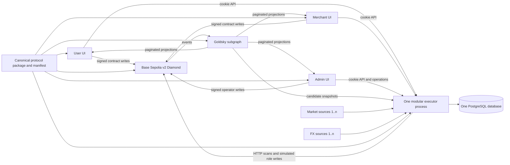
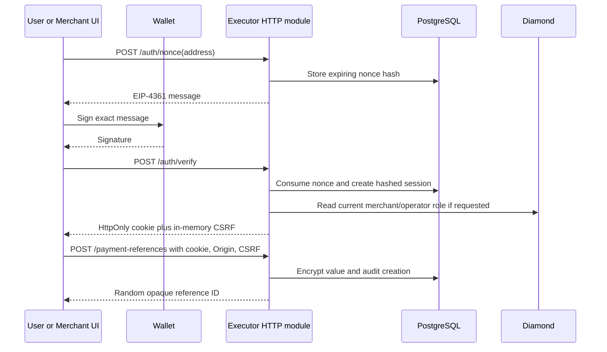
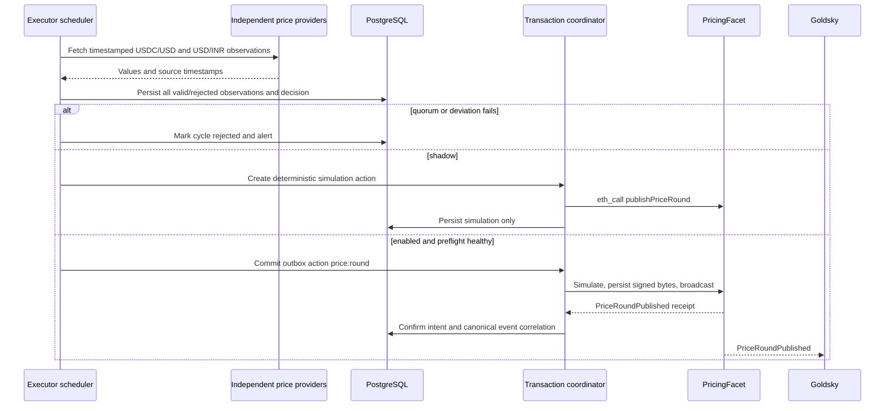
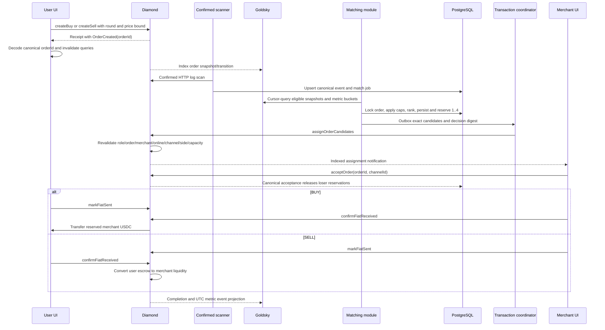
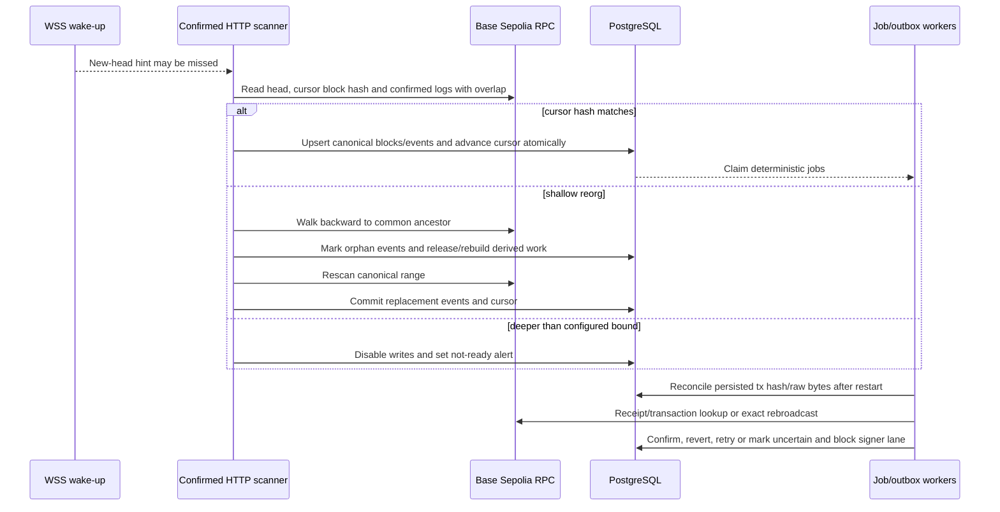

# Software Design Document

**Artifact slug:** `base-sepolia-marketplace-mvp` (paired RDD: [base-sepolia-marketplace-mvp-requirements.md](./base-sepolia-marketplace-mvp-requirements.md))  
**Workflow ID:** `aa373eab-90dc-49a2-8579-9291fe97e22c`  
**Title:** Base Sepolia Marketplace MVP  
**Version:** 1.0  
**Status:** PENDING_APPROVAL  
**RDD reference:** `docs/sdlc/aa373eab-90dc-49a2-8579-9291fe97e22c/base-sepolia-marketplace-mvp-requirements.md`

## 1. System overview

P2PFlow is currently five partially connected prototypes: the Diamond owns USDC and order state, three browser clients duplicate contract/configuration logic, and a Goldsky projection supplies most list reads. Pricing is static, merchant selection scans on-chain state, SELL can settle from one party's assertion, payment details are public or stored in an unauthenticated in-memory UI server, and the repositories do not share one deployable backend or one protocol definition.

This design produces a narrow, externally testable Base Sepolia marketplace. A clean v2 Diamond is the sole authority for roles, custody, merchant/channel eligibility, order transitions, pause state, and final assignment guardrails. Exactly one Node.js 24 LTS Fastify executor process contains pricing, matching, confirmed-chain ingestion, PostgreSQL jobs/outbox, transaction submission, wallet sessions, encrypted payment references, durable notifications, and operational scheduling as internal modules. Goldsky remains a rebuildable, privacy-safe read model. The user, merchant, and admin clients share generated protocol artifacts, use wallet-backed HttpOnly sessions for backend access, and expose only real BUY, SELL, fulfillment, and operator flows.

The default delivery scope is the smallest complete and safe MVP: all Must requirements are included, including cleanup that is explicitly required by FR-24. It does not authorize signing with the exposed key or any deployment. Automated writes remain off until a replacement signer, approved configuration, full verification, and the Base Sepolia release gate are available.

### 1.1 In scope

- One fresh, privacy-safe Base Sepolia v2 Diamond using the official six-decimal Circle USDC contract.
- Authorized price rounds, quote bounds, exact-candidate assignment, symmetric fiat acknowledgement, custody-safe cancellation/recovery/disputes, and separated roles.
- Exactly one modular executor application and one executor container/process, backed by one PostgreSQL database and no separately deployed queue, auth, pricing, scanner, or notification service.
- A generated typed protocol package and one versioned deployment manifest distributed identically to the executor, subgraph, and all three clients.
- A final-ABI Goldsky schema with current snapshots, immutable transitions, provenance, and UTC daily/monthly completed-volume metrics.
- Real user, merchant, and operator routes; wallet-signature sessions; encrypted payment references; targeted query caching; receipt-derived order IDs; durable notifications and operations views.
- Node.js 24 LTS and Solidity 0.8.24 build/test alignment, cross-repository compatibility checks, security/invariant coverage, and deletion of explicitly superseded code.

### 1.2 Out of scope

- Mainnet, real-fiat public production, old testnet state or PII migration, and any use of the exposed signer.
- Multiple tokens/chains/fiat currencies, bridges, gas sponsorship, QR/PAY, circles, reputation/ML routing, rewards, referrals, insurance, governance, campaigns, or advanced analytics.
- Bank/UPI payment-provider verification; the MVP records two explicit human attestations.
- On-chain UTC/rolling business caps, complex automatic timer trees, and a fleet of executor microservices.
- Horizontal active-active automation, a selected cloud/KMS/APM vendor, or a public external SDK.

### 1.3 Requirements coverage

| FR/NFR ID | Design section | Coverage |
|---|---|---|
| FR-1 | §§2.4, 3, 5.1, 9.5 | Base Sepolia and official USDC are fixed in one validated manifest. |
| FR-2 | §§2.1–2.3, 3.3, 5.2 | One process, image, entry point, database boundary, and internal module graph. |
| FR-3 | §§2.5, 3.3, 5.2, 6.2 | Multi-source validation, deterministic aggregation, persistence, and shadow mode. |
| FR-4 | §§4.27, 5.1, 6.2, 8 | Authorized monotonic price rounds, deviation/freshness/slippage checks. |
| FR-5 | §§4.27, 5.1, 6.3 | Creation records price round and event ID; clients decode the receipt. |
| FR-6 | §§2.6, 3.3, 5.2, 6.3 | Confirmed event to idempotent decision, reservations, ranking, and exact candidates. |
| FR-7 | §§4.27, 5.1, 8 | Bounded assignment entry point revalidates every candidate atomically. |
| FR-8 | §§2.7, 4.27, 5.1, 6.3 | BUY/SELL both require payer-sent and receiver-confirmed transitions. |
| FR-9 | §§2.7, 5.1, 8, 9 | Explicit custody buckets and release-once invariants across all terminal paths. |
| FR-10 | §§3.1, 4.6–4.9, 5.1–5.3 | Payment details and reference bindings stay private; only on-chain-generated opaque channel IDs are public. |
| FR-11 | §§2.6, 5.2–5.3, 6.3 | UTC Graph metrics plus PostgreSQL in-flight reservations enforce caps off-chain. |
| FR-12 | §§2.7, 4.27, 6.3, 8 | Only price/open-order/accepted-recovery safety bounds remain; transactions wake the contract. |
| FR-13 | §§2.8, 3.3, 5.2, 6.4 | WSS wake-ups, confirmed HTTP scans, block/hash cursor, overlap and reorg rebuild. |
| FR-14 | §§2.8, 5.2, 6.2–6.4, 8 | Deterministic actions, outbox, simulation, nonce lane, persisted raw tx and receipt reconciliation. |
| FR-15 | §§2.9, 4.1–4.4, 5.2, 6.1 | SIWE-style nonces, signature verification, revocable cookies, CSRF, current role checks. |
| FR-16 | §§3.4–3.6, 4, 9 | Central wallet/session/query ownership and targeted cache invalidation. |
| FR-17 | §§2.4, 3.2, 9.5 | Canonical generated protocol package, deterministic distribution, digest checks, old copies removed. |
| FR-18 | §§3.4, 4.5–4.10, 6.3 | Real quote/BUY/SELL/order/payment/recovery/history with bounded approval. |
| FR-19 | §§3.5, 4.6–4.14, 6.3 | Real onboarding, liquidity, assignments, fulfillment, history, references, notifications. |
| FR-20 | §§3.6, 4.15–4.23, 6.1 | Route guard plus live operator role and real contract/operations controls. |
| FR-21 | §§3.2, 4.28, 5.3 | Final ABI, snapshots/transitions/metrics, provenance, cursor reads, no private fields. |
| FR-22 | §§3.3, 4.15–4.25, 5.2 | Health, lag, jobs, decisions, reservations, tx uncertainty, audit logs and write modes. |
| FR-23 | §§2.4, 2.10, 9.5, 10.3 | Chain/token/facet/role/manifest preflight; no fallback and signing gate. |
| FR-24 | §§1.5, 3.4–3.6, 9.4 | Concrete removal inventory for demos, old backend/auth/ABI/config/time caps. |
| FR-25 | §9 | Unit, negative, access, invariant, restart/reorg, compatibility and E2E gates. |
| NFR-1 | §§2.7, 4.27, 9 | Admin/operator/updater/assigner separation, rotation, pause and denial tests. |
| NFR-2 | §§2.7, 5.1, 8, 9 | SafeERC20, CEI, shared guard, six-decimal math, custody conservation. |
| NFR-3 | §§2.9, 4.6–4.9, 5.2–5.3, 9 | Application encryption, hashed sessions, audit, redaction and artifact scans. |
| NFR-4 | §§2.5, 5.1–5.2, 8, 9 | Two-source quorum per price leg, outliers, rounding, rounds and bounds. |
| NFR-5 | §§2.8, 5.2, 6.4, 9 | Durable scans/jobs/transactions recover from restart, provider loss and reorg. |
| NFR-6 | §§2.6, 2.8, 5.2, 8, 9 | Deterministic unique keys and terminal reconciliation for every side effect. |
| NFR-7 | §§2.2, 2.6, 4.27–4.28, 8 | Projection state is advisory; Diamond revalidates financial actions. |
| NFR-8 | §§2.6, 4.26–4.28, 8, 9 | Candidate count 1–4, no registry scan, bounded cursor page sizes. |
| NFR-9 | §§3.4–3.6, 9 | Stable query keys, coalescing, explicit invalidation and no duplicate polling. |
| NFR-10 | §§3.3, 4.15–4.25, 5.2, 9 | Redacted correlation, health signals, metrics and audit coverage. |
| NFR-11 | §§2.1, 3.3, 5.2, 9 | Strict module exports, thin handlers, one process/image and shared DB transaction. |
| NFR-12 | §§2.4, 3.2, 9 | ABI/manifest/status/unit digest compatibility gates across all consumers. |
| NFR-13 | §§2.9, 4.1–4.4, 8, 9 | Nonce/session/cookie/origin/CSRF/role-change behavior and tests. |
| NFR-14 | §§2.10, 4.20–4.25, 9.5, 10.3 | Writes default off, reversible DB changes, additive v2 rollback and release rehearsal. |
| NFR-15 | §§1.4, 3, 9 | Node.js 24 LTS, Solidity 0.8.24, strict TypeScript, lockfiles and generated drift checks. |

## 1b. Scope options (user selects at SDD approval)

**Scope (choose one — default: Option 1):**

- (x) **Option 1 — Complete safe Base Sepolia MVP** — includes every Must requirement in the RDD across all six modifiable repositories: clean v2 Diamond, one executor, PostgreSQL, multi-source pricing, exact-candidate matching, subgraph, sessions/payment references, three real clients, required security/cleanup/tests, container/runbooks, and default-off Base Sepolia release tooling. It excludes mainnet, old-state migration, vendor-specific managed KMS/APM/hosting, active-active executor replicas, and all explicitly deferred product features.
- ( ) **Option 2 — MVP plus managed pilot operations** — includes Option 1 and additionally implements one chosen managed-signer/KMS adapter, private package-registry publishing for the protocol package, leader-safe multi-replica execution of the same executor artifact, provider-specific dashboards/alerts, and hosted backup/restore rehearsal. It still excludes mainnet, real-fiat public launch, multiple executor services, and deferred marketplace features.

**Cleanup (optional — beyond mandatory FR-24/remove-on-touch cleanup):**

- [ ] **Remove unused files and dead code** in adjacent unaffected areas after the required replacement/removal list is complete.

The FR-24 removal list in §1.5 is mandatory in both options; the checkbox only authorizes broader cleanup outside the affected MVP paths.

### 1.4 Transformation target state and change inventory

| Area | Current state | Option 1 target state |
|---|---|---|
| Runtime | Inconsistent/unverified Node baseline; Solidity pragmas include 0.8.20 | Node.js 24 LTS pinned in engines/CI/images; Solidity compiler and source at 0.8.24. |
| Protocol source | Handwritten ABI, enums, units and addresses in each consumer | One canonical strict TypeScript package generated from compiled facets and the deployment manifest, distributed with a digest. |
| Diamond | Static price, synchronous scan, public PII, asymmetric SELL and risky withdrawals | Clean v2 storage/events, separated roles, round pricing, async exact assignment, symmetric settlement and conserved custody. |
| Backend | No executor; merchant UI hosts a RAM API | One Fastify executable and image with internal modules plus PostgreSQL; UI backend deleted. |
| Queue/recovery | None | PostgreSQL jobs/outbox, confirmed HTTP scanner, WSS wake-up, block/hash cursor and reorg reconciliation. |
| Subgraph | Old deployment/ABI, PII fields, rolling-window assumptions | Manifest-derived source, opaque channel/reference data, immutable transitions and UTC calendar metrics. |
| Clients | Wallet-only auth, duplicate polling/config, fake or placeholder routes | Session-aware route guards, shared protocol, controlled TanStack Query reads, receipt decoding and real MVP routes. |
| Release | Mock/legacy fallbacks and environment drift | Base Sepolia fail-closed preflight, official USDC, default-off writes, coordinated compatibility/test gates. |

| Change category | Repository-specific inventory |
|---|---|
| Toolchain/build | Pin Node 24 engines/images/workflows in five Node repos plus new executor; pin Solidity 0.8.24; add deterministic test/typecheck/build scripts. |
| Dependencies | Add strict TypeScript/Fastify/viem/PostgreSQL/test dependencies to executor; add UI test/query dependencies where missing; remove browser JWT/crypto/server-only packages; reconcile lockfiles. |
| Runtime/config | Add validated executor config and write modes; generate one Base Sepolia manifest; expose only public Vite keys; align subgraph network/start block. |
| Application source | Replace contract price/matching/lifecycle/storage; implement executor modules; replace subgraph schema/mappings; wire real user/merchant/admin journeys. |
| Tests | Repair stale contract tests; add invariants/security, executor DB/reorg/idempotency, mapping, shared-package, UI hook/route, and BUY/SELL E2E suites. |
| Cleanup/release | Delete the exact superseded artifacts in §1.5; add privacy/bundle scans, deployment preflight, shadow-mode and rollback runbooks. |

### 1.5 Complete-delivery scope table and mandatory removals

| Layer | Repository and paths | Create | Modify | Delete/replace |
|---|---|---|---|---|
| Contract business | `p2pflow-smart-contract/contracts/facets`, `contracts/libraries` | `AccessControlFacet.sol`, `PricingFacet.sol`, `AssignmentFacet.sol`, `DisputeFacet.sol`, focused access/custody/price libraries as needed | `MerchantFacet.sol`, `OrderFacet.sol`, `ConfigFacet.sol` | Static price setters, eligible-merchant whitelist/router, registry-scan assignment, rolling cap and old one-party SELL paths. |
| Contract state/deploy | `contracts/shared`, `contracts/upgradeInitializers`, `scripts`, `deployments` | v2 initializer, manifest schema/generator/validator, protocol generator | `AppStorage.sol`, `DiamondInit.sol`, `deploy.js`, `upgrade.js`, smoke scripts, Hardhat config | `scripts/deployMockUsdc.js`, `deployments/baseSepolia-mock-usdc.json`, legacy Sepolia and permissive mock fallbacks; obsolete channel-limit/merchant-upgrade scripts after replacement. |
| Shared protocol | `p2pflow-smart-contract/packages/protocol` and generated vendor artifacts | ABI/events, manifest types, constants, enums, amount/rounding, tx preparation, receipt decoder, error mapping, digest checker | root package scripts/CI | Per-consumer handwritten ABI, address, unit, status and error implementations once migrated. |
| Executor HTTP | `p2pflow-executor/src/http`, `src/modules` | Routes in §4; sessions, prices, matching, orders, payments, notifications, operations modules | N/A (new repo) | No parallel server or module-specific process entry point. |
| Executor infrastructure | `p2pflow-executor/src/chain`, `src/db`, `src/queue`, `src/providers`, `migrations`, tests, container/runbooks | scanner, outbox workers, signer lanes, provider adapters, SQL migrations, one `main.ts`, one Dockerfile | N/A (new repo) | No Redis/BullMQ deployment, raw secret persistence, or additional service Dockerfile. |
| Subgraph | `p2pflow-subgraph/schema.graphql`, `src`, `abis`, `subgraph.yaml`, `networks`, tests | v2 schema/mapping tests and manifest preparation | mapping/helpers/package scripts/README | `networks/sepolia.yaml`, public PII fields/mappings, rolling cap fields, old ABI and legacy Sepolia commands. |
| User HTTP/business | `p2pflow-user-ui/src/App.jsx`, auth, hooks, Buy/Sell/Order/History pages | session/provider/API/query modules and tests | main/layout/real flow components | Stray admin route; referral/coming-soon limit/fake support/settings released routes; unused local auth/crypto/merchant API and duplicate ABI/config. |
| Merchant HTTP/business | `p2pflow-merchant-ui/src/App.jsx`, guards, hooks, Register/Account/Orders | session/query/payment-reference/notification modules and tests | main/layout/real flow components | `server.js`, RAM UPI/webhook API, fake three-second loader, countdown business timers, unused local auth/crypto and duplicate ABI/config; presentation-only routes removed from launch nav. |
| Admin HTTP/business | `p2pflow-admin-ui/src/App.jsx`, guards, hooks, Dashboard/Merchants/Channels/Prices/Transactions | QueryClient/session/operator guards, operations views and tests | main/layout/real control components | Inline coming-soon/dead routes, unused `PrivateRoutes`/auth/crypto, duplicate click hook, stale ABI/config, mock-success writes and non-MVP campaign surface. |
| Client deployment | each UI `package.json`, lockfile, `.env.example`, Docker/Jenkins/Vercel config | test scripts, SPA rewrites, privacy scan | dependencies, Docker ignore/build config | Every `VITE_*SECRET*`, copied `.env` image step, mock-USDC/Ethereum-Sepolia fallback and obsolete server dependency. |

Mandatory named removal checks include `p2pflow-merchant-ui/server.js`, `p2pflow-smart-contract/scripts/deployMockUsdc.js`, `p2pflow-smart-contract/deployments/baseSepolia-mock-usdc.json`, `p2pflow-subgraph/networks/sepolia.yaml`, the three old auth-store/crypto/PrivateRoutes implementations where superseded, all consumer-local Diamond ABI/address copies, and all secret-prefixed Vite keys. Test-only ERC-20 mocks remain isolated under `contracts/mocks` and can never enter a Base Sepolia manifest.

## 2. Architecture

### 2.1 Logical architecture

The executor is one deployable modular monolith. All HTTP routes, schedulers, scanner loops and workers start from `src/main.ts`; modules expose typed service interfaces through their public `index.ts` and cannot deep-import each other's persistence internals. PostgreSQL is the sole new durable store and transaction coordinator. A database-backed `FOR UPDATE SKIP LOCKED` worker loop replaces a separate Redis/queue service. WSS only wakes the scanner; confirmed HTTP logs are canonical.

Browsers sign user/merchant/operator Diamond calls directly so the executor never becomes a general custodian or relayer. The executor signs only explicitly authorized automation actions—price publication, candidate assignment and safe expiry/recovery—using separated signer roles. It serves projections and private references but rechecks the Diamond before privileged disclosure or state-changing operator APIs.

### 2.2 Authority and consistency boundaries

| Concern | Authority | Cached/projected copy | Mandatory write-time check |
|---|---|---|---|
| USDC custody, order status, reservation, merchant/channel eligibility | Diamond | Subgraph and executor evidence | Contract state and custom-error guardrails. |
| Price evidence | Executor PostgreSQL | Admin operations API | PricingFacet publisher role, source quorum, monotonicity, deviation and order-time freshness/bound. |
| Candidate ranking/caps | Executor decision + PostgreSQL reservations | Admin audit view | AssignmentFacet revalidates exact candidates atomically. |
| Lists/history/UTC metrics | Goldsky | TanStack Query | Never used alone to authorize money or PII access. |
| Sessions and payment details | Executor PostgreSQL | Browser memory holds only session display/CSRF | Signature, cookie, origin/CSRF, current participant/role check. |
| Deployment identity | Canonical manifest | Generated consumer artifact | Startup/build/deploy digest and bytecode/selector validation. |

### 2.3 One-executor module boundaries

`config` validates environment and manifest; `db` owns migrations/transactions; `chain` owns confirmed ingestion and reads; `queue` owns durable jobs/outbox; `transactions` owns simulation/nonces/sign/broadcast/reconcile; `pricing`, `matching`, `sessions`, `payments`, `orders`, `notifications`, and `operations` are domain modules; `http` is schema/authorization/serialization only. One lifecycle controller starts them in order and drains HTTP/workers before closing the database. No module exposes its own port, image, process, or datastore.

### 2.4 Protocol package and deployment manifest

The canonical source is `p2pflow-smart-contract/packages/protocol`. Compilation generates facet ABIs and event definitions; a manifest generator emits `deployments/base-sepolia.json` with:

- `schemaVersion`, `protocolVersion`, `chainId: 84532`, network name and creation timestamp;
- Diamond address, deployment transaction hash, deployment block/start block;
- official USDC address and `decimals: 6`;
- each facet name/address/code hash/function selectors;
- expected owner/admin/operator/updater/assigner addresses and role IDs;
- ABI SHA-256 and whole-manifest SHA-256.

The package exports the manifest schema, ABI, `OrderType`/status enums, E6 amount helpers using bigint only, BUY-ceil/SELL-floor price helpers, prepared contract calls, custom-error mapping, and `decodeOrderCreated(receipt)` which fails unless exactly one matching log from the manifest Diamond exists. The canonical package is built once with `npm pack`; coordinated CI distributes that immutable tarball to each repo's generated `vendor/` dependency and verifies package version plus digest. Generated vendor content is allowed; handwritten forks are not. Option 2 may replace vendoring with a private registry without changing imports.

No production manifest exists until a safe deployment occurs. Predeployment tests use an explicitly named local fixture; Base Sepolia builds and executor startup fail closed if the real manifest is absent, incomplete, points to the old/mock deployment, or has a digest mismatch.

### 2.5 Price computation

Each enabled cycle gathers at least two independent `USDC/USD` observations and at least two independent `USD/INR` observations through concrete provider adapters. Every observation carries provider, pair, decimal string, provider timestamp and receive timestamp. The module rejects non-positive/non-finite values, wrong pairs, missing timestamps, age beyond `sourceMaxAgeSeconds`, HTTP timeout/error, and values outside `sourceDeviationBps` of the median. Both legs must retain the configured quorum; otherwise the cycle is persisted as rejected and no publication action is created.

Accepted values are normalized to an internal 1e8 scale. The median USDC/USD and median USD/INR produce a mid INR/USDC value. BUY applies `buySpreadBps` and rounds upward to E6; SELL applies `sellSpreadBps` and rounds downward to E6; BUY must remain greater than or equal to SELL. The evidence rows, normalized medians, parameters, result, oldest source timestamp and `keccak256` evidence digest are persisted. The next round is exactly the latest confirmed on-chain round plus one. `off` records health only, `shadow` persists and simulates, and `enabled` adds an outbox action. An operator-triggered run uses the identical pipeline; there is no unsafe manual price setter.

### 2.6 Matching and reservations

One confirmed `OrderCreated` event creates job `match:<chainId>:<orderId>:<assignmentEpoch>`. The worker waits until Goldsky has indexed at least the event block and stays below the configured lag limit. It cursor-queries bounded pages of merchant/channel snapshots, then filters by order side, account ACTIVE, ONLINE, channel APPROVED/ACTIVE, side mask, declared current capacity, cap policy, UTC completed totals and active PostgreSQL reservations.

Eligible rows sort by `lastCompletedAt ASC NULLS FIRST`, completed count ascending, then a stable hash of `(orderId, merchant, channel)`; no randomness, reputation or ML is used. In one serializable transaction guarded by an order advisory lock, the executor records every accepted/rejected candidate and reason, inserts active reservations for up to four ordered candidates, stores the evidence block and decision digest, and inserts one assignment outbox action. A partial set of one to four is valid. Zero candidates becomes a bounded retry/visible `NO_ELIGIBLE_MERCHANT`, never an empty on-chain call.

All candidate reservations are conservative until one merchant accepts. `OrderAccepted` retains the winner and releases losers; rejection releases that candidate; cancellation/expiry/completion/dispute terminal events release all remaining rows. Assignment revert releases the decision reservations before recomputation. Unique active `(orderId, merchant, channel, epoch)` rows and locked cap aggregation prevent double capacity. The Diamond independently rejects stale or invalid candidates.

### 2.7 Contract state, custody and time model

The v2 order state machine is `CREATED -> ASSIGNED -> ACCEPTED -> FIAT_SENT -> COMPLETED`, with `CREATED/ASSIGNED -> CANCELLED|EXPIRED`, `ASSIGNED -> CREATED` after all candidates reject or an assignment expires, `ACCEPTED -> EXPIRED` only before fiat is marked sent and after its recovery bound, and `ACCEPTED|FIAT_SENT -> DISPUTED -> COMPLETED|CANCELLED`. Every transition is actor-restricted and single-use.

BUY acceptance reserves merchant USDC; the user marks fiat sent; the merchant confirms receipt; completion releases the reservation, debits merchant liquidity and transfers USDC to the user. SELL creation escrows exact user USDC; merchant acceptance reserves declared channel fiat; the merchant marks fiat sent; the user confirms receipt; completion releases/debits fiat capacity and converts escrow into merchant USDC liquidity. A payer's assertion never settles. Dispute resolution executes the same completion or cancellation accounting helpers exactly once.

Global `totalMerchantStakeUsdc`, `totalMerchantLiquidityUsdc`, `totalReservedBuyUsdc` and `totalSellEscrowUsdc`, per-merchant `reservedUsdc`, and per-channel `reservedFiatE6` make obligations explicit. Stake and trading liquidity are separate; withdrawable trading USDC is `liquidity - reservedUsdc - disputeLockedUsdc`, while stake exits require zero obligations and the explicit exit path. SafeERC20, balance-delta checks on inbound official USDC, checks-effects-interactions, one Diamond-wide reentrancy lock and `Math.mulDiv` protect all token paths.

`block.timestamp` is read only when a caller submits a transaction. The contract keeps price freshness, an unaccepted order deadline, a bounded assignment deadline, and an accepted-before-payment recovery deadline. The executor schedules calls, but users/operators can invoke the same permission-safe recovery. No daily/monthly window, recurring clock job or autonomous cancellation exists in Solidity.

### 2.8 Chain ingestion and transaction safety

At startup and before every write mode is enabled, the executor validates chain ID, manifest digest, Diamond/USDC bytecode, USDC decimals, protocol version, facet selectors and signer roles. The scanner compares its stored block hash with HTTP RPC, scans through `head - confirmations`, replays an overlap, and commits canonical blocks/events plus the next cursor in one transaction. WSS only signals a possible new head.

On a hash mismatch it walks backward within `reorgOverlapBlocks` to a common ancestor, marks later events non-canonical, orphans non-terminal jobs/decisions/reservations derived from them, reconciles any transaction receipts, then deterministically replays. A deeper mismatch makes readiness false and all writes off pending operator review.

Each side effect has one deterministic `actionId`. The transaction worker simulates calldata, serializes a signer nonce lane with a PostgreSQL advisory lock, persists intent, nonce, signed raw transaction and deterministic hash before broadcast, and then broadcasts that exact byte sequence. A restart rebroadcasts or reconciles the same hash. States are `PREPARED`, `BROADCAST`, `CONFIRMED`, `REVERTED`, `RETRYABLE`, or `UNCERTAIN`; an uncertain nonce blocks later writes for that signer rather than creating a silent replacement/double action.

### 2.9 Authentication, privacy and client state

The executor creates an EIP-4361-compatible message for the configured API/UI domain, URI, Base Sepolia chain ID, address, random nonce, issued-at and expiry. Verification consumes the nonce in one database transaction, recovers the address, creates a random opaque session, stores only a keyed hash, and sets a `__Host-p2pflow_session` cookie (`Secure`, `HttpOnly`, `SameSite=Lax`, `Path=/`, no Domain). A separate CSRF value is returned to browser memory and its hash is stored in the session; mutating cookie requests require the header plus an exact HTTPS Origin allowlist. Session TTL is short, logout revokes it, wallet change triggers logout, and role-revocation events evict role caches/sessions.

Merchant/operator endpoint authorization rechecks the current Diamond role or merchant status. Payment-reference disclosure additionally reads the authoritative order and permits only its user, accepted merchant, or an operator. Random 32-byte reference IDs have no derivation from PII and never enter calldata, contract state, public events or Graph entities. Values are schema-validated, encrypted with AES-256-GCM using an injected versioned envelope key, and accessed through audited services. A reference is created before the relevant transaction, then bound after receipt to an on-chain-generated channel ID or emitted order ID; matching/approval waits for that verified binding, so a failed browser callback is safely retryable rather than losing data. No PII enters URLs, events, Graph entities, logs, metrics, error bodies or browser persistence.

Each UI mounts one wallet reconnect owner, one `QueryClient`, one session provider and one API client. Query keys come from a central factory; identical reads coalesce. Graph/executor projections use cursor pages and bounded stale/refetch policies. Direct RPC is reserved for balance, allowance, authoritative pre-write state, receipts and security-critical role/participant checks. Post-receipt invalidation targets the affected quote/order/merchant keys; no component creates its own duplicate polling loop.

### 2.10 Runtime, rollout and rollback

- Node.js 24 LTS is pinned via `engines`, version file, CI and executor/UI/subgraph container stages; strict TypeScript applies to executor/protocol. Solidity sources and Hardhat compiler use exact 0.8.24.
- Local Compose runs PostgreSQL and the one executor image; PostgreSQL is infrastructure, not another P2PFlow service. The Base Sepolia deployment unit is one executor container plus static UI sites and Goldsky.
- `PRICE_WRITE_MODE` and `MATCH_WRITE_MODE` default to `off`; `shadow` enables evidence/simulation only; `enabled` requires a non-exposed signer, exact role, healthy scanner/database/subgraph and manifest validation.
- Rollback first pauses the Diamond and turns executor writes off, then rolls back static clients/executor, applies a tested reversible DB down migration if needed, and uses an additive v2 Diamond cut to restore prior v2 selectors. The old privacy-leaking v1 Diamond is never a rollback target.
- P2P.me repositories remain read-only design references and are not imported, patched or deployed.

### 2.11 Architecture decisions

| Decision | Choice and rationale | Consequence |
|---|---|---|
| ADR-1 | Fresh v2 Diamond rather than upgrading the PII-bearing nested v1 storage. | No legacy state migration; deployment tooling refuses v1 upgrade and future v2 storage is append-only. |
| ADR-2 | One Fastify modular monolith plus PostgreSQL, no Redis. | Lowest deploy/operations surface while retaining durable jobs, outbox and locks. |
| ADR-3 | Direct browser signing for participant/operator actions; executor signs only automation roles. | Executor compromise cannot impersonate users or own all administration. |
| ADR-4 | Confirmed HTTP log scans are canonical; WSS is a wake-up. | Missed sockets/restarts converge deterministically at modest latency. |
| ADR-5 | Goldsky supplies discovery/history, never authorization. | Every financial write/disclosure has chain or server-owned revalidation. |
| ADR-6 | Canonical protocol package built from contract output and one manifest. | Cross-repo drift becomes a digest/build failure. |
| ADR-7 | SIWE-style cookie sessions and in-memory CSRF, not localStorage JWT/auth flags. | Revocable backend identity with reduced browser secret exposure. |
| ADR-8 | Conservative reservation of every submitted candidate. | Prevents off-chain overbooking; loser reservations release on canonical acceptance/rejection/terminal events. |
| ADR-9 | Disputes happen before final settlement; no broad post-completion risk window. | Symmetric confirmation is final and eliminates the old unilateral SELL/risk-bucket complexity. |

## 3. Components

| Component | Responsibility | Repo | New/Modified | FR/NFR |
|---|---|---|---|---|
| `AppStorage` v2 and shared modifiers | Clean storage, enums, roles, custody totals, pause and reentrancy lock | smart-contract | Modified/replaced for fresh v2 | FR-4, FR-8–12; NFR-1–2 |
| `AccessControlFacet` / `LibAccess` | Role grant/revoke/query and separated owner/admin/operator/publisher/assigner/pauser/resolver authority | smart-contract | New | FR-4, FR-7, FR-20; NFR-1 |
| `PricingFacet` / `LibPricing` | Monotonic price rounds, evidence digest, policy, freshness and deviation | smart-contract | New | FR-4–5; NFR-4 |
| `AssignmentFacet` | Exact 1–4 candidate assignment and full merchant/channel guardrails | smart-contract | New | FR-6–7; NFR-7–8 |
| `OrderFacet` / `LibOrders` / `LibCustody` | Quote-bound creation, state transitions, settlement, cancellation, recovery and disputes | smart-contract | Modified | FR-5, FR-8–9, FR-12; NFR-2 |
| `DisputeFacet` | Opens and resolves pre-settlement disputes through the same conserved completion/cancellation helpers | smart-contract | New | FR-8–9, FR-12; NFR-1–2 |
| `MerchantFacet` / `LibMerchants` | PII-free onboarding, approval, availability, liquidity, channel metadata and safe withdrawal | smart-contract | Modified | FR-9–10; NFR-2–3 |
| v2 initializer/deployment/preflight | Fresh Diamond, selector/role/token checks and generated manifest | smart-contract | New/modified | FR-1, FR-23; NFR-12, NFR-14 |
| `@p2pflow/protocol` | ABI, manifest, bigint units, statuses, calls, errors and receipt decoding | smart-contract | New package | FR-1, FR-17; NFR-12, NFR-15 |
| Graph v2 schema/mappings | Snapshots, transitions, candidates, disputes and UTC metrics with provenance | subgraph | Modified | FR-11, FR-21; NFR-3, NFR-12 |
| Executor bootstrap/config | One process lifecycle, strict config, module composition and graceful drain | executor | New | FR-2, FR-22; NFR-11, NFR-15 |
| Chain scanner | Confirmed HTTP scans, WSS wake-up, cursor, overlap and reorg replay | executor | New | FR-13; NFR-5–6 |
| Durable job/outbox module | Deterministic jobs/actions, retry scheduling and shared transactions | executor | New | FR-14; NFR-5–6, NFR-11 |
| Transaction coordinator | Simulation, role signer lanes, nonce serialization, raw-tx persistence and receipts | executor | New | FR-14, FR-23; NFR-1, NFR-5–6, NFR-14 |
| Pricing module/providers | Observation collection, validation, aggregation, evidence, shadow/publish jobs | executor | New | FR-3–4, FR-22; NFR-4 |
| Matching module | Graph candidates, cap checks, fairness, decisions and atomic reservations | executor | New | FR-6, FR-11, FR-22; NFR-6–8 |
| Session/auth module | Nonces, signatures, session cookies, CSRF/origin and role middleware | executor | New | FR-15, FR-20; NFR-3, NFR-13 |
| Payment-reference module | Encrypted channel/payout details and participant-scoped audited disclosure | executor | New | FR-10, FR-18–19; NFR-3 |
| Orders/notifications module | Participant projections, durable inbox, canonical-event notification generation | executor | New | FR-18–19, FR-22; NFR-5–6 |
| Operations module | Health, lag, jobs, tx uncertainty, decisions, reservations, caps and write modes | executor | New | FR-20, FR-22; NFR-10, NFR-14 |
| User app providers/hooks/routes | Session, quote, exact approval, receipt ID, order actions/history and cache | user-ui | Modified | FR-16, FR-18, FR-24; NFR-9, NFR-13 |
| Merchant app guards/hooks/routes | Session/onboarding, liquidity/channel, assignments, two-party settlement, inbox/history | merchant-ui | Modified | FR-16, FR-19, FR-24; NFR-3, NFR-9 |
| Admin app guard/controls | Operator route guard, QueryClient, merchant/channel/price/order/dispute/pause/health views | admin-ui | Modified | FR-16, FR-20, FR-24; NFR-1, NFR-9, NFR-13 |

## 4. APIs

### 4.0 HTTP conventions

All executor routes use `/v1`, strict JSON schemas, `Content-Type: application/json`, request IDs, bounded bodies and the error shape `{ "error": { "code": "...", "message": "...", "requestId": "..." } }`. Details never contain secrets or payment values. Cursor lists default to 25 and reject limits outside 1–100. Cursors are opaque, integrity-protected `(sortKey,id)` values. Mutating authenticated routes require the session cookie, exact Origin, `X-CSRF-Token`, and `Idempotency-Key` except deterministic read-state updates explicitly noted below.

Stable mappings include `400 VALIDATION_FAILED`, `401 SESSION_INVALID`, `403 ROLE_REQUIRED|ORDER_ACCESS_DENIED`, `404 NOT_FOUND`, `409 ORDER_STATE_CONFLICT|IDEMPOTENCY_CONFLICT`, `422 INVALID_PRICE_ROUND|STALE_PRICE|ASSIGNMENT_REJECTED`, `429 RATE_LIMITED`, `503 DEPENDENCY_UNAVAILABLE|CHAIN_REORG_RETRY`, and `504 TRANSACTION_UNCERTAIN`.

### 4.1 Create authentication nonce

- **Method / Path:** `POST /v1/auth/nonce`
- **Auth:** Public; rate-limited by normalized address and IP.
- **Request:** `{ address: 0x..., intendedRole?: "USER"|"MERCHANT"|"OPERATOR" }`.
- **Response:** `201 { nonceId, message, expiresAt }`; message is server-generated EIP-4361 data for chain 84532 and allowed domain/URI.
- **Errors:** 400 invalid address, 429 rate limit, 503 database unavailable.
- **Idempotency / rate limits:** A new nonce invalidates older unused nonces for the address; maximum five per ten minutes.

### 4.2 Verify wallet signature

- **Method / Path:** `POST /v1/auth/verify`
- **Auth:** Public with nonce; exact configured Origin required.
- **Request:** `{ nonceId, message, signature }`.
- **Response:** `200 { address, expiresAt, roles, csrfToken }` plus Secure HttpOnly session cookie.
- **Errors:** 400 message mismatch/wrong domain or chain, 401 invalid/replayed/expired nonce or signature, 429 rate limit.
- **Idempotency / rate limits:** Nonce is consumed atomically once; replay is always 401.

### 4.3 Get current session

- **Method / Path:** `GET /v1/auth/session`
- **Auth:** Session cookie.
- **Request:** No body.
- **Response:** `200 { address, expiresAt, roles, merchantStatus, csrfToken }`; CSRF is rotated into memory.
- **Errors:** 401 absent/revoked/expired/wallet-invalidated session, 503 chain role check unavailable.
- **Idempotency / rate limits:** Read-only; short per-session rate limit.

### 4.4 Logout

- **Method / Path:** `POST /v1/auth/logout`
- **Auth:** Session + Origin + CSRF.
- **Request:** Empty object.
- **Response:** `204`, cookie expired and session revoked.
- **Errors:** 401 invalid session, 403 origin/CSRF failure.
- **Idempotency / rate limits:** Repeated logout is a safe 204.

### 4.5 Get executable quote

- **Method / Path:** `GET /v1/prices/quote?side=BUY|SELL&usdcAmount=<atoms>`
- **Auth:** Public; address-independent rate limit.
- **Request:** Positive six-decimal USDC atoms within configured UI bounds.
- **Response:** `{ chainId, usdc, roundId, selectedPriceE6, fiatAmountE6, publishedAt, expiresAt, boundPriceE6, defaultSlippageBps, evidenceDigest, executable }`.
- **Errors:** 400 amount/side, 422 stale/no published price, 503 source/chain unavailable.
- **Idempotency / rate limits:** Read-only; quote cache keyed by round/side/amount and never outlives contract freshness.

### 4.6 Create encrypted payment reference

- **Method / Path:** `POST /v1/payment-references`
- **Auth:** Session + Origin + CSRF.
- **Request:** `{ purpose: "MERCHANT_CHANNEL"|"SELL_PAYOUT", rail: "UPI", value: { upiId, displayLabel? } }`; strict lengths/characters.
- **Response:** `201 { referenceId: bytes32, purpose, createdAt, status: "ACTIVE" }`; plaintext is never returned here after validation.
- **Errors:** 400 schema, 401 session, 403 role mismatch, 409 idempotency mismatch, 413 body too large, 503 encryption key/database unavailable.
- **Idempotency / rate limits:** Required idempotency key; one response per key/session.

### 4.6a Bind a reference to a confirmed channel or order

- **Method / Path:** `POST /v1/payment-references/:referenceId/bind`
- **Auth:** Owner session + Origin + CSRF.
- **Request:** `{ targetType: "MERCHANT_CHANNEL"|"SELL_ORDER", targetId: bytes32, transactionHash }`.
- **Response:** `200 { referenceId, targetType, targetId, status: "BOUND" }` after the executor verifies the canonical receipt/event, target ownership and purpose.
- **Errors:** 400 purpose/target mismatch, 401 session, 403 not owner, 404 reference/event, 409 already bound to another target or receipt not canonical, 503 chain unavailable.
- **Idempotency / rate limits:** Idempotency key required; rebinding the same verified target returns the original result. Channel approval and SELL matching fail closed until binding exists.

### 4.7 List own payment references

- **Method / Path:** `GET /v1/payment-references?purpose=<type>&cursor=<cursor>&limit=<1..100>`
- **Auth:** Session; owner only.
- **Request:** Query only.
- **Response:** `{ items: [{ referenceId, purpose, rail, maskedLabel, status, createdAt }], nextCursor }`.
- **Errors:** 400 cursor/limit, 401 session.
- **Idempotency / rate limits:** Read-only; no plaintext values in list output.

### 4.8 Revoke a payment reference

- **Method / Path:** `DELETE /v1/payment-references/:referenceId`
- **Auth:** Owner session + Origin + CSRF.
- **Request:** No body.
- **Response:** `204` and logical revocation; ciphertext follows retention policy.
- **Errors:** 401 session, 403 not owner, 404 unknown, 409 bound to non-terminal order/active channel.
- **Idempotency / rate limits:** Required idempotency key; already revoked returns 204.

### 4.9 Read the order payment reference

- **Method / Path:** `GET /v1/orders/:orderId/payment-reference`
- **Auth:** Session; authoritative Diamond check requires order user, accepted merchant, or current operator.
- **Request:** Order ID path parameter; no reference ID appears in URL.
- **Response:** `200 { rail, value, displayLabel?, referenceId, accessExpiresAt }`, `Cache-Control: no-store`.
- **Errors:** 401 session, 403 not a current party/role, 404 absent/revoked, 409 order not accepted, 503 chain unavailable.
- **Idempotency / rate limits:** Each success/denial is access-audited; low per-order rate limit.

### 4.10 List participant orders

- **Method / Path:** `GET /v1/orders?status=<status>&cursor=<cursor>&limit=<1..100>`
- **Auth:** Session; address is taken only from session.
- **Request:** Optional status/cursor/limit.
- **Response:** Cursor page of Graph projections plus `indexingBlock`, `chainHead` and `indexingPending`; no PII.
- **Errors:** 400 filters/cursor, 401 session, 503 subgraph unavailable/stale beyond read threshold.
- **Idempotency / rate limits:** Stable query-key response suitable for TanStack Query.

### 4.11 List merchant assignments

- **Method / Path:** `GET /v1/merchant/assignments?state=PENDING|ACTIVE&cursor=<cursor>&limit=<1..100>`
- **Auth:** Session plus current registered ACTIVE/INACTIVE merchant check.
- **Request:** Bounded filter/cursor.
- **Response:** Assigned order/channel summaries, assignment epoch/deadline and indexing metadata.
- **Errors:** 401 session, 403 not merchant/blacklisted, 503 subgraph/chain unavailable.
- **Idempotency / rate limits:** Read-only; shared inbox cache key, event-targeted invalidation.

### 4.12 List merchant activity

- **Method / Path:** `GET /v1/merchant/activity?cursor=<cursor>&limit=<1..100>`
- **Auth:** Current merchant session.
- **Request:** Cursor/limit.
- **Response:** Completed/cancelled/rejected order transitions and daily/monthly totals.
- **Errors:** 400 cursor, 401 session, 403 role, 503 subgraph unavailable.
- **Idempotency / rate limits:** Read-only cursor page.

### 4.13 List notifications

- **Method / Path:** `GET /v1/notifications?unreadOnly=<bool>&cursor=<cursor>&limit=<1..100>`
- **Auth:** Session; recipient is session address.
- **Request:** Filter/cursor.
- **Response:** Durable redacted notification rows containing type/order ID/timestamp/read state, never payment data.
- **Errors:** 400 cursor, 401 session.
- **Idempotency / rate limits:** Read-only; generated idempotently from canonical events.

### 4.14 Mark notification read

- **Method / Path:** `POST /v1/notifications/:notificationId/read`
- **Auth:** Recipient session + Origin + CSRF.
- **Request:** Empty object.
- **Response:** `204`.
- **Errors:** 401 session, 403 not recipient, 404 unknown.
- **Idempotency / rate limits:** Deterministic and safely repeatable; no idempotency header required.

### 4.15 Get detailed operations health

- **Method / Path:** `GET /v1/admin/operations/health`
- **Auth:** Current `OPERATOR_ROLE` session.
- **Request:** None.
- **Response:** Redacted database/migration, chain/cursor/subgraph lag, price quorum/age/deviation, job/outbox, signer/nonce, uncertain transaction, reservation and write-mode state.
- **Errors:** 401 session, 403 role, 503 dependency unavailable with safe partial status.
- **Idempotency / rate limits:** Read-only, short cache.

### 4.16 List jobs and outbox actions

- **Method / Path:** `GET /v1/admin/jobs?type=<type>&state=<state>&cursor=<cursor>&limit=<1..100>`
- **Auth:** Current operator session.
- **Request:** Filters/cursor.
- **Response:** Redacted job/action IDs, attempts, schedule, terminal/error class and correlation IDs.
- **Errors:** 400 filter/cursor, 401 session, 403 role.
- **Idempotency / rate limits:** Read-only.

### 4.17 List matching decisions

- **Method / Path:** `GET /v1/admin/matching-decisions?orderId=<id>&cursor=<cursor>&limit=<1..100>`
- **Auth:** Current operator session.
- **Request:** Optional order and cursor.
- **Response:** Evidence block, algorithm version, candidate ranks/rejection codes, decision digest, assignment action and outcome.
- **Errors:** 400 ID/cursor, 401 session, 403 role.
- **Idempotency / rate limits:** Read-only; no private rail values.

### 4.18 List capacity reservations

- **Method / Path:** `GET /v1/admin/reservations?merchant=<address>&state=<state>&cursor=<cursor>&limit=<1..100>`
- **Auth:** Current operator session.
- **Request:** Bounded filters/cursor.
- **Response:** Order/candidate/channel IDs, side, USDC/fiat amount, UTC bucket keys, state and release reason.
- **Errors:** 400 filters, 401 session, 403 role.
- **Idempotency / rate limits:** Read-only.

### 4.19 List transaction intents and attempts

- **Method / Path:** `GET /v1/admin/transactions?state=<state>&signerRole=<role>&cursor=<cursor>&limit=<1..100>`
- **Auth:** Current operator session.
- **Request:** Filters/cursor.
- **Response:** Action ID, signer address/role, nonce, calldata hash, tx hash, simulation/receipt state and safe error class; never raw signed bytes.
- **Errors:** 400 filters, 401 session, 403 role.
- **Idempotency / rate limits:** Read-only.

### 4.20 Change automation mode

- **Method / Path:** `PUT /v1/admin/automation-mode`
- **Auth:** Current operator session + Origin + CSRF.
- **Request:** `{ module: "PRICING"|"MATCHING"|"RECOVERY", mode: "OFF"|"SHADOW"|"ENABLED", expectedVersion }`.
- **Response:** `{ module, mode, version, effectiveAt, preflight }`.
- **Errors:** 401 session, 403 role/CSRF, 409 version conflict, 422 preflight failure, 503 signer/chain unhealthy.
- **Idempotency / rate limits:** Idempotency key and optimistic version required; enablement fails if signer is missing/exposed/unfunded or lacks role.

### 4.21 Trigger one pricing cycle

- **Method / Path:** `POST /v1/admin/pricing/run`
- **Auth:** Current operator session + Origin + CSRF.
- **Request:** `{ mode?: "SHADOW"|"USE_CONFIGURED_MODE" }`.
- **Response:** `202 { jobId, requestedMode }`.
- **Errors:** 401 session, 403 role, 409 cycle already active/idempotency mismatch, 422 no configured quorum.
- **Idempotency / rate limits:** Idempotency key required; uses the same collection/validation/publication pipeline as scheduling.

### 4.22 List cap policies

- **Method / Path:** `GET /v1/admin/cap-policies?merchant=<address>&cursor=<cursor>&limit=<1..100>`
- **Auth:** Current operator session.
- **Request:** Filters/cursor.
- **Response:** Merchant/channel/side policy, UTC daily/monthly caps, version and effective state.
- **Errors:** 400 filters, 401 session, 403 role.
- **Idempotency / rate limits:** Read-only.

### 4.23 Upsert cap policy

- **Method / Path:** `PUT /v1/admin/cap-policies`
- **Auth:** Current operator session + Origin + CSRF.
- **Request:** `{ merchant, channelId?, side: "BUY"|"SELL"|"BOTH", dailyUsdcAtoms, monthlyUsdcAtoms, expectedVersion }`; zero means disabled only when explicitly confirmed.
- **Response:** `200 { policyId, version, effectiveAt }`.
- **Errors:** 400 units/monthly below daily, 401 session, 403 role, 409 version/idempotency conflict.
- **Idempotency / rate limits:** Idempotency key plus optimistic version; every change audit-logged.

### 4.24 Liveness

- **Method / Path:** `GET /health/live`
- **Auth:** Public; infrastructure rate limit.
- **Request:** None.
- **Response:** `200 { status: "live", version }` while event loop serves.
- **Errors:** No dependency details; process failure closes endpoint.
- **Idempotency / rate limits:** Read-only.

### 4.25 Readiness

- **Method / Path:** `GET /health/ready`
- **Auth:** Public redacted view; detailed state is §4.15.
- **Request:** None.
- **Response:** `200 { status: "ready", writeModes }` only when DB migration, manifest, chain identity and scanner are healthy; otherwise `503 { status: "not_ready", reasonCode }`.
- **Errors:** 503 redacted reason only.
- **Idempotency / rate limits:** Read-only; WSS loss alone does not fail readiness if confirmed scanning is healthy.

### 4.26 Common pagination and GraphQL read contracts

The clients/executor use named Graph operations generated from the final schema: `PlatformSnapshot`, `PriceRounds`, `ParticipantOrders`, `MerchantAssignments`, `MerchantChannels`, `OrderTransitions`, `Disputes`, `MerchantDailyMetrics`, and `MerchantMonthlyMetrics`. Every list takes `first <= 100` plus `id_gt` or immutable `eventCursor_gt`; no `skip` pagination is used. Responses surface `_meta.block.number` so callers can label indexing lag. GraphQL is public projection data and never returns session or payment-reference values.

### 4.27 Diamond callable interface

These are contract calls, not executor HTTP endpoints:

| Facet | New/changed calls | Auth and behavior |
|---|---|---|
| `AccessControlFacet` | `hasRole`, `grantRole`, `revokeRole`, `renounceRole`, role constant getters | Default admin manages nonzero addresses; Diamond owner remains distinct for cuts; the last default admin cannot be removed. Roles include operator, price publisher, assigner, pauser and dispute resolver. |
| `ConfigFacet` | `pausePlatform`, `unpausePlatform`, `setSafetyConfig`, `getConfig`, `protocolVersion` | Operator role; safety values are bounded and evented. Pause blocks new risk but not safe exit/dispute/recovery. |
| `PricingFacet` | `publishPriceRound(roundId,buyPriceE6,sellPriceE6,sourceObservedAt,sourceCount,evidenceDigest,publicationKind)`, `getLatestPriceRound`, `setPricePolicy`, `getPricePolicy` | Publisher or separately authorized emergency operator; identical monotonic/nonzero/quorum/BUY >= SELL/future/stale/deviation validator and event path. |
| `MerchantFacet` | `registerMerchant(stake)`, `approveMerchant`, `setMerchantStatus`, `depositLiquidity`, `withdrawLiquidity`, `setAvailability`, `registerPaymentChannel(sideMask,fiatCapacityE6) returns (channelId)`, `reviewPaymentChannel`, `setChannelAvailability`, `setChannelFiatCapacity`, bounded views | Merchant actions self-only; review/status operator-only; channel ID is generated from chain/Diamond/merchant nonce; withdrawal cannot consume stake or obligations. Executor binding is private/off-chain. |
| `OrderFacet` | `createBuyOrder(usdcAtoms,expectedRoundId,maxPriceE6,quoteValidUntil)`, `createSellOrder(usdcAtoms,expectedRoundId,minPriceE6,quoteValidUntil)`, `acceptOrder(orderId,channelId)`, `rejectAssignment`, `markFiatSent`, `confirmFiatReceived`, `cancelOrder`, `recoverExpiredOrder`, bounded views | Actor/state checks, exact receipt event, symmetric settlement and release-once accounting. SELL reference binds privately after the emitted order ID exists. |
| `AssignmentFacet` | `assignOrderCandidates(orderId,assignmentEpoch,Candidate[1..4],decisionDigest)`, `expireAssignment` | Assigner role; exact pairs, no duplicate/registry scan, order/merchant/status/online/channel/side/capacity revalidation and atomic revert. |
| `DisputeFacet` | `openDispute(orderId)`, `resolveDispute(orderId,CANCEL_TRADE|SETTLE_TRADE)`, `getDispute` | Parties open; dispute resolver settles through the same single-use custody helpers; no PII/evidence is public. |

Contract events include `RoleGranted/Revoked`, `PriceRoundPublished`, `PricePolicyUpdated`, `MerchantRegistered/Status/Availability/Stake/Liquidity`, `PaymentChannelRegistered/Reviewed/Availability/Capacity`, `OrderCreated`, `OrderCandidatesAssigned`, per-candidate rejection, `OrderAccepted`, `FiatPaymentMarked`, `FiatReceiptConfirmed`, `OrderCompleted/Cancelled/Expired`, and `DisputeRaised/Resolved`. Every order event includes order ID; creation includes round, selected price, amounts, deadline and sequential number; assignment includes epoch and decision digest. No payment reference or payment/contact plaintext appears in calldata, state, returns or events.

## 5. Data model

### 5.1 Diamond v2 storage

This design intentionally creates a fresh v2 Diamond because deleting public PII from nested v1 structs cannot be made storage-layout safe. `AppStorage` v2 is documented, layout-tested and append-only after launch; deployment/upgrade scripts reject applying it to the old protocol version.

| Entity | Store | New/Modified | Key fields | Indexes/access | FR |
|---|---|---|---|---|---|
| `RoleStore` | Diamond | New | `role -> account -> bool`, role admins | O(1) mappings | FR-4, FR-7, FR-20 |
| `PlatformConfigV2` | Diamond | Replaced fresh | official token, pause, min stake, price/order/assignment/recovery bounds, max candidates, version | Singleton | FR-1, FR-12, FR-23 |
| `PriceRound` / policy | Diamond | New | round ID, BUY/SELL E6, source observed/published timestamps, digest, deviation/age | latest plus round mapping | FR-4–5 |
| `MerchantV2` | Diamond | Replaced fresh | wallet, PENDING/ACTIVE/INACTIVE/BLACKLISTED/DISPUTED/EXITING/EXITED, ONLINE/OFFLINE, stake, trading liquidity/reserved/dispute-locked USDC, obligations, registered/reviewed time, channel IDs | address mapping and paged event projection | FR-7, FR-9–10 |
| `PaymentChannelV2` | Diamond | Replaced fresh | random ID, owner, PENDING/APPROVED/REJECTED/TERMINATED, ACTIVE/INACTIVE, side bitmask, fiat capacity/reserved E6, timestamps | bytes32 mapping | FR-7, FR-10 |
| `OrderV2` | Diamond | Replaced fresh | ID/number/type/status/user/merchant/channel, USDC/fiat/price/round, deadlines/transition times, assignment epoch and dispute state; no payment reference | bytes32 mapping; participant ID lists only if bounded views paginate | FR-5, FR-8–9, FR-12 |
| `AssignmentCandidate` | Diamond | New | order/epoch, merchant, channel, status | bounded current array 1–4 plus O(1) membership | FR-6–7 |
| Custody totals | Diamond | New | total merchant stake USDC, total merchant trading liquidity USDC, total reserved BUY USDC and total SELL escrow | Singleton plus per-merchant/channel obligations | FR-9 |

All token/fiat/price values are integer E6. `fiatE6 = mulDiv(usdcAtoms, priceE6, 1e6)`, rounding up for BUY and down for SELL. Enums and event signatures are frozen in the protocol package and compatibility-tested.

### 5.2 Executor PostgreSQL

| Entity | Store | New/Modified | Key fields | Indexes / constraints | FR |
|---|---|---|---|---|---|
| `chain_blocks`, `chain_cursors`, `chain_events` | PostgreSQL | New | chain, block/hash/parent, tx/log, ABI event/payload, canonical | unique canonical block; unique event `(chain,tx,log,block_hash)`; cursor per stream | FR-13 |
| `jobs` | PostgreSQL | New | deterministic ID, type/state, source event, attempts, run-after, lease | PK ID; state/run-after; source unique | FR-6, FR-13–14 |
| `outbox_actions` | PostgreSQL | New | action ID/type/payload/state/job | PK action ID; pending schedule | FR-14 |
| `transaction_intents`, `transaction_attempts`, `signer_nonce_lanes` | PostgreSQL | New | action/signer/to/calldata hash, nonce, encrypted-or-restricted raw tx, tx hash, state/receipt | unique action, signer+nonce, tx hash; no raw bytes in API/log | FR-14 |
| `price_observations`, `price_decisions` | PostgreSQL | New | provider/pair/value/times/validity, parameters, round/prices/digest/mode | provider+pair+source time; unique round/action | FR-3 |
| `matching_decisions`, `matching_candidates` | PostgreSQL | New | order/epoch/evidence block/algorithm/digest/outcome; ranks/reasons | unique order+epoch; decision+rank; candidate pair | FR-6, FR-22 |
| `capacity_reservations` | PostgreSQL | New | order/epoch/merchant/channel/side/amount/day/month/state/release reason | unique candidate reservation; active merchant/channel/bucket indexes | FR-6, FR-11 |
| `cap_policies` | PostgreSQL | New | merchant, optional channel, side, UTC caps, version | unique scope+side; optimistic version | FR-11 |
| `auth_nonces` | PostgreSQL | New | nonce ID, wallet, keyed nonce hash, domain/chain, expiry/used | unique ID/hash; wallet+expiry | FR-15 |
| `sessions` | PostgreSQL | New | session ID/token hash/CSRF hash/wallet/expiry/revocation/role-check | unique token hash; wallet active; expiry | FR-15 |
| `payment_references` | PostgreSQL | New | random ID, owner/purpose/rail, ciphertext/nonce/tag/key version, state, verified channel/order binding, retention | PK reference; owner/purpose/state/target; never plaintext indexed | FR-10, FR-18–19 |
| `payment_access_audit`, `audit_log` | PostgreSQL | New | actor/session/action/object/outcome/time/redacted metadata | object/time and actor/time | FR-10, FR-22 |
| `notifications` | PostgreSQL | New | deterministic event-recipient ID, recipient/type/order/redacted payload/read time | unique ID; recipient/read/time | FR-19 |
| `automation_settings` | PostgreSQL | New | module/mode/version/updater/time | unique module; version | FR-22 |

Migrations use checked-in pairs `migrations/NNNN_<name>.up.sql` and `.down.sql`, checksums and a PostgreSQL advisory migration lock. Startup refuses schema drift. Destructive down migrations require write modes off and a backup/rehearsal. Job/event evidence is retained for the testnet pilot; nonce rows expire after 24 hours, sessions after expiry plus seven audit days, and payment ciphertext follows Q-6 (default design recommendation: terminal-order time plus 30 days, then cryptographic/row deletion). Raw signed transaction access is database-role restricted and never exposed through the app.

### 5.3 Goldsky entities

| Entity | Store | New/Modified | Key fields | Pagination/provenance | FR |
|---|---|---|---|---|---|
| `Platform` | Graph | Modified | chain, Diamond, USDC, version, pause, latest price | singleton; last block/tx/log | FR-1, FR-21 |
| `PriceRound` | Graph | New | round/prices/timestamps/digest/updater | round ID/event cursor; block/tx/log | FR-4, FR-21 |
| `Merchant` | Graph | Modified | status/availability/liquidity/reserved/available/times | `id_gt`; last provenance | FR-10, FR-21 |
| `PaymentChannel` | Graph | Modified | on-chain-generated opaque ID/merchant/status/availability/side/capacity/reserved | `id_gt`; no rail value or private reference; provenance | FR-10, FR-21 |
| `Order` | Graph | Modified | v2 fields/current state/round/deadlines, with no payment-reference relation | participant/status indexes, `id_gt`; provenance | FR-5, FR-21 |
| `Assignment` | Graph | New | order/epoch/merchant/channel/rank/status/decision digest | immutable event cursor plus current status | FR-6–7, FR-21 |
| `OrderTransition` | Graph | New immutable | event/type/from/to/actor/time | `eventCursor_gt`; block/tx/log | FR-8, FR-21 |
| `Dispute`, `DisputeTransition` | Graph | New/modified | order/status/result/resolver/times | ID/event cursor; provenance | FR-9, FR-21 |
| `MerchantDailyMetric` | Graph | New | merchant, UTC day start, BUY/SELL completed USDC/count | merchant+day ID; `id_gt` | FR-11, FR-21 |
| `MerchantMonthlyMetric` | Graph | New | merchant, UTC calendar month start, BUY/SELL completed USDC/count | merchant+month ID; `id_gt` | FR-11, FR-21 |

Metrics update only on the first canonical `OrderCompleted` mapping execution and use block timestamp. Day start is floor-to-86400 UTC; month start uses a deterministic tested Gregorian conversion, not a rolling 30-day window. Graph rollback semantics undo reorged aggregates. Every mutable snapshot stores its last block/transaction/log index; every immutable record ID includes transaction hash and log index (plus candidate index when one event contains several rows).

## 6. Sequence flows

### 6.1 Wallet-backed session and private reference

### 6.2 Dynamic price round

### 6.3 BUY/SELL creation, assignment and symmetric settlement

### 6.4 Missed logs, reorg and uncertain transaction recovery

## 7. Risks

| ID | Risk | Impact | Mitigation | Owner phase |
|---|---|---|---|---|
| R-1 | Exposed supplied private key | Invalid/compromised deployment or automation | Never load/use it; writes off; require replacement separated identities and role/balance preflight. | Release |
| R-2 | v1 nested AppStorage/PII incompatibility | Storage corruption or continued public data | Fresh v2 only, no legacy migration, protocol-version refusal and layout regression tests. | Contract |
| R-3 | Price providers fail or correlate | Unsafe quote or halted orders | Two-source quorum per leg, timestamps/outliers, persisted evidence, fail closed, on-chain freshness/bounds. | Executor/contract |
| R-4 | Subgraph lag presents stale capacity | Reverts or over-assignment | Lag gate, DB reservations, optional current RPC preflight and atomic Diamond revalidation. | Executor |
| R-5 | Reorg/crash-after-broadcast | Duplicate/missing financial action | Block/hash cursor, overlap, deterministic IDs, raw tx persistence, nonce lane and receipt reconciliation. | Executor |
| R-6 | Candidate reservations strand capacity | Merchants appear unavailable | Canonical release handlers for accept/reject/terminal/reorg, expiry sweep and reconciliation report. | Executor |
| R-7 | Six repositories drift | Independent green builds fail together | One protocol tarball/manifest digest and coordinated compatibility gate. | Protocol/CI |
| R-8 | Payment data becomes backend-critical | PII disclosure | Random IDs, AES-GCM, least-privilege API, authoritative participant check, retention and audit. | Executor/security |
| R-9 | Cookie/CORS configuration is wrong | Session theft or CSRF | HTTPS origins, `__Host-` cookie, exact Origin, CSRF header, no wildcard CORS and negative tests. | Executor/UI |
| R-10 | Baseline tests/dependencies are stale | Hidden regressions and delivery delay | Pin Node 24, run clean baselines, repair before behavior changes and enforce commands in §9. | Toolchain/QA |
| R-11 | Scope pressure leaves parallel demo paths | Users hit unsafe old behavior | Phase by vertical flow; mandatory deletion list; route/config/orphan scans block review. | All repos |
| R-12 | Hosting/KMS/APM/remote are undecided | Code ready but shared pilot blocked | Provider interfaces, local container/runbook and explicit Q-1/Q-2/Q-8 release gates. | Platform |
| R-13 | Contract dispute decision is operationally abused | Incorrect irreversible settlement | Operator role separation, evidence reference/audit, pause, multisig recommendation and independent review. | Contract/governance |
| R-14 | Fiat capacity is merchant-declared | Matcher accepts an unavailable rail | Merchant attestation, reservations, rapid reject/reassign, caps and pilot merchant controls; no false bank verification claim. | Product/operations |
| R-15 | Regulatory obligations exceed software scope | Public launch may be unlawful | Testnet-only restricted pilot; qualified legal/compliance review before real fiat/mainnet. | Business |

## 8. Edge cases

| Case | Behavior | FR/NFR |
|---|---|---|
| Zero amount, overflow or fractional input | Strict integer atoms, positive bounds and `Math.mulDiv`; UI parses decimals without JS number. | FR-5, NFR-2 |
| Current price round differs from quote | Creation reverts `INVALID_PRICE_ROUND`; UI refreshes quote and never silently substitutes. | FR-4–5, NFR-4 |
| Stale/future/replayed/deviant price | Provider decision rejected and/or PricingFacet reverts; previous round cannot be revived. | FR-3–4, NFR-4 |
| Only one valid price source per leg | Persist rejection, alert and publish nothing; quote becomes non-executable on expiry. | FR-3, NFR-4 |
| Empty/over-four/duplicate candidate list | AssignmentFacet reverts atomically before storage. | FR-7, NFR-8 |
| Merchant changes status/availability/capacity after ranking | Contract rejects the whole assignment; executor releases/recomputes with fresh evidence. | FR-6–7, NFR-7 |
| Two merchants accept same order | First canonical transaction moves state; later transaction reverts without reservation/custody change. | FR-7, FR-9, NFR-6 |
| User cancels while assignment is pending | Chain ordering decides; only one valid transition, and canonical event releases escrow/reservations once. | FR-9, NFR-6 |
| Accepted order reaches recovery before fiat sent | User, merchant, executor or operator may call recovery; resources release once. | FR-12 |
| Fiat marked sent but receiver disagrees | No automatic completion/cancellation; authorized party opens dispute and operator resolves via conserved branch. | FR-8–9 |
| Duplicate event/job/outbox delivery | Deterministic unique keys return the existing logical row/action. | FR-13–14, NFR-6 |
| Crash before broadcast | Persisted PREPARED raw tx/hash is broadcast after restart. | FR-14, NFR-5 |
| Crash after broadcast before DB update | Hash/nonce receipt reconciliation confirms or rebroadcasts the identical bytes. | FR-14, NFR-5–6 |
| RPC timeout leaves nonce uncertain | Mark `UNCERTAIN`, stop that signer lane, expose alert; never create a new action/nonce silently. | FR-14, FR-22 |
| WSS disconnect | Confirmed HTTP scan continues; liveness/readiness reflect only canonical scanner health. | FR-13, NFR-5 |
| Reorg removes OrderCreated or acceptance | Derived non-terminal work is orphaned/released and canonical events rebuild; deep reorg disables writes. | FR-13, NFR-5–6 |
| Subgraph unavailable or behind source event | Match job retries boundedly; lists show unavailable/indexing-pending; no security fallback to stale projection. | FR-6, FR-16, NFR-7 |
| Nonce/signature replay or wrong chain/domain | Atomic nonce consumption/strict message verification returns 401. | FR-15, NFR-13 |
| Wallet disconnect/address change/role revoked | Client clears session; event invalidates server role cache and privileged calls recheck/revoke. | FR-15, NFR-13 |
| Cross-site cookie request | Exact Origin and CSRF mismatch return 403 before handler. | FR-15, NFR-13 |
| Payment reference guessed or requested by old candidate | Random ID is insufficient; authoritative accepted-party/role check denies and audits. | FR-10, NFR-3 |
| Payment reference deletion while bound | 409 until channel/order is safely terminal; scheduled retention deletion is audited. | FR-10, NFR-3 |
| Fee-on-transfer/bad-return/reentrant token in tests | Inbound balance delta and SafeERC20/reentrancy guard reject; real manifest accepts official USDC only. | FR-9, NFR-2 |
| Withdrawal during obligations/dispute | Available balance excludes every reserved/locked amount and active stake minimum. | FR-9, NFR-2 |
| Page limit/cursor abuse | Invalid cursor or limit >100 is 400; no unbounded write/read loop. | FR-21, NFR-8 |
| Manifest points to wrong chain/token/ABI | Build/start/deploy fails before any signer or UI write is enabled. | FR-1, FR-23, NFR-12, NFR-14 |

## 9. Testing strategy

### 9.1 Layer strategy

| Layer | Approach | Tools / commands | FR coverage |
|---|---|---|---|
| Solidity unit/access/state | Price, role, candidate, actor and transition positive/negative cases; exact event assertions | `npm ci && npm run compile && npm test` in smart-contract | FR-4–10, FR-12 |
| Solidity invariant/security | Random action sequences assert custody totals/balance conservation, release once, no over-withdraw; reentrancy/bad token/rounding/gas bounds | Hardhat Mocha/Chai plus coverage target script | FR-7–9, FR-23; NFR-1–2, NFR-8 |
| Protocol package | ABI generation snapshots, manifest schema/digest, E6 property tests, custom-error mapping and receipt order-ID decoding | `npm run protocol:build && npm run protocol:test && npm run protocol:check` | FR-1, FR-5, FR-17 |
| Executor unit | Price quorum/outliers/rounding, ranking/tie break, auth validation, redaction, errors and module boundaries | `npm run lint && npm run typecheck && npm test` | FR-3, FR-6, FR-15, FR-22 |
| Executor PostgreSQL integration | Migrations up/down, job/outbox duplication, serializable cap reservation, restart leases, session/reference access and retention | Vitest + disposable PostgreSQL/Compose | FR-6, FR-10–15 |
| Chain/transaction fault integration | Missed WSS, overlap replay, shallow/deep reorg, simulate revert, nonce race, pre/post-broadcast crash, uncertain receipt | Vitest with controllable Hardhat/JSON-RPC harness | FR-13–14, FR-23 |
| Subgraph mapping | Every v2 event, provenance, immutable ID, reorg-safe aggregate assumption, UTC day/month and leap/month boundary tests | `npm run codegen && npm test && npm run build`; Matchstick where compatible | FR-11, FR-21 |
| User UI | Session guard, one query per key, quote/approval/receipt decode, BUY/SELL actions, indexing-pending and error recovery | `npm run lint && npm test -- --run && npm run build`; React Testing Library | FR-16, FR-18 |
| Merchant UI | Session/onboarding, channel/reference, assignments, accept/reject, payer/receiver actions, inbox/history; no local PII | Same UI commands | FR-16, FR-19 |
| Admin UI | Query provider, operator guard/role removal, merchant/channel/price/order/dispute/pause/health controls and receipt-confirmed success | Same UI commands | FR-16, FR-20 |
| Cross-repo compatibility | Compare ABI/manifest/package digest, Graph handlers and all consumer enums/addresses; fail on generated drift | Primary `npm run verify:workspace` plus clean installs | FR-1, FR-17, FR-21, FR-25 |
| End-to-end | Fresh local v2 deploy + PostgreSQL + one executor + Graph fixture + three browser roles: complete BUY and SELL, dispute/recovery, restart/replay | Playwright/workspace harness; no Base Sepolia signer needed | FR-18–20, FR-25 |
| Security/privacy | Secret/PII regex and bundle scans, CORS/cookie/CSRF/session replay, dependency audit triage and static contract analysis | repository scripts plus Slither-compatible scan when available | FR-10, FR-15, FR-23–25; NFR-1–3, NFR-13–14 |

### 9.2 Contract invariant ledger

At every external call boundary, tests derive actual official/mock-test token balance and assert:

`diamondTokenBalance >= totalMerchantStakeUsdc + totalMerchantLiquidityUsdc + totalSellEscrowUsdc`.

Equality holds after controlled protocol transfers; a direct ERC-20 transfer may create an unaccounted surplus but can never create spendable internal credit. `totalReservedBuyUsdc` is a subset of total merchant trading liquidity and therefore is not added twice.

For each merchant, `reservedUsdc + disputeLockedUsdc <= usdcLiquidity`; for each channel, `reservedFiatE6 <= fiatCapacityE6`; every order's BUY reservation or SELL escrow is represented exactly once until one terminal accounting branch consumes/releases it. No terminal order can transition or release again. Tests cover all completion, cancel, expiry, reject and both dispute outcomes.

### 9.3 Client efficiency assertions

Hook tests mount duplicate consumers of the same query key and assert one network fetch per freshness window. Receipt tests assert targeted invalidation rather than global polling. Production source scans reject autonomous `setInterval`, duplicate per-page Graph clients, transaction hashes used as order IDs, persistent auth tokens/UPI values, and success UI before receipt confirmation.

### 9.4 Removal and privacy checklist

- [ ] All files/routes/keys named in §1.5 are deleted or replaced and `rg` finds no import/config reference.
- [ ] No launched route contains “coming soon”, demo/development mode, fake delay/success, hardcoded live balance/statistics, old branding, or non-working action.
- [ ] No `VITE_*SECRET*`, private key, deployment token, raw session, UPI ID, bank/contact field, `.env` copy step or wildcard credentialed CORS appears in source, built JS, image context, Graph schema/events, logs or fixtures.
- [ ] Merchant UI static deployment contains no backend listener and exactly one executor Dockerfile/process exists workspace-wide.
- [ ] No Ethereum Sepolia/mock-USDC production command/address and no registry-wide merchant assignment loop remains.
- [ ] All generated ABI/config copies have the canonical package version and manifest digest; no handwritten parallel copy remains.

### 9.5 Completion verification checklist

- [ ] Pin/install Node.js 24 LTS; verify `node --version`, clean `npm ci` and deterministic lockfiles in every Node repository.
- [ ] Smart contract: `npm run compile`, `npm test`, protocol build/test/check and storage-layout/security suites pass on Solidity 0.8.24.
- [ ] Executor: `npm run lint && npm run typecheck && npm test && npm run build`; migration up/down and one-image boundary tests pass.
- [ ] Subgraph: `npm run codegen && npm test && npm run build`; generated ABI/manifest has no drift.
- [ ] Each UI: `npm run lint && npm test -- --run && npm run build`; production bundle/privacy scan passes.
- [ ] Workspace compatibility and local BUY/SELL/dispute/recovery E2E pass, including receipt-derived order ID.
- [ ] Restart, missed-log, duplicate-event, shallow-reorg and uncertain-receipt scenarios converge with no double action/reservation.
- [ ] Assignment gas/complexity stays bounded for 1–4 candidates and invalid/stale candidates are rejected by the Diamond.
- [ ] Base Sepolia preflight (read-only until signer rotation) verifies chain 84532, official USDC bytecode/decimals, facet selectors, protocol version, role separation and manifest digest.
- [ ] Before any deployment/signing: replacement signer supplied, independent contract review complete, Q-1–Q-7 values approved, shadow evidence reviewed, no secret in diff/artifact, and explicit operator enablement recorded.
- [ ] Coordinated PR checks for all repositories are green; executor remote/PR handling follows Q-8. No mainnet or exposed-key transaction occurs.

## 10. Appendix

### 10.1 Jira

_(Epic ID after Jira agent; Jira integration is currently disabled, so the downstream workflow should create a local manifest only.)_

### 10.2 Open questions and release decisions

| RDD question | Design decision now | Required before capability is enabled |
|---|---|---|
| Q-1 signers/roles | Interfaces and separate role lanes are fixed; all writes default off. | Replacement deployer/admin/updater/assigner identities, funding and custody method. Exposed key is prohibited. |
| Q-2 hosting/domains/database/alerts | Provider-neutral container, PostgreSQL and exact-origin config. | HTTPS UI/API domains, PostgreSQL/backup, secret store and metrics/alert destination. |
| Q-3 price providers/thresholds | Two-source quorum per market and FX leg; median/outlier/spread pipeline fixed. | Name/approve enabled providers and production values. Recommended testnet starting values are in §10.3. |
| Q-4 caps | Versioned per merchant/channel/side policies; completed UTC volume plus active reservations. | Approved daily/monthly numbers and whether BUY/SELL share policy. Zero is not silently assumed. |
| Q-5 safety durations | Contract model has only freshness/open/assignment/accepted-recovery bounds. | Operator approves exact shared values before initializer/enablement. |
| Q-6 PII fields/retention | UPI plus optional display label, AES-GCM, party/operator access and audit. | Key owner, break-glass policy and retention; recommendation is terminal +30 days. |
| Q-7 review/governance | Gate requires independent review and recorded enablement authority. | Name reviewer and approver before shared writes. |
| Q-8 executor remote/PRs | Local repo is valid for implementation and one artifact. | GitHub remote and coordinated PR policy before publication. |

These questions do not block implementation or local verification; they block the named signing/shared-release capabilities and cannot be silently defaulted in production.

### 10.3 Recommended testnet configuration (explicitly approval-gated)

| Setting | Implementation/test default | Rule |
|---|---:|---|
| Confirmations / reorg overlap | 12 / 64 blocks | Deep mismatch disables writes. |
| Price source age / HTTP timeout | 120 seconds / 5 seconds | Quorum must remain after rejections. |
| Source / on-chain round deviation | 150 / 300 bps | Both BUY and SELL checked. |
| BUY/SELL spread | 50 / 50 bps | BUY ceil, SELL floor; configurable and persisted. |
| Default/max UI slippage | 50 / 200 bps | User bound always supplied to creation. |
| Price round max age | 300 seconds | Contract order-time validation. |
| Open order / assignment bound | 10 minutes / 5 minutes | No automatic wake-up; explicit recovery transaction. |
| Accepted-before-payment recovery | 30 minutes | After fiat-sent, dispute rather than timeout settlement. |
| Auth nonce / session | 5 / 15 minutes | Rotating CSRF, revocable cookie. |
| Job attempts | 8, exponential 2 seconds to 5 minutes | Uncertain financial tx never becomes an ordinary retry. |

These values exist to make code/tests deterministic. Base Sepolia deployment configuration remains invalid until an operator explicitly approves Q-3–Q-5.

### 10.4 Reference files reviewed

- `AGENTS.md`, `.cursor/project-context/{project,architecture,coding-standards,deployment,business-flows}.mdc`, workflow state, complete-delivery rules, SDD template and paired RDD.
- Contract `contracts/shared/AppStorage.sol`, current facets/libraries/initializer, deployment/upgrade/smoke scripts, manifests and tests.
- Subgraph `schema.graphql`, `subgraph.yaml`, `src/helpers.ts`, `src/mapping.ts`, ABI, network preparation and package scripts.
- All three client package/route roots, config/Thirdweb/auth/query/contract hooks, affected BUY/SELL/order/onboarding/admin pages, Docker/Jenkins/Vercel files, and merchant `server.js`.
- P2P.me repositories were considered only as read-only pattern references described in the RDD; they are not implementation targets or dependencies.

### 10.5 Out-of-scope confirmation

The implementation must not add mainnet, legacy-state migration, multiple services, Redis infrastructure, circles/scoring/rewards/referrals/bridges/multi-currency/insurance/governance/ML, bank-payment verification, or a public SDK. No deployment, release or signing is part of SDD authoring, and the exposed key is never usable.
